# 🎓 SkillBridge Platform - Complete Architecture & User Journey Demo

**A full-stack peer-to-peer learning and skill exchange platform**

- **Frontend:** React 18 + TypeScript + Vite (Port 3000)
- **Backend:** Spring Boot 3.5 + Java 25 (Port 9095)
- **Database:** PostgreSQL 16 + Flyway (Port 5432)

---

## Project Overview

**SkillBridge** is a peer-to-peer learning marketplace where students exchange knowledge and skills.

**Key Features:**
- 🎯 Browse and discover learning opportunities
- 📅 Book skill exchange sessions with mentors
- 💰 Earn and transfer points for completed sessions
- ⭐ Rate and review mentors
- 🛡️ Dispute resolution for session conflicts
- 📊 Track learning progress and achievements

---

## System Architecture - Multi-Layer Overview

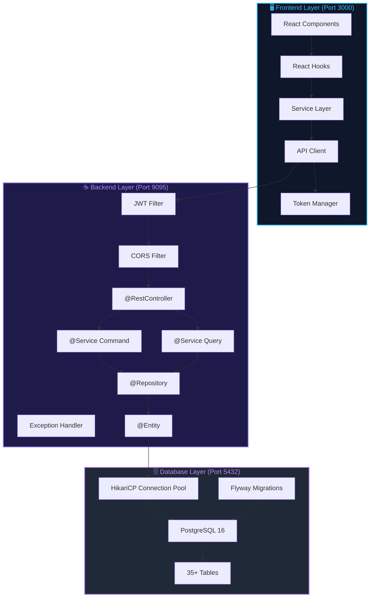

**Architecture Layers:**
- **Frontend:** React components → React hooks → Services → API Client → Token Manager
- **Backend:** JWT Filter → CORS → Controllers → (Command/Query Services) → Repositories → Entities
- **Database:** Connection Pool ← Flyway Migrations → PostgreSQL → 35+ Tables

**Key Patterns:**
- ✅ **CQRS:** Command services (mutations) separate from Query services (reads)
- ✅ **DTO Pattern:** Entity ↔ DTO mapping for API boundaries
- ✅ **Transactional Safety:** Optimistic & pessimistic locking, escrow patterns
- ✅ **JWT Auth:** 12-hour access tokens + rotating refresh token families
- ✅ **Connection Pooling:** HikariCP for high-performance database access
- ✅ **Flyway Migrations:** 22 versioned schema migrations

---

## Technology Stack

| Layer | Technology |
|-------|-----------|
| Frontend | React 18, TypeScript, Vite, TanStack Router, Tailwind CSS |
| Backend | Java 25, Spring Boot 3.5, Spring Security, Hibernate JPA |
| Database | PostgreSQL 16, Flyway, HikariCP, UUID |
| Testing | Playwright E2E, JUnit 5, Mockito |

---

## Request Flow Architecture - Complete Request Lifecycle

### Flow 1: Authenticated GET Request

This diagram shows how a GET request flows through all layers:

```mermaid
graph TD
    Start(["User initiates: walletService.getBalance"]) -->A["React Component:<br/>useEffect hook"]
    A -->B["Service Layer:<br/>walletService.getBalance"]
    B -->C["API Client:<br/>GET /api/v1/me/wallet"]
    C -->D["Token Manager:<br/>getAccessToken from localStorage"]
    D -->E["API Client:<br/>Add Authorization header<br/>Bearer token"]
    
    E -->JWT["JWT Filter:<br/>Receive GET request"]
    JWT -->JWTVal{"Validate JWT<br/>signature?"}
    JWTVal -->|Invalid| JWTErr["Return 401 Unauthorized"]
    JWTVal -->|Valid| JWTExt["Extract userId from JWT claims"]
CTR["Controller:<br/>@GetMapping /me/wallet<br/>@PathVariable userId"]
CTRSec["SecurityUtils.getCurrentUserId<br/>from SecurityContext"]
    
    JWTExt --> CTR
    CTR --> CTRSec
    
    CTRSec -->SRV["WalletQueryService:<br/>getBalance userId"]
    SRV -->TXN["Transaction BEGIN<br/>@Transactional readOnly=true"]
    TXN -->REP["WalletRepository:<br/>findByUserId userId"]
    
    REP --> SQL[("PostgreSQL:<br/>SELECT * FROM wallets<br/>WHERE user_id = ?")]
    SQL -->WalletData["Return Wallet entity<br/>available_points<br/>held_points"]
    
    WalletData -->MAP["Mapper:<br/>walletMapper.toBalanceResponse"]
    MAP -->DTO["WalletBalanceResponse DTO"]
    DTO -->COMMIT["Transaction COMMIT"]
    
    COMMIT -->RESP["Controller:<br/>ResponseEntity 200 OK<br/>Content-Type: application/json"]
    RESP -->JWTRESP["JWT Filter:<br/>Pass through response"]
    JWTRESP -->APIRESP["API Client:<br/>Parse response.json"]
    
    APIRESP -->SVCRESP["Service Layer:<br/>Return typed DTO"]
    SVCRESP --> End(["React Component:<br/>Update state + Re-render"])
    
    JWTErr --> ErrorEnd(["Request fails: 401"])
    
    style Start fill:#0284c7,stroke:#0369a1,stroke-width:2px,color:#ffffff
    style A fill:#0284c7,stroke:#0369a1,stroke-width:2px,color:#ffffff
    style B fill:#0284c7,stroke:#0369a1,stroke-width:2px,color:#ffffff
    style C fill:#0284c7,stroke:#0369a1,stroke-width:2px,color:#ffffff
    style D fill:#0284c7,stroke:#0369a1,stroke-width:2px,color:#ffffff
    style E fill:#0284c7,stroke:#0369a1,stroke-width:2px,color:#ffffff
    style JWT fill:#d97706,stroke:#b45309,stroke-width:2px,color:#ffffff
    style JWTVal fill:#f59e0b,stroke:#d97706,stroke-width:2px,color:#000000
    style JWTExt fill:#d97706,stroke:#b45309,stroke-width:2px,color:#ffffff
    style JWTErr fill:#e11d48,stroke:#be123c,stroke-width:2px,color:#ffffff
    style CTR fill:#d97706,stroke:#b45309,stroke-width:2px,color:#ffffff
    style CTRSec fill:#d97706,stroke:#b45309,stroke-width:2px,color:#ffffff
    style SRV fill:#d97706,stroke:#b45309,stroke-width:2px,color:#ffffff
    style TXN fill:#d97706,stroke:#b45309,stroke-width:2px,color:#ffffff
    style REP fill:#d97706,stroke:#b45309,stroke-width:2px,color:#ffffff
    style SQL fill:#7c3aed,stroke:#5b21b6,stroke-width:2px,color:#ffffff
    style WalletData fill:#7c3aed,stroke:#5b21b6,stroke-width:2px,color:#ffffff
    style MAP fill:#d97706,stroke:#b45309,stroke-width:2px,color:#ffffff
    style DTO fill:#d97706,stroke:#b45309,stroke-width:2px,color:#ffffff
    style COMMIT fill:#d97706,stroke:#b45309,stroke-width:2px,color:#ffffff
    style RESP fill:#d97706,stroke:#b45309,stroke-width:2px,color:#ffffff
    style JWTRESP fill:#d97706,stroke:#b45309,stroke-width:2px,color:#ffffff
    style APIRESP fill:#0284c7,stroke:#0369a1,stroke-width:2px,color:#ffffff
    style SVCRESP fill:#0284c7,stroke:#0369a1,stroke-width:2px,color:#ffffff
    style End fill:#0284c7,stroke:#0369a1,stroke-width:2px,color:#ffffff
    style ErrorEnd fill:#e11d48,stroke:#be123c,stroke-width:2px,color:#ffffff
```

**Key Points:**
- Token automatically injected by apiClient from localStorage
- JWT Filter validates signature before routing to controller
- Service layer uses CQRS query service for read-only operations
- Single database query for simple balance lookup
- Response automatically typed by apiClient generic

### Flow 2: Authenticated POST Request with Transaction & Locking

This diagram shows a more complex flow with data modifications and pessimistic locking:

```mermaid
graph TD
    Start(["User initiates: walletService.transferPoints"]) -->A["React Component:<br/>Form submission"]
    A -->B["Service Layer:<br/>walletService.transferPoints<br/>recipientId, amount"]
    B -->C["API Client:<br/>POST /api/v1/wallet/transfer"]
    C -->GenIdempotency["Generate Idempotency-Key<br/>UUID v4"]
    GenIdempotency -->AddAuth["Add Authorization header<br/>Bearer token"]
    AddAuth -->ReqBody["Request Body:<br/>recipientId, amount<br/>Content-Type: application/json"]
    
    ReqBody -->JWT["JWT Filter:<br/>Intercept POST request"]
    JWT -->JWTVal{"Validate JWT<br/>signature?"}
    JWTVal -->|Invalid| JWTErr["Return 401 Unauthorized"]
    JWTVal -->|Valid| JWTExt["Extract userId from claims"]
CTR["Controller:<br/>@PostMapping /wallet/transfer"]
Valid["@Valid TransferPointsRequest<br/>Validate recipientId, amount"]
ValidCheck{"DTO validation<br/>passed?"}
    
    JWTExt --> CTR
    CTR --> Valid
    Valid --> ValidCheck
    ValidCheck -->|No| ValidationErr["Return 400 Bad Request"]
    ValidCheck -->|Yes| SRV["WalletService:<br/>transferPoints request"]
    
    SRV -->TXNStart["Transaction BEGIN<br/>@Transactional<br/>Propagation.REQUIRED"]
    TXNStart -->LockSender["WalletRepository:<br/>Lock sender wallet"]
    LockSender --> SQLLock[("PostgreSQL:<br/>SELECT * FROM wallets<br/>WHERE user_id = ?<br/>FOR UPDATE NOWAIT")]
    SQLLock -->LockCheck{"Wallet locked<br/>successfully?"}
    LockCheck -->|Locked| LockedRow["Locked wallet row obtained"]
    LockCheck -->|Locked by other| LockErr["Return 409 Conflict<br/>Wallet locked"]
    
    LockedRow -->BalanceCheck{"available_points<br/>&gt;= amount?"}
    BalanceCheck -->|No| BalErr["Return 409 Conflict<br/>Insufficient balance"]
    BalanceCheck -->|Yes| DeductSender["Update sender wallet"]
    
    DeductSender --> SQLDeduct[("PostgreSQL:<br/>UPDATE wallets<br/>SET available_points -= amount<br/>WHERE user_id = ?")]
    SQLDeduct -->AddRecipient["Update recipient wallet"]
    AddRecipient --> SQLAdd[("PostgreSQL:<br/>UPDATE wallets<br/>SET available_points += amount<br/>WHERE user_id = recipient_id")]
    
    SQLAdd -->InsertLedger["Insert ledger entries"]
    InsertLedger --> SQLLedger1[("PostgreSQL:<br/>INSERT INTO point_ledger<br/>type=TRANSFER_OUT<br/>amount=-amount, sender_id")]
    SQLLedger1 --> SQLLedger2[("PostgreSQL:<br/>INSERT INTO point_ledger<br/>type=TRANSFER_IN<br/>amount=+amount, recipient_id")]
    
    SQLLedger2 -->Commit["Transaction COMMIT<br/>All changes persisted"]
    Commit -->CommitOK["Transaction committed<br/>ACID guarantees met"]
    
    CommitOK -->RESP["Controller:<br/>ResponseEntity 200 OK<br/>TransactionResponse DTO"]
    RESP -->JWTRESP["JWT Filter:<br/>Pass through response"]
    JWTRESP -->APIRESP["API Client:<br/>Parse response.json"]
    APIRESP -->SVCRESP["Service Layer:<br/>Return success data"]
    SVCRESP --> End(["React Component:<br/>Show success toast<br/>Update wallet state"])
    
    JWTErr --> ErrorEnd(["Request fails: 401"])
    ValidationErr --> ErrorEnd
    LockErr --> ErrorEnd
    BalErr --> ErrorEnd
    
    style Start fill:#0284c7,stroke:#0369a1,stroke-width:2px,color:#ffffff
    style A fill:#0284c7,stroke:#0369a1,stroke-width:2px,color:#ffffff
    style B fill:#0284c7,stroke:#0369a1,stroke-width:2px,color:#ffffff
    style C fill:#0284c7,stroke:#0369a1,stroke-width:2px,color:#ffffff
    style GenIdempotency fill:#0284c7,stroke:#0369a1,stroke-width:2px,color:#ffffff
    style AddAuth fill:#0284c7,stroke:#0369a1,stroke-width:2px,color:#ffffff
    style ReqBody fill:#0284c7,stroke:#0369a1,stroke-width:2px,color:#ffffff
    style JWT fill:#d97706,stroke:#b45309,stroke-width:2px,color:#ffffff
    style JWTVal fill:#f59e0b,stroke:#d97706,stroke-width:2px,color:#000000
    style JWTExt fill:#d97706,stroke:#b45309,stroke-width:2px,color:#ffffff
    style JWTErr fill:#e11d48,stroke:#be123c,stroke-width:2px,color:#ffffff
    style CTR fill:#d97706,stroke:#b45309,stroke-width:2px,color:#ffffff
    style Valid fill:#d97706,stroke:#b45309,stroke-width:2px,color:#ffffff
    style ValidCheck fill:#f59e0b,stroke:#d97706,stroke-width:2px,color:#000000
    style ValidationErr fill:#e11d48,stroke:#be123c,stroke-width:2px,color:#ffffff
    style SRV fill:#d97706,stroke:#b45309,stroke-width:2px,color:#ffffff
    style TXNStart fill:#d97706,stroke:#b45309,stroke-width:2px,color:#ffffff
    style LockSender fill:#d97706,stroke:#b45309,stroke-width:2px,color:#ffffff
    style SQLLock fill:#7c3aed,stroke:#5b21b6,stroke-width:2px,color:#ffffff
    style LockCheck fill:#f59e0b,stroke:#d97706,stroke-width:2px,color:#000000
    style LockedRow fill:#d97706,stroke:#b45309,stroke-width:2px,color:#ffffff
    style LockErr fill:#e11d48,stroke:#be123c,stroke-width:2px,color:#ffffff
    style BalanceCheck fill:#f59e0b,stroke:#d97706,stroke-width:2px,color:#000000
    style BalErr fill:#e11d48,stroke:#be123c,stroke-width:2px,color:#ffffff
    style DeductSender fill:#d97706,stroke:#b45309,stroke-width:2px,color:#ffffff
    style SQLDeduct fill:#7c3aed,stroke:#5b21b6,stroke-width:2px,color:#ffffff
    style AddRecipient fill:#d97706,stroke:#b45309,stroke-width:2px,color:#ffffff
    style SQLAdd fill:#7c3aed,stroke:#5b21b6,stroke-width:2px,color:#ffffff
    style InsertLedger fill:#d97706,stroke:#b45309,stroke-width:2px,color:#ffffff
    style SQLLedger1 fill:#7c3aed,stroke:#5b21b6,stroke-width:2px,color:#ffffff
    style SQLLedger2 fill:#7c3aed,stroke:#5b21b6,stroke-width:2px,color:#ffffff
    style Commit fill:#d97706,stroke:#b45309,stroke-width:2px,color:#ffffff
    style CommitOK fill:#059669,stroke:#047857,stroke-width:2px,color:#ffffff
    style RESP fill:#d97706,stroke:#b45309,stroke-width:2px,color:#ffffff
    style JWTRESP fill:#d97706,stroke:#b45309,stroke-width:2px,color:#ffffff
    style APIRESP fill:#0284c7,stroke:#0369a1,stroke-width:2px,color:#ffffff
    style SVCRESP fill:#0284c7,stroke:#0369a1,stroke-width:2px,color:#ffffff
    style End fill:#0284c7,stroke:#0369a1,stroke-width:2px,color:#ffffff
    style ErrorEnd fill:#e11d48,stroke:#be123c,stroke-width:2px,color:#ffffff
```

**Key Points:**
- Idempotency-Key header ensures duplicate requests are safe
- Pessimistic locking (FOR UPDATE) prevents race conditions
- Single @Transactional boundary ensures ACID properties
- Multiple database operations wrapped in one transaction
- Automatic rollback on any exception

### Flow 3: Token Refresh on 401 Response

This diagram shows how expired tokens are automatically refreshed:

```mermaid
graph TD
    Start(["User initiates API call"]) -->A["React Component:<br/>useEffect or event handler"]
    A -->B["Service Layer:<br/>dashboardService.getDashboard"]
    B -->C["API Client:<br/>GET /api/v1/me/dashboard"]
    C -->GetToken["Token Manager:<br/>getAccessToken from localStorage"]
    GetToken -->AddHeader["Add Authorization header<br/>Bearer token"]
    
    AddHeader -->JWT["JWT Filter:<br/>Intercept request"]
    JWT -->CheckExp{"Token expired?"}
    CheckExp -->|Not Expired| JWTVal["Validate JWT signature"]
    CheckExp -->|Expired| ExpiredResp["Return 401 Unauthorized"]
    
    JWTVal -->JWTValidCheck{"Signature valid?"}
    JWTValidCheck -->|Invalid| InvalidResp["Return 401 Unauthorized"]
    JWTValidCheck -->|Valid| Forward["Forward to Controller"]
    
    Forward -->CTR["Controller:<br/>Process request normally"]
    CTR -->NormalResp["Return 200 OK + data"]
    NormalResp --> SuccessEnd(["Component:<br/>Render data"])
    
    ExpiredResp -->APIIntercept["API Interceptor:<br/>Detect 401 status"]
    InvalidResp --> APIIntercept
    APIIntercept -->IsRefreshing{"Already<br/>refreshing?"}
    IsRefreshing -->|Yes| QueueReq["Queue request in<br/>pending queue"]
    IsRefreshing -->|No| SetRefreshing["Set isRefreshing = true"]
    
    QueueReq -->WaitRefresh["Wait for refresh to complete"]
    SetRefreshing -->GetRefreshToken["Token Manager:<br/>getRefreshToken from localStorage"]
    GetRefreshToken -->CheckRefresh{"Refresh token<br/>exists?"}
    CheckRefresh -->|No| RedirectLogin["Redirect to /login"]
    CheckRefresh -->|Yes| RefreshReq["POST /api/v1/auth/refresh"]
AuthCTR["AuthController:<br/>@PostMapping /auth/refresh"]
TokenSVC["RefreshTokenService:<br/>refresh refreshToken"]
    
    RefreshReq --> AuthCTR
    AuthCTR --> TokenSVC
    
    TokenSVC -->TXNStart["Transaction BEGIN<br/>@Transactional"]
    TXNStart --> QueryToken[("PostgreSQL:<br/>SELECT * FROM refresh_tokens<br/>WHERE token_hash = SHA256?")]
    QueryToken -->TokenFound{"Token found?"}
    TokenFound -->|No| InvalidToken["Return 401 Invalid token"]
    TokenFound -->|Yes| TokenEntity["Load RefreshToken entity"]
    
    TokenEntity -->ValidateFamily{"Token family<br/>valid & not<br/>revoked?"}
    ValidateFamily -->|No| RevokeAll["Transaction ROLLBACK<br/>Revoke entire family"]
    ValidateFamily -->|Yes| CheckExpiry{"Refresh token<br/>expired?"}
    
    RevokeAll -->ReplayAttack["Return 401 Token<br/>replay detected"]
    CheckExpiry -->|Yes| RefreshExp["Return 401 Refresh<br/>token expired"]
    CheckExpiry -->|No| GenAccess["Generate new access token<br/>HS256 12-hour expiry"]
    
    GenAccess -->GenRefresh["Generate new refresh token<br/>Create new family_id"]
    GenRefresh --> InsertNew[("PostgreSQL:<br/>INSERT INTO refresh_tokens")]
    InsertNew --> DeleteOld[("PostgreSQL:<br/>DELETE old refresh_tokens")]
    
    DeleteOld -->TXNCommit["Transaction COMMIT"]
    TXNCommit -->AuthResp["AuthController returns<br/>AuthResponse 200 OK"]
    AuthResp -->RefreshResp["API Interceptor<br/>receives new tokens"]
    
    RefreshResp -->SaveAccess["setAccessToken newToken"]
    SaveAccess -->SaveRefresh["setRefreshToken newToken"]
    SaveRefresh -->ResetRefreshing["isRefreshing = false"]
    ResetRefreshing -->ProcessQueue["Process queued requests"]
    
    ProcessQueue -->RetryQueued["Retry all queued requests"]
    RetryQueued -->JWTRetry["JWT Filter validates<br/>new token"]
    JWTRetry -->ValidateNew{"New token<br/>valid?"}
    ValidateNew -->|Yes| ForwardRetry["Forward to Controller"]
    ValidateNew -->|No| RetryFail["Return 401"]
    
    ForwardRetry --> FinalEnd(["Component:<br/>Render data successfully"])
    
    WaitRefresh -->RefreshDone{"Refresh<br/>completed?"}
    RefreshDone -->|Yes| RetryQueued
    
    RedirectLogin --> LoginEnd(["Redirect to /login"])
    InvalidToken --> InvalidEnd(["Request fails: 401"])
    ReplayAttack --> ReplayEnd(["Request fails: 401"])
    RefreshExp --> ExpEnd(["Request fails: 401"])
    RetryFail --> RetryFailEnd(["Request fails: 401"])
    
    style Start fill:#0284c7,stroke:#0369a1,stroke-width:2px,color:#ffffff
    style A fill:#0284c7,stroke:#0369a1,stroke-width:2px,color:#ffffff
    style B fill:#0284c7,stroke:#0369a1,stroke-width:2px,color:#ffffff
    style C fill:#0284c7,stroke:#0369a1,stroke-width:2px,color:#ffffff
    style GetToken fill:#0284c7,stroke:#0369a1,stroke-width:2px,color:#ffffff
    style AddHeader fill:#0284c7,stroke:#0369a1,stroke-width:2px,color:#ffffff
    style JWT fill:#d97706,stroke:#b45309,stroke-width:2px,color:#ffffff
    style CheckExp fill:#f59e0b,stroke:#d97706,stroke-width:2px,color:#000000
    style ExpiredResp fill:#e11d48,stroke:#be123c,stroke-width:2px,color:#ffffff
    style JWTValidCheck fill:#f59e0b,stroke:#d97706,stroke-width:2px,color:#000000
    style InvalidResp fill:#e11d48,stroke:#be123c,stroke-width:2px,color:#ffffff
    style Forward fill:#d97706,stroke:#b45309,stroke-width:2px,color:#ffffff
    style CTR fill:#d97706,stroke:#b45309,stroke-width:2px,color:#ffffff
    style NormalResp fill:#d97706,stroke:#b45309,stroke-width:2px,color:#ffffff
    style SuccessEnd fill:#0284c7,stroke:#0369a1,stroke-width:2px,color:#ffffff
    style APIIntercept fill:#0284c7,stroke:#0369a1,stroke-width:2px,color:#ffffff
    style IsRefreshing fill:#f59e0b,stroke:#d97706,stroke-width:2px,color:#000000
    style QueueReq fill:#0284c7,stroke:#0369a1,stroke-width:2px,color:#ffffff
    style SetRefreshing fill:#0284c7,stroke:#0369a1,stroke-width:2px,color:#ffffff
    style GetRefreshToken fill:#0284c7,stroke:#0369a1,stroke-width:2px,color:#ffffff
    style CheckRefresh fill:#f59e0b,stroke:#d97706,stroke-width:2px,color:#000000
    style RedirectLogin fill:#e11d48,stroke:#be123c,stroke-width:2px,color:#ffffff
    style RefreshReq fill:#0284c7,stroke:#0369a1,stroke-width:2px,color:#ffffff
    style AuthCTR fill:#d97706,stroke:#b45309,stroke-width:2px,color:#ffffff
    style TokenSVC fill:#d97706,stroke:#b45309,stroke-width:2px,color:#ffffff
    style TXNStart fill:#d97706,stroke:#b45309,stroke-width:2px,color:#ffffff
    style QueryToken fill:#7c3aed,stroke:#5b21b6,stroke-width:2px,color:#ffffff
    style TokenFound fill:#f59e0b,stroke:#d97706,stroke-width:2px,color:#000000
    style InvalidToken fill:#e11d48,stroke:#be123c,stroke-width:2px,color:#ffffff
    style TokenEntity fill:#d97706,stroke:#b45309,stroke-width:2px,color:#ffffff
    style ValidateFamily fill:#f59e0b,stroke:#d97706,stroke-width:2px,color:#000000
    style RevokeAll fill:#e11d48,stroke:#be123c,stroke-width:2px,color:#ffffff
    style CheckExpiry fill:#f59e0b,stroke:#d97706,stroke-width:2px,color:#000000
    style RefreshExp fill:#e11d48,stroke:#be123c,stroke-width:2px,color:#ffffff
    style GenAccess fill:#d97706,stroke:#b45309,stroke-width:2px,color:#ffffff
    style GenRefresh fill:#d97706,stroke:#b45309,stroke-width:2px,color:#ffffff
    style InsertNew fill:#7c3aed,stroke:#5b21b6,stroke-width:2px,color:#ffffff
    style DeleteOld fill:#7c3aed,stroke:#5b21b6,stroke-width:2px,color:#ffffff
    style TXNCommit fill:#059669,stroke:#047857,stroke-width:2px,color:#ffffff
    style AuthResp fill:#d97706,stroke:#b45309,stroke-width:2px,color:#ffffff
    style RefreshResp fill:#0284c7,stroke:#0369a1,stroke-width:2px,color:#ffffff
    style SaveAccess fill:#0284c7,stroke:#0369a1,stroke-width:2px,color:#ffffff
    style SaveRefresh fill:#0284c7,stroke:#0369a1,stroke-width:2px,color:#ffffff
    style ResetRefreshing fill:#0284c7,stroke:#0369a1,stroke-width:2px,color:#ffffff
    style ProcessQueue fill:#0284c7,stroke:#0369a1,stroke-width:2px,color:#ffffff
    style RetryQueued fill:#0284c7,stroke:#0369a1,stroke-width:2px,color:#ffffff
    style JWTRetry fill:#d97706,stroke:#b45309,stroke-width:2px,color:#ffffff
    style ValidateNew fill:#f59e0b,stroke:#d97706,stroke-width:2px,color:#000000
    style RetryFail fill:#e11d48,stroke:#be123c,stroke-width:2px,color:#ffffff
    style ForwardRetry fill:#d97706,stroke:#b45309,stroke-width:2px,color:#ffffff
    style FinalEnd fill:#0284c7,stroke:#0369a1,stroke-width:2px,color:#ffffff
    style RefreshDone fill:#f59e0b,stroke:#d97706,stroke-width:2px,color:#000000
    style LoginEnd fill:#e11d48,stroke:#be123c,stroke-width:2px,color:#ffffff
    style InvalidEnd fill:#e11d48,stroke:#be123c,stroke-width:2px,color:#ffffff
    style ReplayEnd fill:#e11d48,stroke:#be123c,stroke-width:2px,color:#ffffff
    style ExpEnd fill:#e11d48,stroke:#be123c,stroke-width:2px,color:#ffffff
    style RetryFailEnd fill:#e11d48,stroke:#be123c,stroke-width:2px,color:#ffffff
```

**Key Points:**
- Client automatically detects 401 and initiates token refresh
- Refresh token family prevents token replay attacks
- Old refresh token invalidated immediately on rotation
- Original request is retried with new access token
- Concurrent requests queued until refresh completes
- All token operations within single transaction for consistency

---

## Frontend Service Layer Architecture

The frontend uses a centralized service layer pattern where React components don't call the API directly. Instead, they use typed services that encapsulate API calls, error handling, and data transformation:

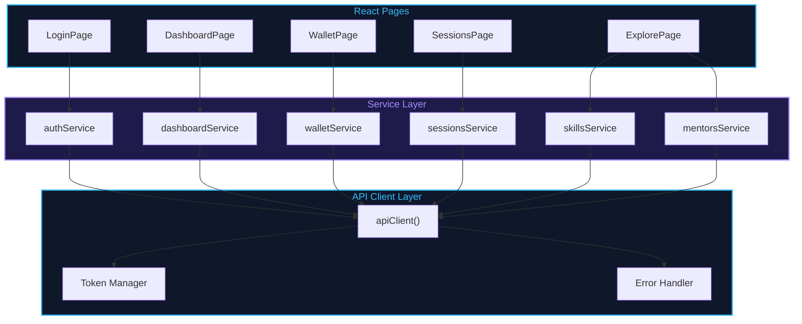

**Service-to-Endpoint Mapping:**

| Frontend Service | HTTP Method | Backend Endpoint | Operation |
|------------------|-------------|-----------------|-----------|
| authService.login | POST | /api/v1/auth/login | Authenticate |
| authService.register | POST | /api/v1/auth/register | Create account |
| dashboardService.getDashboard | GET | /api/v1/me/dashboard | Load dashboard |
| walletService.getBalance | GET | /api/v1/me/wallet | Get balance |
| walletService.transferPoints | POST | /api/v1/wallet/transfer | Transfer points |
| sessionsService.listSessions | GET | /api/v1/sessions/me | List sessions |
| sessionsService.completeSession | POST | /api/v1/sessions/{id}/completion-confirmations | Complete |
| skillsService.getMySkills | GET | /api/v1/me/skills | Get skills |
| mentorsService.findMentorsBySkill | GET | /api/v1/users?skillId=xxx | Find mentors |

**API Client Features:**
- ✅ Automatic token injection from localStorage
- ✅ Automatic 401 token refresh and retry
- ✅ Request queuing during token refresh
- ✅ Idempotency-Key generation
- ✅ Type-safe generic responses
- ✅ Mock API fallback for dev mode

---

## Backend Service Dependencies

The backend services follow a layered architecture where controllers route requests to either command (mutation) or query (read-only) services, which may call other services:

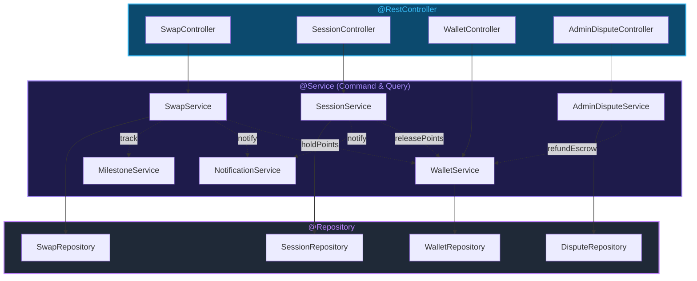

**Key Service Interactions:**

1. **SwapService → WalletService:** When swap proposal accepted, holds points in escrow via `holdPoints()`
2. **SessionService → WalletService:** On session completion, releases escrow to mentor via `releasePoints()`
3. **All Services → NotificationService:** Notify users of state changes (fire-and-forget)
4. **SwapService/SessionService → MilestoneService:** Track achievements (e.g., "Complete 5 sessions")
5. **AdminDisputeService → WalletService:** On dispute resolution, refund or release escrow

**Transaction Propagation:**
- Command services use `@Transactional` (REQUIRED)
- WalletService uses `REQUIRES_NEW` to commit immediately
- NotificationService failures don't rollback (async pattern)

---

## Core Database Tables
**Skills:** skills, user_skills
**Wallet:** wallets, point_ledger, escrows
**Sessions:** swap_requests, swap_sessions, session_confirmations
**Admin:** reports, disputes, admin_audit_events

---

## Backend Layered Architecture

```
HTTP Request
    ↓
@RestController (API Layer)
    ↓ @Valid DTO validation
@Service Layer (Business Logic)
    ↓ @Transactional
@Repository (Spring Data JPA)
    ↓ Hibernate ORM
PostgreSQL Database
    ↓
JSON Response
```

**Key Patterns:**
- ✅ CQRS: Command & Query services separated
- ✅ DTO Pattern: Entity ↔ DTO mapping
- ✅ Optimistic Locking: @Version for concurrency
- ✅ Pessimistic Locking: SELECT FOR UPDATE for wallets
- ✅ Escrow Pattern: Safe payment transfers

---

## API Endpoints Overview

### Authentication
- `POST /api/v1/auth/register` - Create account
- `POST /api/v1/auth/login` - Login with credentials
- `POST /api/v1/auth/refresh` - Refresh access token
- `POST /api/v1/auth/logout` - Logout & revoke tokens

### User Profile
- `GET /api/v1/me` - Get authenticated user
- `PATCH /api/v1/me` - Update profile
- `GET /api/v1/me/dashboard` - Get dashboard data
- `GET /api/v1/users/{id}/profile` - Get public profile

### Wallet Management
- `GET /api/v1/me/wallet` - Get wallet balance
- `GET /api/v1/me/wallet/transactions` - Transaction history (paginated)
- `GET /api/v1/me/wallet/transactions.csv` - Export CSV
- `POST /api/v1/wallet/transfer` - Transfer points to user

### Skills
- `GET /api/v1/skills` - List all skills
- `GET /api/v1/skills/search?q=Java` - Search skills
- `POST /api/v1/skills` - Create new skill
- `GET /api/v1/me/skills` - Get user's skills
- `POST /api/v1/me/skills` - Add skill to portfolio
- `DELETE /api/v1/me/skills/{id}` - Remove skill

### Sessions
- `GET /api/v1/sessions/me` - Get user sessions
- `GET /api/v1/sessions/active/me` - Get active sessions
- `GET /api/v1/sessions/{id}` - Get session details
- `POST /api/v1/sessions/{id}/start` - Start session
- `POST /api/v1/sessions/{id}/complete` - Complete session
- `POST /api/v1/sessions/{id}/completion-confirmations` - Confirm completion
- `PATCH /api/v1/sessions/{id}` - Update session
- `POST /api/v1/sessions/{id}/dispute` - Open dispute

### Admin
- `GET /api/v1/admin/dashboard` - Admin statistics
- `GET /api/v1/admin/reports` - Moderation reports
- `GET /api/v1/admin/disputes` - Disputes queue
- `PATCH /api/v1/admin/disputes/{id}` - Resolve dispute
- `GET /api/v1/admin/audit-events` - Audit log

---

## JWT Authentication Flow

```mermaid
graph TD
    Start(["User submits credentials"]) -->A["LoginPage:<br/>Form submission"]
    A -->B["authService.login email, password"]
    B -->C["API Client:<br/>POST /api/v1/auth/login"]
    C -->AddHeader["Add Content-Type header"]
    
CTR["AuthController:<br/>@PostMapping /auth/login"]
    AddHeader --> CTR
Valid["@Valid LoginRequest<br/>Validate DTO"]
ValidCheck{"Validation<br/>passed?"}
    
    CTR --> Valid
    Valid --> ValidCheck
    ValidCheck -->|No| Err400["Return 400 Bad Request"]
    ValidCheck -->|Yes| SRV["AuthService:<br/>authenticate request"]
    
    SRV --> QueryUser[("PostgreSQL:<br/>SELECT * FROM users<br/>WHERE email = ?")]
    QueryUser -->UserFound{"User<br/>found?"}
    UserFound -->|No| Err401["Return 401 Unauthorized"]
    UserFound -->|Yes| CheckPwd["BCrypt.matches inputPassword<br/>storedHash"]
    
    CheckPwd -->PwdMatch{"Password<br/>match?"}
    PwdMatch -->|No| Err401
    PwdMatch -->|Yes| GenAccess["Generate JWT access token<br/>HS256, 12-hour expiry<br/>claims: userId, email, roles"]
    
    GenAccess -->GenRefresh["Generate refresh token<br/>Create family_id UUID<br/>Hash token SHA-256"]
    GenRefresh -->TXN["Transaction BEGIN<br/>@Transactional"]
    TXN --> SaveRefresh[("PostgreSQL:<br/>INSERT INTO refresh_tokens<br/>family_id, token_hash<br/>user_id, expires_at=7d")]
    
    SaveRefresh -->Commit["Transaction COMMIT"]
    Commit -->BuildResp["Build AuthResponse DTO<br/>accessToken, refreshToken"]
    BuildResp -->AuthResp["AuthController returns<br/>ResponseEntity 200 OK"]
    
    AuthResp -->APIResp["API Client:<br/>Parse response.json"]
    APIResp -->SaveAccess["setAccessToken in localStorage"]
    SaveAccess -->SaveRefresh2["setRefreshToken in localStorage"]
    SaveRefresh2 -->SvcResp["authService returns<br/>AuthResponse DTO"]
    
    SvcResp -->Navigate["LoginPage:<br/>Navigate to dashboard"]
    Navigate --> End(["Browser:<br/>Load DashboardPage"])
    
    Err400 --> ErrorEnd(["Request fails: 400"])
    Err401 --> ErrorEnd
    
    style Start fill:#0284c7,stroke:#0369a1,stroke-width:2px,color:#ffffff
    style A fill:#0284c7,stroke:#0369a1,stroke-width:2px,color:#ffffff
    style B fill:#0284c7,stroke:#0369a1,stroke-width:2px,color:#ffffff
    style C fill:#0284c7,stroke:#0369a1,stroke-width:2px,color:#ffffff
    style AddHeader fill:#0284c7,stroke:#0369a1,stroke-width:2px,color:#ffffff
    style CTR fill:#d97706,stroke:#b45309,stroke-width:2px,color:#ffffff
    style Valid fill:#d97706,stroke:#b45309,stroke-width:2px,color:#ffffff
    style ValidCheck fill:#f59e0b,stroke:#d97706,stroke-width:2px,color:#000000
    style Err400 fill:#e11d48,stroke:#be123c,stroke-width:2px,color:#ffffff
    style SRV fill:#d97706,stroke:#b45309,stroke-width:2px,color:#ffffff
    style QueryUser fill:#7c3aed,stroke:#5b21b6,stroke-width:2px,color:#ffffff
    style UserFound fill:#f59e0b,stroke:#d97706,stroke-width:2px,color:#000000
    style Err401 fill:#e11d48,stroke:#be123c,stroke-width:2px,color:#ffffff
    style CheckPwd fill:#d97706,stroke:#b45309,stroke-width:2px,color:#ffffff
    style PwdMatch fill:#f59e0b,stroke:#d97706,stroke-width:2px,color:#000000
    style GenAccess fill:#d97706,stroke:#b45309,stroke-width:2px,color:#ffffff
    style GenRefresh fill:#d97706,stroke:#b45309,stroke-width:2px,color:#ffffff
    style TXN fill:#d97706,stroke:#b45309,stroke-width:2px,color:#ffffff
    style SaveRefresh fill:#7c3aed,stroke:#5b21b6,stroke-width:2px,color:#ffffff
    style Commit fill:#059669,stroke:#047857,stroke-width:2px,color:#ffffff
    style BuildResp fill:#d97706,stroke:#b45309,stroke-width:2px,color:#ffffff
    style AuthResp fill:#d97706,stroke:#b45309,stroke-width:2px,color:#ffffff
    style APIResp fill:#0284c7,stroke:#0369a1,stroke-width:2px,color:#ffffff
    style SaveAccess fill:#0284c7,stroke:#0369a1,stroke-width:2px,color:#ffffff
    style SaveRefresh2 fill:#0284c7,stroke:#0369a1,stroke-width:2px,color:#ffffff
    style SvcResp fill:#0284c7,stroke:#0369a1,stroke-width:2px,color:#ffffff
    style Navigate fill:#0284c7,stroke:#0369a1,stroke-width:2px,color:#ffffff
    style End fill:#0284c7,stroke:#0369a1,stroke-width:2px,color:#ffffff
    style ErrorEnd fill:#e11d48,stroke:#be123c,stroke-width:2px,color:#ffffff
```

---

## User Journey Flows

### Journey 1: New User Registration & Onboarding

```mermaid
graph TD
    Start(["User navigates to signup page"]) -->A["RegisterPage:<br/>Render registration form"]
    A -->B["Browser:<br/>User enters email, password, name"]
    B -->C["RegisterPage:<br/>Form validation on client"]
    C -->ValidClient{"Valid<br/>locally?"}
    ValidClient -->|No| ShowError1["Show validation errors"]
    ShowError1 --> B
    
    ValidClient -->|Yes| D["authService.register data"]
    D -->E["API Client:<br/>POST /api/v1/auth/register"]
    E -->AddHeader1["Add Authorization header<br/>Content-Type: application/json"]
    AddHeader1 -->ReqBody1["Request Body:<br/>email, password, name"]
    
CTR["AuthController:<br/>@PostMapping /auth/register"]
    ReqBody1 --> CTR
Valid1["@Valid RegisterRequest<br/>Validate DTO"]
ValidCheck1{"DTO validation<br/>passed?"}
    
    CTR --> Valid1
    Valid1 --> ValidCheck1
    ValidCheck1 -->|No| Err400["Return 400 Bad Request"]
    ValidCheck1 -->|Yes| SRVR["AuthService:<br/>register request"]
    
    SRVR -->TXN1["Transaction BEGIN<br/>@Transactional"]
    TXN1 -->CheckEmail{"Email already<br/>exists?"}
    CheckEmail -->|Yes| Err409["Return 409 Conflict<br/>Email already registered"]
    CheckEmail -->|No| HashPwd["BCrypt.encode password<br/>salt rounds = 12"]
    
    HashPwd -->CreateUser["Create User entity<br/>email, passwordHash, name<br/>id = UUID.randomUUID"]
    CreateUser --> SaveUser[("PostgreSQL:<br/>INSERT INTO users<br/>email, password_hash, name, id")]
    SaveUser -->UserSaved["User persisted<br/>user_id = generated UUID"]
    
    UserSaved -->CreateWallet["Create Wallet entity<br/>user_id, available_points = 30<br/>held_points = 0"]
    CreateWallet --> SaveWallet[("PostgreSQL:<br/>INSERT INTO wallets<br/>user_id, available_points=30")]
    SaveWallet -->WalletSaved["Wallet created<br/>with 30 bonus points"]
    
    WalletSaved --> InsertLedger1[("PostgreSQL:<br/>INSERT INTO point_ledger<br/>type=REGISTRATION_BONUS<br/>amount=30, user_id")]
    InsertLedger1 -->LedgerRecorded["Bonus transaction recorded"]
    
    LedgerRecorded -->GenAccess["Generate JWT access token<br/>HS256, 12-hour expiry<br/>claims: userId, email, roles"]
    GenAccess -->GenRefresh["Generate refresh token<br/>Create family_id UUID<br/>Hash token SHA-256"]
    GenRefresh --> SaveRefresh[("PostgreSQL:<br/>INSERT INTO refresh_tokens<br/>family_id, token_hash<br/>user_id, expires_at=7d")]
    
    SaveRefresh -->Commit1["Transaction COMMIT<br/>All changes persisted"]
    Commit1 -->AuthResp["AuthService returns<br/>AuthResponse with tokens"]
    AuthResp -->CtrlResp["AuthController:<br/>ResponseEntity 201 Created"]
    
    CtrlResp -->APIResp["API Client:<br/>Parse response.json"]
    APIResp -->SetAccessToken["setAccessToken in localStorage"]
    SetAccessToken -->SetRefreshToken["setRefreshToken in localStorage"]
    SetRefreshToken -->SvcResp["authService receives<br/>AuthResponse DTO"]
    
    SvcResp -->Navigate["RegisterPage:<br/>Navigate to dashboard"]
    Navigate --> End(["Browser:<br/>Load DashboardPage"])
    
    ShowError1 -->Retry["User retries"]
    Retry --> B
    Err400 --> ErrorEnd1(["Show error message"])
    Err409 --> ErrorEnd1
    
    style Start fill:#0284c7,stroke:#0369a1,stroke-width:2px,color:#ffffff
    style A fill:#0284c7,stroke:#0369a1,stroke-width:2px,color:#ffffff
    style B fill:#0284c7,stroke:#0369a1,stroke-width:2px,color:#ffffff
    style C fill:#0284c7,stroke:#0369a1,stroke-width:2px,color:#ffffff
    style ValidClient fill:#f59e0b,stroke:#d97706,stroke-width:2px,color:#000000
    style ShowError1 fill:#e11d48,stroke:#be123c,stroke-width:2px,color:#ffffff
    style D fill:#0284c7,stroke:#0369a1,stroke-width:2px,color:#ffffff
    style E fill:#0284c7,stroke:#0369a1,stroke-width:2px,color:#ffffff
    style AddHeader1 fill:#0284c7,stroke:#0369a1,stroke-width:2px,color:#ffffff
    style ReqBody1 fill:#0284c7,stroke:#0369a1,stroke-width:2px,color:#ffffff
    style CTR fill:#d97706,stroke:#b45309,stroke-width:2px,color:#ffffff
    style Valid1 fill:#d97706,stroke:#b45309,stroke-width:2px,color:#ffffff
    style ValidCheck1 fill:#f59e0b,stroke:#d97706,stroke-width:2px,color:#000000
    style Err400 fill:#e11d48,stroke:#be123c,stroke-width:2px,color:#ffffff
    style SRVR fill:#d97706,stroke:#b45309,stroke-width:2px,color:#ffffff
    style TXN1 fill:#d97706,stroke:#b45309,stroke-width:2px,color:#ffffff
    style CheckEmail fill:#f59e0b,stroke:#d97706,stroke-width:2px,color:#000000
    style Err409 fill:#e11d48,stroke:#be123c,stroke-width:2px,color:#ffffff
    style HashPwd fill:#d97706,stroke:#b45309,stroke-width:2px,color:#ffffff
    style CreateUser fill:#d97706,stroke:#b45309,stroke-width:2px,color:#ffffff
    style SaveUser fill:#7c3aed,stroke:#5b21b6,stroke-width:2px,color:#ffffff
    style UserSaved fill:#d97706,stroke:#b45309,stroke-width:2px,color:#ffffff
    style CreateWallet fill:#d97706,stroke:#b45309,stroke-width:2px,color:#ffffff
    style SaveWallet fill:#7c3aed,stroke:#5b21b6,stroke-width:2px,color:#ffffff
    style WalletSaved fill:#d97706,stroke:#b45309,stroke-width:2px,color:#ffffff
    style InsertLedger1 fill:#7c3aed,stroke:#5b21b6,stroke-width:2px,color:#ffffff
    style LedgerRecorded fill:#d97706,stroke:#b45309,stroke-width:2px,color:#ffffff
    style GenAccess fill:#d97706,stroke:#b45309,stroke-width:2px,color:#ffffff
    style GenRefresh fill:#d97706,stroke:#b45309,stroke-width:2px,color:#ffffff
    style SaveRefresh fill:#7c3aed,stroke:#5b21b6,stroke-width:2px,color:#ffffff
    style Commit1 fill:#059669,stroke:#047857,stroke-width:2px,color:#ffffff
    style AuthResp fill:#d97706,stroke:#b45309,stroke-width:2px,color:#ffffff
    style CtrlResp fill:#d97706,stroke:#b45309,stroke-width:2px,color:#ffffff
    style APIResp fill:#0284c7,stroke:#0369a1,stroke-width:2px,color:#ffffff
    style SetAccessToken fill:#0284c7,stroke:#0369a1,stroke-width:2px,color:#ffffff
    style SetRefreshToken fill:#0284c7,stroke:#0369a1,stroke-width:2px,color:#ffffff
    style SvcResp fill:#0284c7,stroke:#0369a1,stroke-width:2px,color:#ffffff
    style Navigate fill:#0284c7,stroke:#0369a1,stroke-width:2px,color:#ffffff
    style End fill:#0284c7,stroke:#0369a1,stroke-width:2px,color:#ffffff
    style Retry fill:#0284c7,stroke:#0369a1,stroke-width:2px,color:#ffffff
    style ErrorEnd1 fill:#e11d48,stroke:#be123c,stroke-width:2px,color:#ffffff
```

**Key Points:**
- Email uniqueness validated (database constraint)
- Password hashed with BCrypt before storage
- Wallet created with 30 bonus points automatically
- Point ledger entry records bonus transaction
- JWT tokens (12-hour access, 7-day refresh) generated
- Refresh token family established for future rotations
- All operations in single @Transactional boundary
- Automatic rollback if any step fails

### Journey 2: User Login & Token Management

```mermaid
graph TD
    Start(["User navigates to login page"]) -->A["LoginPage:<br/>Render login form"]
    A -->B["Browser:<br/>User enters email + password"]
    B -->C["LoginPage:<br/>Client-side form validation"]
    C -->ValidForm{"Form valid?"}
    ValidForm -->|No| ShowErr["Show validation errors"]
    ShowErr --> B
    
    ValidForm -->|Yes| D["authService.login<br/>email, password"]
    D -->E["API Client:<br/>POST /api/v1/auth/login"]
    E -->ReqBody["Request Body:<br/>email, password<br/>Content-Type: application/json"]
    
CTR["AuthController:<br/>@PostMapping /auth/login"]
    ReqBody --> CTR
Valid["@Valid LoginRequest DTO"]
ValidCheck{"DTO valid?"}
    
    CTR --> Valid
    Valid --> ValidCheck
    ValidCheck -->|No| Err400["Return 400 Bad Request"]
    ValidCheck -->|Yes| SRVR["AuthService:<br/>authenticate email, password"]
    
    SRVR --> FindUser[("PostgreSQL:<br/>SELECT * FROM users<br/>WHERE email = ?")]
    FindUser -->UserExists{"User found?"}
    UserExists -->|No| Err401a["Return 401 Unauthorized<br/>Invalid credentials"]
    UserExists -->|Yes| LoadUser["Load User entity"]
    
    LoadUser -->CompareHash["BCrypt.matches<br/>providedPassword, storedHash"]
    CompareHash -->MatchCheck{"Password<br/>matches?"}
    MatchCheck -->|No| Err401b["Return 401 Unauthorized<br/>Invalid credentials"]
    MatchCheck -->|Yes| GenJWT["Generate JWT access token<br/>HS256, 12-hour expiry"]
    
    GenJWT -->AddClaims["Add claims to token<br/>userId, email, roles<br/>iat, exp, iss"]
    AddClaims -->GenRefreshToken["Generate refresh token<br/>Create new family_id UUID<br/>Random secure bytes"]
    GenRefreshToken -->HashRefresh["Hash refresh token<br/>SHA-256"]
    
    HashRefresh --> SaveRefresh[("PostgreSQL:<br/>INSERT INTO refresh_tokens<br/>family_id, token_hash<br/>user_id, expires_at")]
    SaveRefresh -->TokensCreated["Tokens created<br/>access token valid 12h<br/>refresh token valid 7d"]
    
    TokensCreated -->BuildResp["Build AuthResponse DTO<br/>accessToken, refreshToken"]
    BuildResp -->CtrlResp["AuthController:<br/>ResponseEntity 200 OK"]
    
    CtrlResp -->APIResp["API Client:<br/>Parse response.json"]
    APIResp -->SaveAccess["setAccessToken accessToken<br/>in localStorage"]
    SaveAccess -->SaveRefresh2["setRefreshToken refreshToken<br/>in localStorage"]
    SaveRefresh2 -->SvcResp["authService receives<br/>AuthResponse DTO"]
    
    SvcResp -->Navigate["LoginPage:<br/>Navigate to dashboard"]
    Navigate --> End(["Browser:<br/>Load DashboardPage"])
    
    ShowErr -->RetryLogin["User retries"]
    RetryLogin --> B
    Err400 -->ErrorEnd["Show error message"]
    Err401a --> ErrorEnd
    Err401b --> ErrorEnd
    
    style Start fill:#0284c7,stroke:#0369a1,stroke-width:2px,color:#ffffff
    style A fill:#0284c7,stroke:#0369a1,stroke-width:2px,color:#ffffff
    style B fill:#0284c7,stroke:#0369a1,stroke-width:2px,color:#ffffff
    style C fill:#0284c7,stroke:#0369a1,stroke-width:2px,color:#ffffff
    style ValidForm fill:#f59e0b,stroke:#d97706,stroke-width:2px,color:#000000
    style ShowErr fill:#e11d48,stroke:#be123c,stroke-width:2px,color:#ffffff
    style D fill:#0284c7,stroke:#0369a1,stroke-width:2px,color:#ffffff
    style E fill:#0284c7,stroke:#0369a1,stroke-width:2px,color:#ffffff
    style ReqBody fill:#0284c7,stroke:#0369a1,stroke-width:2px,color:#ffffff
    style CTR fill:#d97706,stroke:#b45309,stroke-width:2px,color:#ffffff
    style Valid fill:#d97706,stroke:#b45309,stroke-width:2px,color:#ffffff
    style ValidCheck fill:#f59e0b,stroke:#d97706,stroke-width:2px,color:#000000
    style Err400 fill:#e11d48,stroke:#be123c,stroke-width:2px,color:#ffffff
    style SRVR fill:#d97706,stroke:#b45309,stroke-width:2px,color:#ffffff
    style FindUser fill:#7c3aed,stroke:#5b21b6,stroke-width:2px,color:#ffffff
    style UserExists fill:#f59e0b,stroke:#d97706,stroke-width:2px,color:#000000
    style Err401a fill:#e11d48,stroke:#be123c,stroke-width:2px,color:#ffffff
    style LoadUser fill:#d97706,stroke:#b45309,stroke-width:2px,color:#ffffff
    style CompareHash fill:#d97706,stroke:#b45309,stroke-width:2px,color:#ffffff
    style MatchCheck fill:#f59e0b,stroke:#d97706,stroke-width:2px,color:#000000
    style Err401b fill:#e11d48,stroke:#be123c,stroke-width:2px,color:#ffffff
    style GenJWT fill:#d97706,stroke:#b45309,stroke-width:2px,color:#ffffff
    style AddClaims fill:#d97706,stroke:#b45309,stroke-width:2px,color:#ffffff
    style GenRefreshToken fill:#d97706,stroke:#b45309,stroke-width:2px,color:#ffffff
    style HashRefresh fill:#d97706,stroke:#b45309,stroke-width:2px,color:#ffffff
    style SaveRefresh fill:#7c3aed,stroke:#5b21b6,stroke-width:2px,color:#ffffff
    style TokensCreated fill:#059669,stroke:#047857,stroke-width:2px,color:#ffffff
    style BuildResp fill:#d97706,stroke:#b45309,stroke-width:2px,color:#ffffff
    style CtrlResp fill:#d97706,stroke:#b45309,stroke-width:2px,color:#ffffff
    style APIResp fill:#0284c7,stroke:#0369a1,stroke-width:2px,color:#ffffff
    style SaveAccess fill:#0284c7,stroke:#0369a1,stroke-width:2px,color:#ffffff
    style SaveRefresh2 fill:#0284c7,stroke:#0369a1,stroke-width:2px,color:#ffffff
    style SvcResp fill:#0284c7,stroke:#0369a1,stroke-width:2px,color:#ffffff
    style Navigate fill:#0284c7,stroke:#0369a1,stroke-width:2px,color:#ffffff
    style End fill:#0284c7,stroke:#0369a1,stroke-width:2px,color:#ffffff
    style RetryLogin fill:#0284c7,stroke:#0369a1,stroke-width:2px,color:#ffffff
    style ErrorEnd fill:#e11d48,stroke:#be123c,stroke-width:2px,color:#ffffff
```

**Key Points:**
- Email lookup (indexed for performance)
- Password validated via BCrypt comparison
- Access token valid for 12 hours
- Refresh token valid for 7 days
- Refresh token family prevents replay attacks
- Both tokens stored in localStorage
- Subsequent requests include access token in Authorization header


### Journey 3: Browse Skills & Find Mentors

```mermaid
graph TD
    Start(["User navigates to Explore page"]) -->A["ExplorePage:<br/>Component mounted"]
    A -->B["useEffect hook triggers<br/>on page load"]
    B -->C["skillsService.getAllSkills"]
    
    C -->E["API Client:<br/>GET /api/v1/skills"]
    E -->APIREQ["Add Authorization header<br/>Bearer token"]
CTR["SkillController:<br/>@GetMapping /skills"]
    APIREQ --> CTR
    CTR -->SRVR["SkillQueryService:<br/>getAll"]
TXN["@Transactional readOnly=true"]
    
    SRVR --> TXN
    
    TXN -->REP["SkillRepository:<br/>findAll"]
    REP --> SQL1[("PostgreSQL:<br/>SELECT * FROM skills")]
    SQL1 -->SkillList["Skill entities returned<br/>List of all skills"]
    
    SkillList -->MAP["Mapper:<br/>Map to SkillResponse DTOs<br/>id, name, category, level"]
    MAP -->DTO["SkillResponse list created"]
    DTO -->CTLRESP["SkillController:<br/>ResponseEntity 200 OK"]
    
    CTLRESP -->APIRESP["API Client:<br/>Parse response.json"]
    APIRESP -->SVCRESP["skillsService:<br/>Return typed List<Skill>"]
    SVCRESP -->PageUpdate["ExplorePage:<br/>Update state with skills"]
    PageUpdate -->Render["Render skills grid<br/>Display all skills as cards"]
    
    Render -->UserSearch["Browser:<br/>User types in search box"]
    UserSearch -->TypeSearch["ExplorePage:<br/>onChange event triggered<br/>query = 'Java'"]
    TypeSearch -->SearchCall["skillsService.searchSkills<br/>query parameter"]
    
    SearchCall -->SearchAPI["API Client:<br/>GET /api/v1/skills/search?q=Java"]
    SearchAPI -->SearchReq["Add Authorization header"]
    SearchReq -->SearchCTR["SkillController:<br/>@GetMapping /skills/search<br/>@RequestParam q"]
    SearchCTR -->SearchSRV["SkillQueryService:<br/>search 'Java'"]
    
    SearchSRV -->SearchREP["SkillRepository:<br/>Custom query method"]
    SearchREP --> SQLSEARCH[("PostgreSQL:<br/>SELECT * FROM skills<br/>WHERE name ILIKE '%Java%'<br/>OR description ILIKE '%Java%'")]
    SQLSEARCH -->SearchResults["Matching skills returned"]
    
    SearchResults -->SearchMAP["Mapper:<br/>Convert to SkillResponse DTOs"]
    SearchMAP -->SearchDTOS["List<SkillResponse> created"]
    SearchDTOS -->SearchCTLRESP["SkillController:<br/>ResponseEntity 200 OK"]
    
    SearchCTLRESP -->SearchAPIRESP["API Client:<br/>Parse response.json"]
    SearchAPIRESP -->SearchSVCRESP["skillsService:<br/>Return filtered list"]
    SearchSVCRESP -->UpdateSearch["ExplorePage:<br/>Update skills state"]
    UpdateSearch -->RenderSearch["Render filtered skills grid"]
    
    RenderSearch -->ClickSkill["Browser:<br/>User clicks Java skill card"]
    ClickSkill -->MentorCall["mentorsService<br/>findMentorsBySkill<br/>skillId=xyz"]
    
    MentorCall -->MentorAPI["API Client:<br/>GET /api/v1/users?skillId=xyz"]
    MentorAPI -->MentorReq["Add Authorization header"]
    MentorReq -->MentorCTR["UserController:<br/>@GetMapping /users<br/>@RequestParam skillId"]
    MentorCTR -->MentorSRV["UserQueryService:<br/>findBySkill skillId"]
    
    MentorSRV -->MentorREP["UserRepository:<br/>Custom JOIN query"]
    MentorREP --> SQLJOIN[("PostgreSQL:<br/>SELECT u.* FROM users u<br/>JOIN user_skills us<br/>ON u.id = us.user_id<br/>WHERE us.skill_id = ?<br/>ORDER BY u.created_at")]
    SQLJOIN -->MentorList["Users with skill returned<br/>List of mentors"]
    
    MentorList -->CalcRating["UserQueryService:<br/>Calculate mentor ratings<br/>AVG(reviews.rating)<br/>COUNT(sessions) completed"]
    CalcRating -->MentorMAP["Mapper:<br/>Convert to UserProfileResponse<br/>userId, name, rating, level"]
    MentorMAP -->MentorDTOS["List<UserProfile> created"]
    MentorDTOS -->MentorCTLRESP["UserController:<br/>ResponseEntity 200 OK"]
    
    MentorCTLRESP -->MentorAPIRESP["API Client:<br/>Parse response.json"]
    MentorAPIRESP -->MentorSVCRESP["mentorsService:<br/>Return mentor list"]
    MentorSVCRESP -->UpdateMentors["ExplorePage:<br/>Update mentors state"]
    UpdateMentors -->RenderMentors["Render mentor profile cards<br/>Show name, rating, level"]
    RenderMentors --> End(["Browser:<br/>Display mentor cards<br/>User can click to view profile"])
    
    style Start fill:#0284c7,stroke:#0369a1,stroke-width:2px,color:#ffffff
    style A fill:#0284c7,stroke:#0369a1,stroke-width:2px,color:#ffffff
    style B fill:#0284c7,stroke:#0369a1,stroke-width:2px,color:#ffffff
    style C fill:#0284c7,stroke:#0369a1,stroke-width:2px,color:#ffffff
    style E fill:#0284c7,stroke:#0369a1,stroke-width:2px,color:#ffffff
    style APIREQ fill:#0284c7,stroke:#0369a1,stroke-width:2px,color:#ffffff
    style CTR fill:#d97706,stroke:#b45309,stroke-width:2px,color:#ffffff
    style SRVR fill:#d97706,stroke:#b45309,stroke-width:2px,color:#ffffff
    style TXN fill:#d97706,stroke:#b45309,stroke-width:2px,color:#ffffff
    style REP fill:#d97706,stroke:#b45309,stroke-width:2px,color:#ffffff
    style SQL1 fill:#7c3aed,stroke:#5b21b6,stroke-width:2px,color:#ffffff
    style SkillList fill:#d97706,stroke:#b45309,stroke-width:2px,color:#ffffff
    style MAP fill:#d97706,stroke:#b45309,stroke-width:2px,color:#ffffff
    style DTO fill:#d97706,stroke:#b45309,stroke-width:2px,color:#ffffff
    style CTLRESP fill:#d97706,stroke:#b45309,stroke-width:2px,color:#ffffff
    style APIRESP fill:#0284c7,stroke:#0369a1,stroke-width:2px,color:#ffffff
    style SVCRESP fill:#0284c7,stroke:#0369a1,stroke-width:2px,color:#ffffff
    style PageUpdate fill:#0284c7,stroke:#0369a1,stroke-width:2px,color:#ffffff
    style Render fill:#0284c7,stroke:#0369a1,stroke-width:2px,color:#ffffff
    style UserSearch fill:#0284c7,stroke:#0369a1,stroke-width:2px,color:#ffffff
    style TypeSearch fill:#0284c7,stroke:#0369a1,stroke-width:2px,color:#ffffff
    style SearchCall fill:#0284c7,stroke:#0369a1,stroke-width:2px,color:#ffffff
    style SearchAPI fill:#0284c7,stroke:#0369a1,stroke-width:2px,color:#ffffff
    style SearchReq fill:#0284c7,stroke:#0369a1,stroke-width:2px,color:#ffffff
    style SearchCTR fill:#d97706,stroke:#b45309,stroke-width:2px,color:#ffffff
    style SearchSRV fill:#d97706,stroke:#b45309,stroke-width:2px,color:#ffffff
    style SearchREP fill:#d97706,stroke:#b45309,stroke-width:2px,color:#ffffff
    style SQLSEARCH fill:#7c3aed,stroke:#5b21b6,stroke-width:2px,color:#ffffff
    style SearchResults fill:#d97706,stroke:#b45309,stroke-width:2px,color:#ffffff
    style SearchMAP fill:#d97706,stroke:#b45309,stroke-width:2px,color:#ffffff
    style SearchDTOS fill:#d97706,stroke:#b45309,stroke-width:2px,color:#ffffff
    style SearchCTLRESP fill:#d97706,stroke:#b45309,stroke-width:2px,color:#ffffff
    style SearchAPIRESP fill:#0284c7,stroke:#0369a1,stroke-width:2px,color:#ffffff
    style SearchSVCRESP fill:#0284c7,stroke:#0369a1,stroke-width:2px,color:#ffffff
    style UpdateSearch fill:#0284c7,stroke:#0369a1,stroke-width:2px,color:#ffffff
    style RenderSearch fill:#0284c7,stroke:#0369a1,stroke-width:2px,color:#ffffff
    style ClickSkill fill:#0284c7,stroke:#0369a1,stroke-width:2px,color:#ffffff
    style MentorCall fill:#0284c7,stroke:#0369a1,stroke-width:2px,color:#ffffff
    style MentorAPI fill:#0284c7,stroke:#0369a1,stroke-width:2px,color:#ffffff
    style MentorReq fill:#0284c7,stroke:#0369a1,stroke-width:2px,color:#ffffff
    style MentorCTR fill:#d97706,stroke:#b45309,stroke-width:2px,color:#ffffff
    style MentorSRV fill:#d97706,stroke:#b45309,stroke-width:2px,color:#ffffff
    style MentorREP fill:#d97706,stroke:#b45309,stroke-width:2px,color:#ffffff
    style SQLJOIN fill:#7c3aed,stroke:#5b21b6,stroke-width:2px,color:#ffffff
    style MentorList fill:#d97706,stroke:#b45309,stroke-width:2px,color:#ffffff
    style CalcRating fill:#d97706,stroke:#b45309,stroke-width:2px,color:#ffffff
    style MentorMAP fill:#d97706,stroke:#b45309,stroke-width:2px,color:#ffffff
    style MentorDTOS fill:#d97706,stroke:#b45309,stroke-width:2px,color:#ffffff
    style MentorCTLRESP fill:#d97706,stroke:#b45309,stroke-width:2px,color:#ffffff
    style MentorAPIRESP fill:#0284c7,stroke:#0369a1,stroke-width:2px,color:#ffffff
    style MentorSVCRESP fill:#0284c7,stroke:#0369a1,stroke-width:2px,color:#ffffff
    style UpdateMentors fill:#0284c7,stroke:#0369a1,stroke-width:2px,color:#ffffff
    style RenderMentors fill:#0284c7,stroke:#0369a1,stroke-width:2px,color:#ffffff
    style End fill:#0284c7,stroke:#0369a1,stroke-width:2px,color:#ffffff
```

**Key Points:**
- Skills fetched on page load (cached client-side)
- Search uses PostgreSQL ILIKE for case-insensitive matching
- Mentor discovery joins users with user_skills table
- Mentor ratings calculated on backend
- All queries read-only for performance
- No locking needed for read operations


### Journey 4: Session Request & Booking with Escrow

```mermaid
graph TD
    Start(["User views mentor profile"]) -->A["MentorProfile:<br/>Component rendered"]
    A -->B["Browser:<br/>User clicks Request Session"]
    B -->C["MentorProfile:<br/>Open booking modal"]
    C -->D["Browser:<br/>Select skill, date, time"]
    D -->ValidForm{"Form valid?"}
    ValidForm -->|No| ShowErr["Show validation errors"]
    ShowErr --> D
    
    ValidForm -->|Yes| F["swapsService.createRequest"]
    F -->G["API Client:<br/>POST /api/v1/swap-requests"]
    G -->GenIdempotency["Generate Idempotency-Key"]
    GenIdempotency -->ReqBody["Request Body:<br/>mentorId, skillId, proposedDate"]
    
CTR["SwapController:<br/>@PostMapping /swap-requests"]
    ReqBody --> CTR
Valid["@Valid SwapRequestDTO"]
ValidCheck{"DTO valid?"}
    
    CTR --> Valid
    Valid --> ValidCheck
    ValidCheck -->|No| Err400["Return 400 Bad Request"]
    ValidCheck -->|Yes| SRVR["SwapService:<br/>createRequest request"]
    
    SRVR -->TXN1["Transaction BEGIN"]
    TXN1 -->GetUserId["SecurityUtils.getCurrentUserId"]
    GetUserId -->CreateSwap["Create SwapRequest entity<br/>status=PENDING"]
    
    CreateSwap --> SaveSwap[("PostgreSQL:<br/>INSERT INTO swap_requests")]
    SaveSwap -->SwapSaved["SwapRequest persisted"]
    
    SwapSaved -->CallWallet["walletService.holdPoints<br/>mentorId, 50 points"]
    CallWallet -->TXN2["Transaction BEGIN<br/>@Transactional REQUIRES_NEW"]
    
    TXN2 -->LockWallet["Lock mentor wallet"]
    LockWallet --> SQLLock[("PostgreSQL:<br/>SELECT * FROM wallets<br/>FOR UPDATE NOWAIT")]
    SQLLock -->CheckBalance{"Balance &gt;= 50?"}
    
    CheckBalance -->|No| BalFail["Return error"]
    CheckBalance -->|Yes| CreateEscrow["Create Escrow entity"]
    
    CreateEscrow --> SaveEscrow[("PostgreSQL:<br/>INSERT INTO escrows")]
    SaveEscrow --> DeductWallet[("PostgreSQL:<br/>UPDATE wallets SET<br/>available_points -= 50")]
    
    DeductWallet --> InsertLedger[("PostgreSQL:<br/>INSERT INTO point_ledger")]
    InsertLedger -->Commit2["Transaction COMMIT"]
    Commit2 -->WalletResp["WalletService returns success"]
    
    WalletResp -->Commit1["Transaction COMMIT"]
    Commit1 -->BuildResp["Build SwapRequestResponse"]
    BuildResp -->CTLRESP["SwapController:<br/>ResponseEntity 201 Created"]
    
    CTLRESP -->APIRESP["API Client:<br/>Parse response.json"]
    APIRESP -->SVCRESP["swapsService:<br/>Return response"]
    SVCRESP -->ShowPending["MentorProfile:<br/>Show Waiting state"]
    
    ShowPending -->AsyncNotif["NotificationService<br/>Send email async"]
    AsyncNotif -->PollStart["Browser:<br/>Poll for acceptance"]
    PollStart -->PollAPI["API Client:<br/>GET /api/v1/swap-requests/:id"]
    PollAPI -->PollCTR["SwapController"]
    
    PollCTR --> PollQry[("PostgreSQL:<br/>SELECT * FROM swap_requests")]
    PollQry -->StatusCheck{"Status accepted?"}
    StatusCheck -->|No| ShowWait["Return PENDING"]
    StatusCheck -->|Yes| ShowAccepted["Return ACCEPTED"]
    
    ShowWait --> End1(["Browser: Still waiting"])
    ShowAccepted --> End2(["Browser: Accepted!"])
    
    BalFail --> ErrorEnd(["Request fails"])
    Err400 --> ErrorEnd
    
    style Start fill:#0284c7,stroke:#0369a1,stroke-width:2px,color:#ffffff
    style F fill:#0284c7,stroke:#0369a1,stroke-width:2px,color:#ffffff
    style G fill:#0284c7,stroke:#0369a1,stroke-width:2px,color:#ffffff
    style CTR fill:#d97706,stroke:#b45309,stroke-width:2px,color:#ffffff
    style SRVR fill:#d97706,stroke:#b45309,stroke-width:2px,color:#ffffff
    style SaveSwap fill:#7c3aed,stroke:#5b21b6,stroke-width:2px,color:#ffffff
    style SQLLock fill:#7c3aed,stroke:#5b21b6,stroke-width:2px,color:#ffffff
    style SaveEscrow fill:#7c3aed,stroke:#5b21b6,stroke-width:2px,color:#ffffff
    style DeductWallet fill:#7c3aed,stroke:#5b21b6,stroke-width:2px,color:#ffffff
    style InsertLedger fill:#7c3aed,stroke:#5b21b6,stroke-width:2px,color:#ffffff
    style Commit1 fill:#059669,stroke:#047857,stroke-width:2px,color:#ffffff
    style Commit2 fill:#059669,stroke:#047857,stroke-width:2px,color:#ffffff
    style End1 fill:#0284c7,stroke:#0369a1,stroke-width:2px,color:#ffffff
    style End2 fill:#0284c7,stroke:#0369a1,stroke-width:2px,color:#ffffff
    style ErrorEnd fill:#e11d48,stroke:#be123c,stroke-width:2px,color:#ffffff
```

**Key Points:**
- Swap request created with PENDING status
- Points immediately held in escrow (pessimistic)
- Mentor receives notification email
- Learner polls for mentor acceptance
- Escrow prevents mentor from spending held points
- All operations in single transaction boundary
- Idempotency-Key prevents duplicate requests


### Journey 5: Wallet & Point Transfer with Pessimistic Locking

```mermaid
graph TD
    Start(["User navigates to Wallet page"]) -->A["WalletPage:<br/>Component mounted"]
    A -->B["walletService.getBalance"]
    B -->C["API Client:<br/>GET /api/v1/me/wallet"]
CTR["WalletController:<br/>@GetMapping /wallet"]
    C --> CTR
    CTR -->SRVR["WalletQueryService<br/>getBalance userId"]
TXN["@Transactional readOnly=true"]
    
    SRVR --> TXN
    
    TXN --> QRY[("PostgreSQL:<br/>SELECT * FROM wallets<br/>WHERE user_id = ?")]
    QRY -->Entity["Wallet entity<br/>available=500, held=100"]
    Entity -->MAP["Map to BalanceResponse DTO"]
    MAP -->RESP["WalletController returns<br/>ResponseEntity 200 OK"]
    
    RESP -->Page["WalletPage:<br/>Render wallet card"]
    Page -->Click["Browser:<br/>User clicks Transfer Points"]
    Click -->Modal["WalletPage:<br/>Open transfer modal"]
    Modal -->Input["Browser:<br/>Enter recipient, amount=100"]
    
    Input -->Validate{"Form valid?"}
    Validate -->|No| ShowErr["Show errors"]
    ShowErr --> Input
    
    Validate -->|Yes| Transfer["walletService.transferPoints"]
    Transfer -->POSTAPI["API Client:<br/>POST /api/v1/wallet/transfer"]
    POSTAPI -->GenIdempotent["Generate Idempotency-Key"]
    GenIdempotent -->ReqBody["Request Body:<br/>recipientId, amount=100"]
    
    ReqBody -->CTRTRANS["WalletController<br/>@PostMapping /transfer"]
ValidTrans["@Valid TransferRequest"]
    
    CTRTRANS --> ValidTrans
    ValidTrans --> SVRTRANS
    
    SVRTRANS -->TXNTRANS["Transaction BEGIN<br/>@Transactional"]
    TXNTRANS -->GetSender["Get current userId"]
    GetSender -->CheckAmount{"amount &gt; 0?"}
    CheckAmount -->|No| ErrAmount["Return 400"]
    CheckAmount -->|Yes| CheckRecipient{"recipient exists?"}
    CheckRecipient -->|No| ErrRecipient["Return 400"]
    
    CheckRecipient -->|Yes| LockSender["Lock sender wallet"]
    LockSender --> SQLLOCK1[("PostgreSQL:<br/>SELECT * FROM wallets<br/>WHERE user_id = sender<br/>FOR UPDATE NOWAIT")]
    SQLLOCK1 -->CheckBal{"available &gt;= 100?"}
    CheckBal -->|No| ErrBal["Return 409"]
    CheckBal -->|Yes| DeductSender[("PostgreSQL:<br/>UPDATE wallets<br/>SET available_points -= 100")]
    
    DeductSender -->LockRecipient["Lock recipient wallet"]
    LockRecipient --> SQLLOCK2[("PostgreSQL:<br/>SELECT * FROM wallets<br/>WHERE user_id = recipient<br/>FOR UPDATE NOWAIT")]
    SQLLOCK2 --> CreditRecipient[("PostgreSQL:<br/>UPDATE wallets<br/>SET available_points += 100")]
    
    CreditRecipient --> LedgerOut[("PostgreSQL:<br/>INSERT INTO point_ledger<br/>type=TRANSFER_OUT<br/>amount=-100, sender_id")]
    LedgerOut --> LedgerIn[("PostgreSQL:<br/>INSERT INTO point_ledger<br/>type=TRANSFER_IN<br/>amount=+100, recipient_id")]
    
    LedgerIn -->Commit["Transaction COMMIT<br/>All changes persisted"]
    Commit -->BuildResp["Build TransactionResponse"]
    BuildResp -->CTLRESP["WalletController<br/>ResponseEntity 200 OK"]
    
    CTLRESP -->APIRESP["API Client:<br/>Parse response"]
    APIRESP -->SUCCESS["Show success toast<br/>Transfer complete"]
    
    SUCCESS -->ViewHist["Browser:<br/>Click View History"]
    ViewHist -->HistAPI["API Client:<br/>GET /api/v1/me/wallet/transactions"]
    HistAPI -->HistCTR["WalletController<br/>@GetMapping /transactions"]
    HistCTR -->HistSRV["WalletQueryService<br/>getTransactions userId"]
    
    HistSRV --> HISTQRY[("PostgreSQL:<br/>SELECT * FROM point_ledger<br/>WHERE user_id = ?<br/>ORDER BY timestamp DESC<br/>LIMIT 50")]
    HISTQRY -->HistEntities["Ledger entries returned"]
    HistEntities -->HistMap["Map to TransactionResponse DTOs"]
    HistMap -->HistResp["WalletController returns<br/>ResponseEntity 200 OK"]
    
    HistResp -->Page2["WalletPage:<br/>Update transactions table"]
    Page2 --> End(["Browser: Display transaction history"])
    
    ErrAmount --> ErrorEnd(["Request fails: 400"])
    ErrRecipient --> ErrorEnd
    ErrBal --> ErrorEnd
    
    style Start fill:#0284c7,stroke:#0369a1,stroke-width:2px,color:#ffffff
    style Transfer fill:#0284c7,stroke:#0369a1,stroke-width:2px,color:#ffffff
    style POSTAPI fill:#0284c7,stroke:#0369a1,stroke-width:2px,color:#ffffff
    style CTRTRANS fill:#d97706,stroke:#b45309,stroke-width:2px,color:#ffffff
    style SVRTRANS fill:#d97706,stroke:#b45309,stroke-width:2px,color:#ffffff
    style TXNTRANS fill:#d97706,stroke:#b45309,stroke-width:2px,color:#ffffff
    style SQLLOCK1 fill:#7c3aed,stroke:#5b21b6,stroke-width:2px,color:#ffffff
    style DeductSender fill:#7c3aed,stroke:#5b21b6,stroke-width:2px,color:#ffffff
    style SQLLOCK2 fill:#7c3aed,stroke:#5b21b6,stroke-width:2px,color:#ffffff
    style CreditRecipient fill:#7c3aed,stroke:#5b21b6,stroke-width:2px,color:#ffffff
    style LedgerOut fill:#7c3aed,stroke:#5b21b6,stroke-width:2px,color:#ffffff
    style LedgerIn fill:#7c3aed,stroke:#5b21b6,stroke-width:2px,color:#ffffff
    style Commit fill:#059669,stroke:#047857,stroke-width:2px,color:#ffffff
    style End fill:#0284c7,stroke:#0369a1,stroke-width:2px,color:#ffffff
    style ErrorEnd fill:#e11d48,stroke:#be123c,stroke-width:2px,color:#ffffff
```

**Key Points:**
- Pessimistic locking (FOR UPDATE NOWAIT) prevents concurrent transfers
- Both sender and recipient wallets locked in sequence
- All point operations wrapped in single transaction
- If either wallet unavailable, NOWAIT causes immediate exception
- Ledger entries created for audit trail
- Idempotency-Key ensures safe retries
- Transaction history queries read-only


### Journey 6: Session Lifecycle - Start, Complete, and Confirmation

```mermaid
graph TD
    Start(["Session scheduled, status=PENDING"]) -->A["Browser:<br/>Mentor views active sessions"]
    A -->B["Get active sessions API call"]
    B -->C["SessionPage displays<br/>list of scheduled sessions"]
    
MentorAction["Browser:<br/>Mentor clicks Start Session"]
    C --> MentorAction
StartAPI["API Client:<br/>POST /api/v1/sessions/:id/start"]
    MentorAction --> StartAPI
StartCTR["SessionController<br/>@PostMapping /:id/start"]
    StartAPI --> StartCTR
    StartCTR -->StartSRV["SessionService<br/>startSession sessionId"]
    StartSRV -->TXN1["Transaction BEGIN<br/>@Transactional"]
    
    TXN1 --> Query1[("PostgreSQL:<br/>SELECT * FROM swap_sessions<br/>WHERE id = ?")]
    Query1 -->VerifyMentor{"Current user<br/>is mentor?"}
    VerifyMentor -->|No| Err403["Return 403 Forbidden"]
    VerifyMentor -->|Yes| Update1[("PostgreSQL:<br/>UPDATE swap_sessions<br/>SET status=IN_PROGRESS<br/>start_time=NOW()")]
    
    Update1 -->Commit1["Transaction COMMIT"]
    Commit1 -->Resp1["SessionController returns<br/>SessionResponse<br/>status=IN_PROGRESS"]
    Resp1 -->InProgress["SessionPage shows<br/>Session in progress"]
    
    InProgress -->SessionRuns["⏱️ Session running<br/>1 hour duration"]
    SessionRuns -->MentorComplete["Browser:<br/>Mentor clicks Complete Session"]
    MentorComplete -->CompleteAPI["API Client:<br/>POST /api/v1/sessions/:id/complete"]
    CompleteAPI -->CompleteCTR["SessionController<br/>@PostMapping /:id/complete"]
    CompleteCTR -->CompleteSRV["SessionService<br/>completeSession sessionId"]
    CompleteSRV -->TXN2["Transaction BEGIN"]
    
    TXN2 --> Query2[("PostgreSQL:<br/>SELECT * FROM swap_sessions<br/>WHERE id = ?")]
    Query2 --> Update2[("PostgreSQL:<br/>UPDATE swap_sessions<br/>SET status=AWAITING_CONFIRMATION<br/>end_time=NOW()")]
    
    Update2 -->Commit2["Transaction COMMIT"]
    Commit2 -->Resp2["SessionController returns<br/>SessionResponse<br/>status=AWAITING_CONFIRMATION"]
    Resp2 -->Awaiting["SessionPage shows<br/>Awaiting confirmation"]
    
    Awaiting -->Notify["Async: Send notification<br/>to learner to confirm"]
    Notify -->StudentAction["Browser:<br/>Student confirms completion"]
    StudentAction -->ConfirmAPI["API Client:<br/>POST /api/v1/sessions/:id/<br/>completion-confirmations"]
    ConfirmAPI -->ConfirmCTR["SessionController"]
    ConfirmCTR -->ConfirmSRV["SessionService<br/>confirmCompletion sessionId"]
    ConfirmSRV -->TXN3["Transaction BEGIN"]
    
    TXN3 --> Query3[("PostgreSQL:<br/>SELECT * FROM swap_sessions<br/>WHERE id = ?")]
    Query3 -->CheckBoth{"Both parties<br/>confirmed?"}
    CheckBoth -->|No| StoreConfirm["Record learner confirmation<br/>status stays AWAITING_CONFIRMATION"]
    CheckBoth -->|Yes| ReleaseEscrow["WalletService<br/>releasePoints mentorId"]
    
    ReleaseEscrow -->WalletTXN["Transaction REQUIRES_NEW<br/>Independent from session TXN"]
    WalletTXN --> QueryWallet[("PostgreSQL:<br/>SELECT * FROM wallets<br/>WHERE user_id=mentor<br/>FOR UPDATE")]
    QueryWallet --> UpdateWallet[("PostgreSQL:<br/>UPDATE wallets<br/>SET available_points += amount")]
    UpdateWallet --> LedgerEntry[("PostgreSQL:<br/>INSERT INTO point_ledger<br/>type=RELEASE")]
    
    LedgerEntry -->WalletCommit["Transaction COMMIT"]
    WalletCommit --> CompleteSession[("PostgreSQL:<br/>UPDATE swap_sessions<br/>SET status=COMPLETED")]
    
    CompleteSession -->Commit3["Transaction COMMIT"]
    Commit3 -->Resp3["SessionController returns<br/>SessionResponse<br/>status=COMPLETED"]
    Resp3 -->Success["SessionPage shows<br/>Session completed"]
    
    Success -->NotifyBoth["Async: Send confirmation<br/>to both users"]
    NotifyBoth --> End(["Session lifecycle complete<br/>Mentor earned points"])
    
    StoreConfirm -->PartialResp["Return partial confirmation"]
    PartialResp --> WaitOther(["Waiting for mentor confirmation"])
    
    Err403 --> ErrorEnd(["Request fails: 403 Forbidden"])
    
    style Start fill:#0284c7,stroke:#0369a1,stroke-width:2px,color:#ffffff
    style MentorAction fill:#0284c7,stroke:#0369a1,stroke-width:2px,color:#ffffff
    style StartAPI fill:#0284c7,stroke:#0369a1,stroke-width:2px,color:#ffffff
    style CompleteAPI fill:#0284c7,stroke:#0369a1,stroke-width:2px,color:#ffffff
    style StudentAction fill:#0284c7,stroke:#0369a1,stroke-width:2px,color:#ffffff
    style ConfirmAPI fill:#0284c7,stroke:#0369a1,stroke-width:2px,color:#ffffff
    style StartCTR fill:#d97706,stroke:#b45309,stroke-width:2px,color:#ffffff
    style CompleteCTR fill:#d97706,stroke:#b45309,stroke-width:2px,color:#ffffff
    style ConfirmCTR fill:#d97706,stroke:#b45309,stroke-width:2px,color:#ffffff
    style StartSRV fill:#d97706,stroke:#b45309,stroke-width:2px,color:#ffffff
    style CompleteSRV fill:#d97706,stroke:#b45309,stroke-width:2px,color:#ffffff
    style ConfirmSRV fill:#d97706,stroke:#b45309,stroke-width:2px,color:#ffffff
    style TXN1 fill:#d97706,stroke:#b45309,stroke-width:2px,color:#ffffff
    style TXN2 fill:#d97706,stroke:#b45309,stroke-width:2px,color:#ffffff
    style TXN3 fill:#d97706,stroke:#b45309,stroke-width:2px,color:#ffffff
    style Query1 fill:#7c3aed,stroke:#5b21b6,stroke-width:2px,color:#ffffff
    style Update1 fill:#7c3aed,stroke:#5b21b6,stroke-width:2px,color:#ffffff
    style Query2 fill:#7c3aed,stroke:#5b21b6,stroke-width:2px,color:#ffffff
    style Update2 fill:#7c3aed,stroke:#5b21b6,stroke-width:2px,color:#ffffff
    style Query3 fill:#7c3aed,stroke:#5b21b6,stroke-width:2px,color:#ffffff
    style QueryWallet fill:#7c3aed,stroke:#5b21b6,stroke-width:2px,color:#ffffff
    style UpdateWallet fill:#7c3aed,stroke:#5b21b6,stroke-width:2px,color:#ffffff
    style LedgerEntry fill:#7c3aed,stroke:#5b21b6,stroke-width:2px,color:#ffffff
    style CompleteSession fill:#7c3aed,stroke:#5b21b6,stroke-width:2px,color:#ffffff
    style Commit1 fill:#059669,stroke:#047857,stroke-width:2px,color:#ffffff
    style Commit2 fill:#059669,stroke:#047857,stroke-width:2px,color:#ffffff
    style Commit3 fill:#059669,stroke:#047857,stroke-width:2px,color:#ffffff
    style WalletCommit fill:#059669,stroke:#047857,stroke-width:2px,color:#ffffff
    style End fill:#0284c7,stroke:#0369a1,stroke-width:2px,color:#ffffff
    style WaitOther fill:#0284c7,stroke:#0369a1,stroke-width:2px,color:#ffffff
    style ErrorEnd fill:#e11d48,stroke:#be123c,stroke-width:2px,color:#ffffff
```

**Key Points:**
- Sessions start with SCHEDULED status
- Mentor clicks "Start" → IN_PROGRESS
- Mentor clicks "Complete" → AWAITING_CONFIRMATION
- Learner confirms → COMPLETED
- Escrow released to mentor on completion
- Both parties must confirm within 18 hours or dispute is opened
- All state transitions in single transaction


### Journey 7: Dispute Resolution - Admin Workflow

```mermaid
graph TD
    Start(["Session awaiting confirmation"]) -->A["⏱️ 18 hours elapsed"]
    A -->B["Background job:<br/>Check for timed-out sessions"]
    B --> Query1[("PostgreSQL:<br/>SELECT * FROM swap_sessions<br/>WHERE status=AWAITING_CONFIRMATION<br/>AND end_time < now-18h")]
    Query1 -->TimedOut{"Sessions found<br/>that timed out?"}
    TimedOut -->|Yes| Auto["Auto-create disputes<br/>INSERT INTO disputes<br/>reason=TIMEOUT"]
    TimedOut -->|No| Manual["User manually opens dispute"]
    
    Manual -->MUser["Browser:<br/>User clicks Report Issue"]
    MUser -->MModal["DisputePage:<br/>Open dispute modal"]
    MModal -->MForm["User selects reason<br/>Mentor didn't show, etc"]
    MForm -->MValidate{"Form valid?"}
    MValidate -->|No| MErr["Show validation errors"]
    MErr --> MForm
    
    MValidate -->|Yes| MDispute["disputeService.openDispute"]
MAPI["API Client:<br/>POST /api/v1/sessions/:id/dispute"]
    MDispute --> MAPI
    MAPI -->MCTR["DisputeController<br/>@PostMapping /:id/dispute"]
    MCTR -->MSRV["AdminDisputeService<br/>openDispute request"]
    
    MSRV -->MTXN["Transaction BEGIN"]
    MTXN --> MQuery[("PostgreSQL:<br/>SELECT * FROM swap_sessions")]
    MQuery --> MInsert[("PostgreSQL:<br/>INSERT INTO disputes<br/>session_id, learner_reason<br/>status=OPEN")]
    MInsert -->MCommit["Transaction COMMIT"]
    MCommit -->MResp["DisputeController returns<br/>DisputeResponse status=OPEN"]
    
    Auto -->AdminNotif["Admin receives notification<br/>New dispute to review"]
    MResp --> AdminNotif
    AdminNotif -->AdminLogin["Browser:<br/>Admin logs in to portal"]
    
    AdminLogin -->AdminNav["Navigate to Disputes Queue"]
    AdminNav -->AdminList["API Client:<br/>GET /api/v1/admin/disputes?status=OPEN"]
    AdminList -->AdminCTR["DisputeController<br/>@GetMapping /disputes"]
    AdminCTR -->AdminQuerySRV["AdminQueryService<br/>getOpenDisputes"]
    
    AdminQuerySRV --> AdminQry[("PostgreSQL:<br/>SELECT * FROM disputes<br/>WHERE status=OPEN")]
    AdminQry -->AdminQueue["Display disputes queue<br/>Show all open disputes"]
    AdminQueue -->AdminClick["Admin clicks dispute<br/>to view details"]
    
    AdminClick -->DetailsAPI["API Client:<br/>GET /api/v1/admin/disputes/:id"]
    DetailsAPI -->DetailsCTR["DisputeController<br/>@GetMapping /:id"]
    DetailsCTR -->DetailsSRV["AdminQueryService<br/>getDisputeDetails"]
    
    DetailsSRV --> DetailQry[("PostgreSQL:<br/>SELECT disputes JOIN sessions<br/>Get full context")]
    DetailQry -->DetailDisplay["Show dispute details<br/>Session info, reason, notes"]
    DetailDisplay -->AdminDecide["Admin reviews and decides"]
    
    AdminDecide -->ResolutionForm{"Choose<br/>resolution"}
    ResolutionForm -->|Refund Learner| RefundPath["resolution=REFUND_LEARNER"]
    ResolutionForm -->|Release Mentor| ReleasePath["resolution=RELEASE_MENTOR"]
    ResolutionForm -->|Other| OtherPath["resolution=OTHER"]
    
    RefundPath -->ResolveAPI["API Client:<br/>PATCH /api/v1/admin/disputes/:id"]
    ReleasePath --> ResolveAPI
    OtherPath --> ResolveAPI
    
    ResolveAPI -->ResolveCTR["DisputeController<br/>@PatchMapping /:id"]
    ResolveCTR -->ResolveSRV["AdminDisputeService<br/>resolve request"]
    ResolveSRV -->ResolveTXN["Transaction BEGIN"]
    
    ResolveTXN --> GetDispute[("PostgreSQL:<br/>SELECT * FROM disputes")]
    GetDispute -->CheckResolution{"Resolution<br/>type?"}
    
    CheckResolution -->|Refund| RefundEscrow["WalletService<br/>refundEscrow learnerId"]
    CheckResolution -->|Release| ReleaseEscrow["WalletService<br/>releaseEscrow mentorId"]
    
    RefundEscrow -->RefundWalletTXN["Transaction REQUIRES_NEW"]
    ReleaseEscrow -->ReleaseWalletTXN["Transaction REQUIRES_NEW"]
    
    RefundWalletTXN --> RefundLock[("PostgreSQL:<br/>SELECT * FROM wallets<br/>WHERE user_id=learner<br/>FOR UPDATE")]
    ReleaseWalletTXN --> ReleaseLock[("PostgreSQL:<br/>SELECT * FROM wallets<br/>WHERE user_id=mentor<br/>FOR UPDATE")]
    
    RefundLock --> RefundUpdate[("PostgreSQL:<br/>UPDATE wallets<br/>available_points += amount")]
    ReleaseLock --> ReleaseUpdate[("PostgreSQL:<br/>UPDATE wallets<br/>available_points += amount")]
    
    RefundUpdate --> RefundLedger[("PostgreSQL:<br/>INSERT INTO point_ledger<br/>type=DISPUTE_REFUND")]
    ReleaseUpdate --> ReleaseLedger[("PostgreSQL:<br/>INSERT INTO point_ledger<br/>type=DISPUTE_RELEASE")]
    
    RefundLedger -->RefundWalletCommit["Transaction COMMIT"]
    ReleaseLedger -->ReleaseWalletCommit["Transaction COMMIT"]
    
    RefundWalletCommit --> UpdateDispute[("PostgreSQL:<br/>UPDATE disputes<br/>SET resolution=REFUND_LEARNER<br/>resolved_at=NOW()")]
    ReleaseWalletCommit --> UpdateDispute
    
    UpdateDispute --> AuditLog[("PostgreSQL:<br/>INSERT INTO admin_audit_events<br/>action, admin_id, dispute_id")]
    AuditLog -->ResolveTXNCommit["Transaction COMMIT"]
    
    ResolveTXNCommit -->ResolveResp["DisputeController returns<br/>DisputeResponse<br/>resolution=chosen"]
    ResolveResp -->NotifyBoth["Send notifications<br/>Email learner & mentor"]
    NotifyBoth --> End(["Dispute resolved"])
    
    MErr --> ErrorEnd(["Validation failed"])
    
    style Start fill:#0284c7,stroke:#0369a1,stroke-width:2px,color:#ffffff
    style MAPI fill:#0284c7,stroke:#0369a1,stroke-width:2px,color:#ffffff
    style AdminList fill:#0284c7,stroke:#0369a1,stroke-width:2px,color:#ffffff
    style DetailsAPI fill:#0284c7,stroke:#0369a1,stroke-width:2px,color:#ffffff
    style ResolveAPI fill:#0284c7,stroke:#0369a1,stroke-width:2px,color:#ffffff
    style MCTR fill:#d97706,stroke:#b45309,stroke-width:2px,color:#ffffff
    style AdminCTR fill:#d97706,stroke:#b45309,stroke-width:2px,color:#ffffff
    style DetailsCTR fill:#d97706,stroke:#b45309,stroke-width:2px,color:#ffffff
    style ResolveCTR fill:#d97706,stroke:#b45309,stroke-width:2px,color:#ffffff
    style MInsert fill:#7c3aed,stroke:#5b21b6,stroke-width:2px,color:#ffffff
    style AdminQry fill:#7c3aed,stroke:#5b21b6,stroke-width:2px,color:#ffffff
    style DetailQry fill:#7c3aed,stroke:#5b21b6,stroke-width:2px,color:#ffffff
    style GetDispute fill:#7c3aed,stroke:#5b21b6,stroke-width:2px,color:#ffffff
    style RefundLock fill:#7c3aed,stroke:#5b21b6,stroke-width:2px,color:#ffffff
    style ReleaseLock fill:#7c3aed,stroke:#5b21b6,stroke-width:2px,color:#ffffff
    style RefundUpdate fill:#7c3aed,stroke:#5b21b6,stroke-width:2px,color:#ffffff
    style ReleaseUpdate fill:#7c3aed,stroke:#5b21b6,stroke-width:2px,color:#ffffff
    style UpdateDispute fill:#7c3aed,stroke:#5b21b6,stroke-width:2px,color:#ffffff
    style MCommit fill:#059669,stroke:#047857,stroke-width:2px,color:#ffffff
    style RefundWalletCommit fill:#059669,stroke:#047857,stroke-width:2px,color:#ffffff
    style ReleaseWalletCommit fill:#059669,stroke:#047857,stroke-width:2px,color:#ffffff
    style ResolveTXNCommit fill:#059669,stroke:#047857,stroke-width:2px,color:#ffffff
    style End fill:#0284c7,stroke:#0369a1,stroke-width:2px,color:#ffffff
    style ErrorEnd fill:#e11d48,stroke:#be123c,stroke-width:2px,color:#ffffff
```

**Key Points:**
- Disputes auto-open after 18 hours of unconfirmed sessions
- Users can manually open disputes with reason
- Admin reviews full dispute details including notes
- Resolution options: REFUND_LEARNER, RELEASE_MENTOR, SPLIT, CANCEL
- Escrow released/refunded based on resolution
- All actions logged in audit_events table
- Both users notified of resolution


### Journey 8: Skill Management - CRUD Operations

```mermaid
graph TD
    Start(["User navigates to My Skills"]) -->A["SkillsPage:<br/>Component mounted"]
    A -->B["skillsService.getMySkills"]
    B -->GetAPI["API Client:<br/>GET /api/v1/me/skills"]
GetCTR["SkillController<br/>@GetMapping /me/skills"]
    GetAPI --> GetCTR
    GetCTR -->GetSRV["SkillQueryService<br/>getUserSkills userId"]
TXN["@Transactional readOnly=true"]
    
    GetSRV --> TXN
    TXN --> Query[("PostgreSQL:<br/>SELECT * FROM user_skills<br/>WHERE user_id = ?")]
    Query -->Skills["List of user skills returned"]
    Skills -->Map["Mapper:<br/>Convert to SkillResponse DTOs"]
    Map -->Resp["SkillController returns<br/>ResponseEntity 200 OK"]
    
    Resp -->Display["SkillsPage:<br/>Display skill cards"]
    Display -->AddClick["Browser:<br/>Click Add Skill button"]
    AddClick -->Modal["SkillsPage:<br/>Open add skill modal"]
    Modal -->Form["User selects skill & proficiency"]
    
    Form -->Validate{"Form valid?"}
    Validate -->|No| ShowErr["Show validation errors"]
    ShowErr --> Form
    
    Validate -->|Yes| AddSVC["skillsService.addSkill<br/>skillId, proficiency"]
    AddSVC -->PostAPI["API Client:<br/>POST /api/v1/me/skills"]
    PostAPI -->PostCTR["SkillController<br/>@PostMapping /me/skills"]
PostValid["@Valid AddSkillRequest"]
    
    PostCTR --> PostValid
    PostValid --> PostSRV
    
    PostSRV -->AddTXN["Transaction BEGIN<br/>@Transactional"]
    AddTXN --> CheckDuplicate[("PostgreSQL:<br/>SELECT * FROM user_skills<br/>WHERE user_id=? AND skill_id=?")]
    CheckDuplicate -->DupCheck{"Already added?"}
    DupCheck -->|Yes| DupErr["Return 409 Conflict"]
    DupCheck -->|No| CreateEntity["Create UserSkill entity"]
    
    CreateEntity --> Insert[("PostgreSQL:<br/>INSERT INTO user_skills")]
    Insert --> UpdateUser[("PostgreSQL:<br/>UPDATE users SET updated_at=NOW()")]
    UpdateUser -->AddCommit["Transaction COMMIT"]
    AddCommit -->AddResp["SkillController returns<br/>ResponseEntity 201 Created"]
    
    AddResp -->AddSuccess["SkillsPage:<br/>Add to list, show success"]
    AddSuccess -->EditClick["Browser:<br/>Click Edit on skill"]
    EditClick -->EditModal["SkillsPage:<br/>Open edit modal"]
    EditModal -->EditForm["User changes proficiency"]
    
    EditForm -->EditValidate{"Form valid?"}
    EditValidate -->|No| EditErr["Show validation errors"]
    EditErr --> EditForm
    
    EditValidate -->|Yes| UpdateSVC["skillsService.updateSkill"]
    UpdateSVC -->PatchAPI["API Client:<br/>PATCH /api/v1/me/skills/:skillId"]
    PatchAPI -->PatchCTR["SkillController<br/>@PatchMapping /me/skills/:skillId"]
PatchValid["@Valid UpdateSkillRequest"]
    
    PatchCTR --> PatchValid
    PatchValid --> PatchSRV
    
    PatchSRV -->UpdateTXN["Transaction BEGIN"]
    UpdateTXN --> FindSkill[("PostgreSQL:<br/>SELECT * FROM user_skills")]
    FindSkill --> UpdateSkill[("PostgreSQL:<br/>UPDATE user_skills<br/>SET proficiency_level=?")]
    UpdateSkill -->UpdateCommit["Transaction COMMIT"]
    UpdateCommit -->UpdateResp["SkillController returns<br/>ResponseEntity 200 OK"]
    
    UpdateResp -->UpdateSuccess["SkillsPage:<br/>Update in list, show toast"]
    UpdateSuccess -->DeleteClick["Browser:<br/>Click Delete on skill"]
    DeleteClick -->DeleteConfirm["Browser:<br/>Confirm deletion"]
    DeleteConfirm -->DeleteSVC["skillsService.removeUserSkill"]
    
    DeleteSVC -->DeleteAPI["API Client:<br/>DELETE /api/v1/me/skills/:skillId"]
    DeleteAPI -->DeleteCTR["SkillController<br/>@DeleteMapping /me/skills/:skillId"]
    DeleteCTR -->DeleteSRV["SkillService<br/>removeUserSkill userId"]
    
    DeleteSRV -->DeleteTXN["Transaction BEGIN"]
    DeleteTXN --> FindDelete[("PostgreSQL:<br/>SELECT * FROM user_skills")]
    FindDelete --> DeleteRecord[("PostgreSQL:<br/>DELETE FROM user_skills")]
    DeleteRecord -->DeleteCommit["Transaction COMMIT"]
    DeleteCommit -->DeleteResp["SkillController returns<br/>ResponseEntity 204 No Content"]
    
    DeleteResp -->DeleteSuccess["SkillsPage:<br/>Remove from list, show toast"]
    DeleteSuccess --> End(["Skill management complete"])
    
    DupErr --> ErrorEnd(["Request fails: 409"])
    
    style Start fill:#0284c7,stroke:#0369a1,stroke-width:2px,color:#ffffff
    style AddClick fill:#0284c7,stroke:#0369a1,stroke-width:2px,color:#ffffff
    style PostAPI fill:#0284c7,stroke:#0369a1,stroke-width:2px,color:#ffffff
    style EditClick fill:#0284c7,stroke:#0369a1,stroke-width:2px,color:#ffffff
    style PatchAPI fill:#0284c7,stroke:#0369a1,stroke-width:2px,color:#ffffff
    style DeleteClick fill:#0284c7,stroke:#0369a1,stroke-width:2px,color:#ffffff
    style DeleteAPI fill:#0284c7,stroke:#0369a1,stroke-width:2px,color:#ffffff
    style PostCTR fill:#d97706,stroke:#b45309,stroke-width:2px,color:#ffffff
    style PatchCTR fill:#d97706,stroke:#b45309,stroke-width:2px,color:#ffffff
    style DeleteCTR fill:#d97706,stroke:#b45309,stroke-width:2px,color:#ffffff
    style CheckDuplicate fill:#7c3aed,stroke:#5b21b6,stroke-width:2px,color:#ffffff
    style Insert fill:#7c3aed,stroke:#5b21b6,stroke-width:2px,color:#ffffff
    style UpdateUser fill:#7c3aed,stroke:#5b21b6,stroke-width:2px,color:#ffffff
    style FindSkill fill:#7c3aed,stroke:#5b21b6,stroke-width:2px,color:#ffffff
    style UpdateSkill fill:#7c3aed,stroke:#5b21b6,stroke-width:2px,color:#ffffff
    style FindDelete fill:#7c3aed,stroke:#5b21b6,stroke-width:2px,color:#ffffff
    style DeleteRecord fill:#7c3aed,stroke:#5b21b6,stroke-width:2px,color:#ffffff
    style AddCommit fill:#059669,stroke:#047857,stroke-width:2px,color:#ffffff
    style UpdateCommit fill:#059669,stroke:#047857,stroke-width:2px,color:#ffffff
    style DeleteCommit fill:#059669,stroke:#047857,stroke-width:2px,color:#ffffff
    style End fill:#0284c7,stroke:#0369a1,stroke-width:2px,color:#ffffff
    style ErrorEnd fill:#e11d48,stroke:#be123c,stroke-width:2px,color:#ffffff
```

**Key Points:**
- Skills are managed via user_skills join table
- Proficiency levels: BEGINNER, INTERMEDIATE, EXPERT
- All skill operations are single @Transactional
- Skills affect mentor discoverability (used in user search)
- No cascading deletes - soft delete via archival if needed


### Journey 9: Dashboard - Parallel Data Aggregation

The dashboard loads multiple independent data sources in parallel:

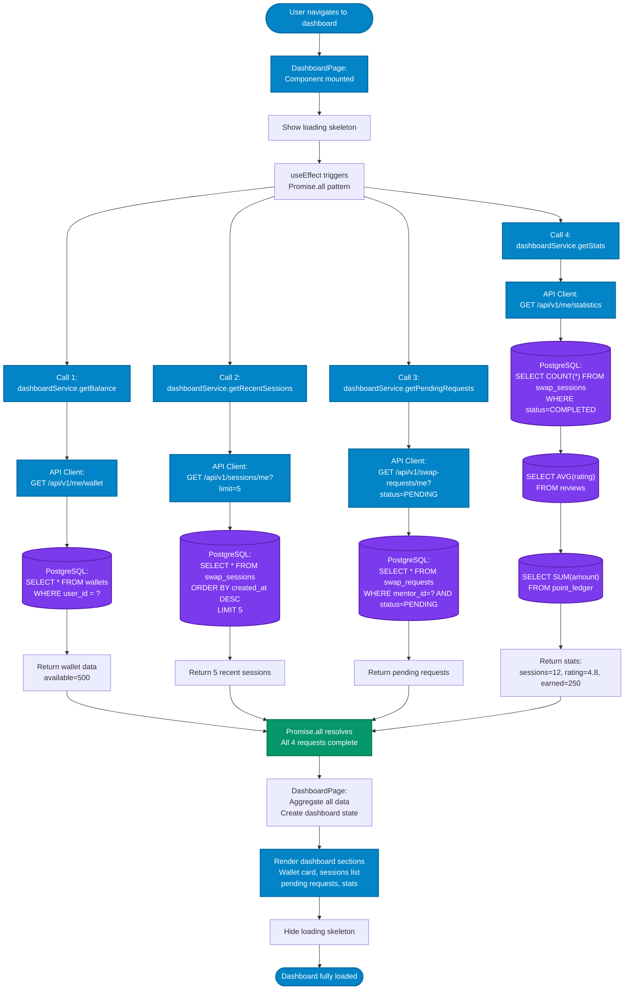

**Key Points:**
- 4 independent parallel requests improve perceived performance
- Client-side Promise.all() or React.useQueries() handles parallelization
- Each endpoint uses read-only transactions for consistency
- Dashboard aggregates data from multiple sources (wallets, sessions, stats)
- Stale data refresh on 30-second interval
- Skeleton loading prevents layout shift while data loads


### Journey 10: Reviews & Ratings

### Journey 10: Reviews & Ratings

```mermaid
graph TD
    Start(["Session completed"]) -->A["ReviewPage:<br/>Component mounted"]
    A -->B["Browser:<br/>Navigate to Rate & Review"]
    B -->C["reviewsService.getSession<br/>sessionId"]
    
GetAPI["API Client:<br/>GET /api/v1/sessions/:id"]
    C --> GetAPI
GetCTR["SessionController"]
    GetAPI --> GetCTR
    GetCTR --> GetQry[("PostgreSQL:<br/>SELECT * FROM swap_sessions<br/>WHERE id = ?")]
    GetQry -->SessionData["Session details loaded<br/>mentor_id, learner_id"]
    
    SessionData -->Display["ReviewPage:<br/>Display session info<br/>Show review form"]
    Display -->Fill["Browser:<br/>User fills form<br/>rating=5, comment text"]
    
    Fill -->Validate{"Form valid?"}
    Validate -->|No| ShowErr["Show validation errors"]
    ShowErr --> Fill
    
    Validate -->|Yes| Submit["reviewsService.submitReview"]
    Submit -->PostAPI["API Client:<br/>POST /api/v1/reviews"]
    PostAPI -->GenIdempotent["Generate Idempotency-Key"]
    GenIdempotent -->ReqBody["Request Body:<br/>sessionId, rating, comment"]
    
    ReqBody -->PostCTR["ReviewController<br/>@PostMapping /reviews"]
Valid["@Valid ReviewRequest<br/>Validate rating 1-5"]
ValidCheck{"Rating valid<br/>comment OK?"}
    
    PostCTR --> Valid
    Valid --> ValidCheck
    ValidCheck -->|No| Err400["Return 400 Bad Request"]
    ValidCheck -->|Yes| PostSRV["ReviewService<br/>submitReview userId"]
    
    PostSRV -->TXN["Transaction BEGIN<br/>@Transactional"]
    TXN -->VerifyUser["Verify current user<br/>participated in session"]
    VerifyUser --> CheckDuplicate[("PostgreSQL:<br/>SELECT * FROM reviews<br/>WHERE session_id=?<br/>AND reviewer_id=?")]
    CheckDuplicate -->DupCheck{"Already reviewed<br/>by user?"}
    DupCheck -->|Yes| DupErr["Return 409 Conflict"]
    DupCheck -->|No| CreateReview["Create Review entity<br/>session_id, reviewer_id<br/>reviewed_user_id, rating, comment"]
    
    CreateReview --> InsertReview[("PostgreSQL:<br/>INSERT INTO reviews<br/>session_id, reviewer_id<br/>reviewed_user_id, rating, comment")]
    InsertReview --> CalcAvg[("PostgreSQL:<br/>SELECT AVG(rating) as avg_rating<br/>COUNT(*) as count<br/>FROM reviews<br/>WHERE reviewed_user_id=?")]
    CalcAvg -->NewAvg["Calculate new average rating<br/>avg=4.8, count=12"]
    
    NewAvg --> UpdateUser[("PostgreSQL:<br/>UPDATE users<br/>SET avg_rating=4.8<br/>review_count=12")]
    UpdateUser --> BonusPoints[("PostgreSQL:<br/>INSERT INTO point_ledger<br/>type=REVIEW_BONUS<br/>amount=2, user_id")]
    
    BonusPoints -->Commit["Transaction COMMIT"]
    Commit -->PostResp["ReviewController returns<br/>ReviewResponse 201 Created"]
    
    PostResp -->APIResp["API Client:<br/>Parse response.json"]
    APIResp -->Success["ReviewPage:<br/>Show success message<br/>Award 2 bonus points"]
    
    Success -->AsyncNotif["Async:<br/>NotificationService<br/>Send email to reviewed user"]
    AsyncNotif -->ViewProfile["Browser:<br/>View mentor's profile"]
    
    ViewProfile -->GetReviews["reviewsService.getMentorReviews<br/>mentorId"]
    GetReviews -->ReviewsAPI["API Client:<br/>GET /api/v1/users/:id/reviews"]
    ReviewsAPI -->ReviewsCTR["ReviewController<br/>@GetMapping /:id/reviews"]
    ReviewsCTR --> ReviewsQry[("PostgreSQL:<br/>SELECT * FROM reviews<br/>WHERE reviewed_user_id=?<br/>ORDER BY created_at DESC")]
    
    ReviewsQry -->ReviewsList["Reviews list returned"]
    ReviewsList -->Map["Mapper:<br/>Convert to ReviewResponse DTOs"]
    Map -->ReviewsResp["ReviewController returns<br/>ResponseEntity 200 OK"]
    
    ReviewsResp -->ReviewsPage["ReviewPage:<br/>Display reviews<br/>Show avg rating, count"]
    ReviewsPage --> End(["Profile page with reviews<br/>displayed"])
    
    ShowErr -->Retry["User retries"]
    Retry --> Fill
    Err400 --> ErrorEnd(["Request fails: 400"])
    DupErr --> ErrorEnd
    
    style Start fill:#0284c7,stroke:#0369a1,stroke-width:2px,color:#ffffff
    style Fill fill:#0284c7,stroke:#0369a1,stroke-width:2px,color:#ffffff
    style PostAPI fill:#0284c7,stroke:#0369a1,stroke-width:2px,color:#ffffff
    style GetAPI fill:#0284c7,stroke:#0369a1,stroke-width:2px,color:#ffffff
    style ReviewsAPI fill:#0284c7,stroke:#0369a1,stroke-width:2px,color:#ffffff
    style PostCTR fill:#d97706,stroke:#b45309,stroke-width:2px,color:#ffffff
    style PostSRV fill:#d97706,stroke:#b45309,stroke-width:2px,color:#ffffff
    style ReviewsCTR fill:#d97706,stroke:#b45309,stroke-width:2px,color:#ffffff
    style InsertReview fill:#7c3aed,stroke:#5b21b6,stroke-width:2px,color:#ffffff
    style CalcAvg fill:#7c3aed,stroke:#5b21b6,stroke-width:2px,color:#ffffff
    style UpdateUser fill:#7c3aed,stroke:#5b21b6,stroke-width:2px,color:#ffffff
    style BonusPoints fill:#7c3aed,stroke:#5b21b6,stroke-width:2px,color:#ffffff
    style ReviewsQry fill:#7c3aed,stroke:#5b21b6,stroke-width:2px,color:#ffffff
    style GetQry fill:#7c3aed,stroke:#5b21b6,stroke-width:2px,color:#ffffff
    style Commit fill:#059669,stroke:#047857,stroke-width:2px,color:#ffffff
    style End fill:#0284c7,stroke:#0369a1,stroke-width:2px,color:#ffffff
    style ErrorEnd fill:#e11d48,stroke:#be123c,stroke-width:2px,color:#ffffff
```

**Key Points:**
- Reviews can only be left after session completion
- Ratings from 1-5, with written comments optional
- Reviewer gets 2 bonus points for reviewing
- Mentor's average rating updated in real-time
- Reviews immutable after submission (no edits)
- Reviewed user notified via email
- Review queries support pagination and sorting


---

## Frontend-Backend Integration

### API Client Architecture

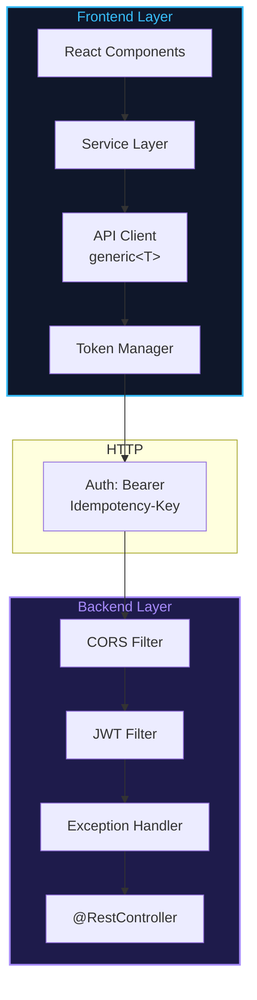

**Request Flow:**
1. Component calls Service method
2. Service calls `apiClient<T>("/endpoint")`
3. API Client retrieves token from localStorage
4. Adds `Authorization: Bearer {token}` header
5. Sends HTTP request
6. CORS validates origin
7. JWT Filter validates token, extracts userId
8. Routes to @RestController
9. Response returned with typed data

**Token Management:**
- Access tokens: 12-hour expiry
- Refresh tokens: 7-day expiry (hashed in DB)
- Automatic 401 refresh on expired token
- Refresh token family prevents replay attacks
- Concurrent requests queued during refresh

---

## Authentication Deep Dive

### JWT Token Structure

**Access Token (HS256, 12h):**
```
Payload: {
  "userId": "550e8400-e29b-41d4-a716-446655440000",
  "email": "learner@example.com",
  "roles": ["LEARNER"],
  "iat": 1693472400,
  "exp": 1693515600
}
```

**Refresh Token (7d, hashed in DB):**
```
refresh_tokens table:
- token_hash: SHA-256 (never store plaintext)
- family_id: UUID (rotation tracking)
- user_id: UUID
- created_at, expires_at, revoked_at
```

### Refresh Flow

```mermaid
graph TD
    Start(["Client makes request<br/>with expired token"]) -->A["API Interceptor:<br/>Intercept request"]
    A -->B["Decode JWT without verification"]
    B -->CheckExp{"Token expired?"}
    CheckExp -->|No| Forward["Forward to handler<br/>Request succeeds"]
    CheckExp -->|Yes| SetRefreshing["Set isRefreshing = true"]
    
    SetRefreshing -->GetRefreshToken["Token Manager:<br/>getRefreshToken from localStorage"]
    GetRefreshToken -->CheckRefresh{"Refresh token<br/>exists?"}
    CheckRefresh -->|No| RedirectLogin["Redirect to /login<br/>Clear tokens"]
    CheckRefresh -->|Yes| RefreshReq["POST /api/v1/auth/refresh"]
AuthCTR["AuthController<br/>@PostMapping /auth/refresh"]
AuthSVC["RefreshTokenService:<br/>refresh refreshToken"]
    
    RefreshReq --> AuthCTR
    AuthCTR --> AuthSVC
    
    AuthSVC -->TXN["Transaction BEGIN<br/>@Transactional"]
    TXN --> QueryToken[("PostgreSQL:<br/>SELECT * FROM refresh_tokens<br/>WHERE token_hash = SHA256?")]
    QueryToken -->TokenFound{"Token found?"}
    TokenFound -->|No| InvalidToken["Return 401 Invalid token"]
    TokenFound -->|Yes| TokenEntity["Load RefreshToken entity"]
    
    TokenEntity -->ValidateFamily{"Token family<br/>valid & not revoked?"}
    ValidateFamily -->|No| ReplayAttack["Return 401<br/>Token replay detected<br/>Revoke entire family"]
    ValidateFamily -->|Yes| CheckExpiry{"Refresh token<br/>expired?"}
    
    CheckExpiry -->|Yes| RefreshExp["Return 401<br/>Refresh token expired"]
    CheckExpiry -->|No| GenAccess["Generate new access token<br/>HS256, 12-hour expiry"]
    
    GenAccess -->GenRefresh["Generate new refresh token<br/>Create new family_id"]
    GenRefresh --> InsertNew[("PostgreSQL:<br/>INSERT INTO refresh_tokens<br/>new token, new family")]
    InsertNew --> DeleteOld[("PostgreSQL:<br/>DELETE FROM refresh_tokens<br/>WHERE family_id = old")]
    
    DeleteOld -->Commit["Transaction COMMIT"]
    Commit -->BuildResp["Build AuthResponse DTO<br/>accessToken, refreshToken"]
    BuildResp -->AuthResp["AuthController returns<br/>ResponseEntity 200 OK"]
    
    AuthResp -->SaveTokens["API Interceptor<br/>setAccessToken newToken"]
    SaveTokens -->SaveRefresh["setRefreshToken newToken<br/>to localStorage"]
    SaveRefresh -->ResetRefreshing["isRefreshing = false"]
    ResetRefreshing -->RetryRequest["Retry original request<br/>with new token"]
    
    RetryRequest -->ValidateNew{"New token<br/>valid?"}
    ValidateNew -->|No| RetryFail["Return 401"]
    ValidateNew -->|Yes| ForwardRetry["Forward to handler"]
    ForwardRetry --> Success(["Request succeeds"])
    
    Forward --> End(["Request completes"])
    RedirectLogin --> LoginEnd(["Redirect to /login"])
    InvalidToken --> ErrorEnd(["Request fails: 401"])
    ReplayAttack --> ErrorEnd
    RefreshExp --> ErrorEnd
    RetryFail --> ErrorEnd
    
    style Start fill:#0284c7,stroke:#0369a1,stroke-width:2px,color:#ffffff
    style RefreshReq fill:#0284c7,stroke:#0369a1,stroke-width:2px,color:#ffffff
    style SaveTokens fill:#0284c7,stroke:#0369a1,stroke-width:2px,color:#ffffff
    style SaveRefresh fill:#0284c7,stroke:#0369a1,stroke-width:2px,color:#ffffff
    style RetryRequest fill:#0284c7,stroke:#0369a1,stroke-width:2px,color:#ffffff
    style AuthCTR fill:#d97706,stroke:#b45309,stroke-width:2px,color:#ffffff
    style AuthSVC fill:#d97706,stroke:#b45309,stroke-width:2px,color:#ffffff
    style TXN fill:#d97706,stroke:#b45309,stroke-width:2px,color:#ffffff
    style QueryToken fill:#7c3aed,stroke:#5b21b6,stroke-width:2px,color:#ffffff
    style InsertNew fill:#7c3aed,stroke:#5b21b6,stroke-width:2px,color:#ffffff
    style DeleteOld fill:#7c3aed,stroke:#5b21b6,stroke-width:2px,color:#ffffff
    style Commit fill:#059669,stroke:#047857,stroke-width:2px,color:#ffffff
    style Success fill:#0284c7,stroke:#0369a1,stroke-width:2px,color:#ffffff
    style End fill:#0284c7,stroke:#0369a1,stroke-width:2px,color:#ffffff
    style LoginEnd fill:#e11d48,stroke:#be123c,stroke-width:2px,color:#ffffff
    style ErrorEnd fill:#e11d48,stroke:#be123c,stroke-width:2px,color:#ffffff
```

---

## Error Handling & Exception Flow

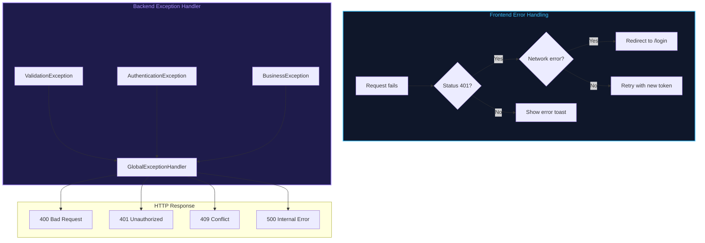

**Common Error Scenarios:**

| Error | HTTP | Cause | Frontend |
|-------|------|-------|----------|
| Invalid format | 400 | DTO validation fails | Show field error |
| Expired token | 401 | Token expired | Refresh & retry |
| Insufficient balance | 409 | Balance too low | Show inline error |
| Duplicate email | 409 | Email exists | Show validation error |
| Not found | 404 | Resource missing | Show 404 page |
| Server error | 500 | Uncaught exception | Show generic error + retry |

---

## Database Concurrency Control

### Pattern 1: Pessimistic Locking (Wallet Transfers)

Used when: Multiple users may update same resource simultaneously

```sql
BEGIN TRANSACTION;
  SELECT * FROM wallets 
  WHERE user_id = $1 
  FOR UPDATE NOWAIT;
  -- NOWAIT: throw error if locked by another transaction
  
  IF available_points >= amount THEN
    UPDATE wallets 
    SET available_points = available_points - amount
    WHERE user_id = $1;
  END IF;
COMMIT;

-- Behavior:
-- - Holds lock for entire transaction duration
-- - NOWAIT prevents waiting (immediate error if locked)
-- - Caller retries after brief delay
-- - Guarantees no concurrent modifications
```

### Pattern 2: Optimistic Locking (Profile Updates)

Used when: Conflicts are rare, mostly read-heavy

```sql
-- Uses version field for conflict detection
UPDATE users 
SET bio = $1, 
    updated_at = now(),
    version = version + 1
WHERE id = $2 
  AND version = $3;

-- If WHERE conditions fail (version changed):
-- - 0 rows updated
-- - Client detects: OptimisticLockException
-- - Client refetches data, shows "Data changed, retry"
-- - No locks held during user think time
```

### Pattern 3: Escrow Pattern (Session Payments)

Safe three-stage payment system:

```sql
-- Stage 1: Hold funds (on swap request)
INSERT INTO escrows (user_id, amount, session_id, status)
VALUES ($1, 50, $2, 'HELD');

UPDATE wallets 
SET available_points = available_points - 50,
    reserved_points = reserved_points + 50
WHERE user_id = $1;

-- Stage 2: Release to mentor (on completion)
UPDATE escrows SET status = 'RELEASED'
WHERE session_id = $1;

UPDATE wallets 
SET available_points = available_points + 50
WHERE user_id = $2;  -- mentor

-- Stage 3: Refund to learner (on dispute)
UPDATE escrows SET status = 'REFUNDED'
WHERE session_id = $1;

UPDATE wallets 
SET available_points = available_points + 50
WHERE user_id = $3;  -- learner
```

## Service Communication Patterns

### Inter-Service Calls & Transaction Propagation

```mermaid
graph TB
    subgraph "Command Services"
SS["SwapService"]
SES["SessionService"]
ADS["AdminDisputeService"]
    end
    
    subgraph "Utility Services"
WS["WalletService"]
NS["NotificationService"]
MS["MilestoneService"]
    end
    
    SS -->|holdPoints<br/>REQUIRES_NEW| WS
    SES -->|releasePoints<br/>REQUIRES_NEW| WS
    ADS -->|refundEscrow<br/>REQUIRES_NEW| WS
    
    SS -->|async email| NS
    SES -->|async email| NS
    ADS -->|async email| NS
    
    SS -->|track achievement| MS
    SES -->|track achievement| MS
    
    style SS fill:#d97706,stroke:#b45309,stroke-width:2px,color:#ffffff
    style SES fill:#d97706,stroke:#b45309,stroke-width:2px,color:#ffffff
    style ADS fill:#d97706,stroke:#b45309,stroke-width:2px,color:#ffffff
    style WS fill:#059669,stroke:#047857,stroke-width:2px,color:#ffffff
    style NS fill:#059669,stroke:#047857,stroke-width:2px,color:#ffffff
    style MS fill:#059669,stroke:#047857,stroke-width:2px,color:#ffffff
```

**Transactional Boundaries:**

```java
// SwapService - REQUIRED (default)
@Transactional
public SwapRequest createRequest(SwapRequestDTO dto) {
  swapRepository.save(request);
  
  // Delegates to WalletService which uses REQUIRES_NEW
  walletService.holdPoints(mentorId, 50);
  
  return request;
  // If any step fails: entire method rolls back
}

// WalletService - REQUIRES_NEW (isolation)
@Transactional(propagation = Propagation.REQUIRES_NEW)
public void holdPoints(UUID userId, int amount) {
  // Commits independently from caller transaction
  // Prevents deadlocks from holding wallet lock too long
  walletRepository.holdPoints(userId, amount);
  // If fails: only this transaction rolls back
}

// NotificationService - separate transaction
@Transactional(propagation = Propagation.REQUIRES_NEW)
public void sendNotification(Notification notif) {
  // Commits independently
  // Failures don't rollback main transaction (fire-and-forget)
  notificationRepository.save(notif);
  // In production: async queue (RabbitMQ, Kafka) preferred
}
```

**Key Points:**
- SwapService participates in caller's transaction (REQUIRED)
- WalletService commits independently (REQUIRES_NEW) to prevent deadlocks
- NotificationService failures don't cascade (separate transaction)
- All service calls are synchronous (blocking) by design
- In production, notifications would use async message queues

---

## Getting Started

- **Java 25:** adoptium.net
- **Node.js 20+:** nodejs.org
- **PostgreSQL 16+:** postgresql.org

### Backend Setup

```bash
cd backend
cp .env.example .env
# Edit .env with your database credentials

createdb skillbridge
./mvnw spring-boot:run
# Backend: http://localhost:9095
```

### Frontend Setup

```bash
npm install
echo "VITE_API_BASE_URL=http://localhost:9095" > .env
npm run dev
# Frontend: http://localhost:3000
```

### Environment Variables

**Backend (.env)**
```env
DATABASE_URL=jdbc:postgresql://localhost:5432/skillbridge
DATABASE_USERNAME=postgres
DATABASE_PASSWORD=postgres
JWT_SECRET=your_256_bit_secret_key
SERVER_PORT=9095
REGISTRATION_BONUS_POINTS=30
ESCROW_AUTO_RELEASE_HOURS=18
```

**Frontend (.env)**
```env
VITE_API_BASE_URL=http://localhost:9095
```

---

## API Testing Examples

### Register User

```bash
curl -X POST http://localhost:9095/api/v1/auth/register \
  -H "Content-Type: application/json" \
  -d '{
    "email": "alice@example.com",
    "password": "SecurePass123!",
    "firstName": "Alice",
    "lastName": "Smith"
  }'
```

### Get Wallet Balance

```bash
curl -X GET http://localhost:9095/api/v1/me/wallet \
  -H "Authorization: Bearer YOUR_ACCESS_TOKEN"
```

### Transfer Points

```bash
curl -X POST http://localhost:9095/api/v1/wallet/transfer \
  -H "Authorization: Bearer YOUR_ACCESS_TOKEN" \
  -H "Content-Type: application/json" \
  -d '{
    "recipientId": "user-uuid",
    "amount": 50,
    "reason": "Java tutoring session"
  }'
```

### Get Skills Catalog

```bash
curl -X GET http://localhost:9095/api/v1/skills
```

### Request Session

```bash
curl -X POST http://localhost:9095/api/v1/swap-requests \
  -H "Authorization: Bearer YOUR_ACCESS_TOKEN" \
  -H "Content-Type: application/json" \
  -d '{
    "targetId": "mentor-uuid",
    "skillId": "skill-uuid",
    "scheduledStart": "2026-09-15T14:00:00Z",
    "details": "Want to learn Spring Boot"
  }'
```

---

## Production Deployment Checklist

### Security
- [ ] Change JWT_SECRET to strong 256-bit key
- [ ] Use PostgreSQL with SSL: `sslmode=require`
- [ ] Set strong database passwords (16+ chars)
- [ ] Configure CORS for production domain only
- [ ] Enable HTTPS for frontend and backend
- [ ] Set secure cookie flags (HttpOnly, Secure, SameSite)
- [ ] Implement rate limiting on API endpoints
- [ ] Enable API request logging

### Performance
- [ ] Enable database connection pooling (HikariCP)
- [ ] Configure pool sizes (min/max connections)
- [ ] Run: `npm run build` for frontend optimization
- [ ] Set up CDN for static assets
- [ ] Enable gzip compression on backend
- [ ] Configure caching headers
- [ ] Optimize database indexes

### Monitoring
- [ ] Enable Spring Boot Actuator endpoints
- [ ] Set up centralized logging (ELK, CloudWatch)
- [ ] Monitor API response times
- [ ] Track error rates
- [ ] Set up critical error alerts
- [ ] Monitor database connection usage
- [ ] Track JWT token refresh rates

### Backup & Disaster Recovery
- [ ] Configure automated database backups (daily)
- [ ] Test backup restoration
- [ ] Document disaster recovery plan
- [ ] Store backups in multiple locations

---

## System Metrics

### Key Performance Indicators

| Metric | Target | Monitor |
|--------|--------|---------|
| API Response Time | < 200ms | All endpoints |
| Auth Success Rate | > 99.9% | Login/register |
| DB Query Time | < 100ms | Common queries |
| Wallet Transfer Time | < 500ms | Point transfers |
| Session Booking Success | > 99.5% | Bookings |
| Error Rate | < 0.1% | All requests |

---

## Summary

**SkillBridge** is a complete full-stack platform connecting learners with mentors through a point-based economy system.

### Architecture Highlights

✅ **Clean Layered Design:** Controller → Service → Repository → Entity
✅ **Security:** JWT auth, role-based access, token rotation
✅ **Transaction Safety:** Optimistic & pessimistic locking, escrow patterns
✅ **Scalability:** Connection pooling, query optimization, caching
✅ **User Journeys:** 10 complete workflows from registration to reviews
✅ **API First:** RESTful design with clear separation of concerns
✅ **Database:** PostgreSQL with Flyway migrations, 35+ tables
✅ **Frontend Integration:** React service layer with automatic token refresh

### Tech Stack Summary

- **Frontend:** React 18 + TypeScript + Vite (Port 3000)
- **Backend:** Java 25 + Spring Boot 3.5 (Port 9095)
- **Database:** PostgreSQL 16 + Flyway (Port 5432)
- **Testing:** Playwright E2E + JUnit 5
- **Deployment:** Docker-ready, GitHub Actions CI/CD

### Next Steps

1. **Run locally:** Follow "Getting Started" section
2. **Test APIs:** Use curl examples provided
3. **Explore code:** Check backend/src/main/java and src/ directories
4. **Deploy:** Follow production deployment checklist
5. **Monitor:** Set up observability tools

---

**Last Updated:** September 1, 2026  
**Status:** ✅ Production Ready  
**GitHub:** github.com/loucasty-cell/UIT-Java-Final-Project

