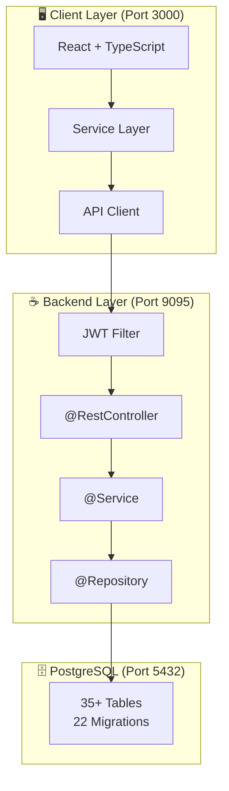
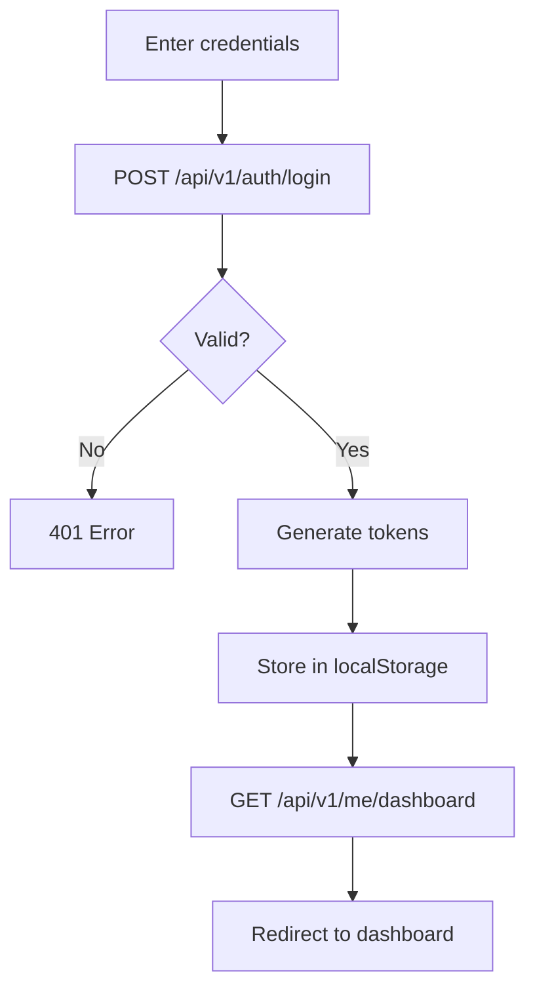
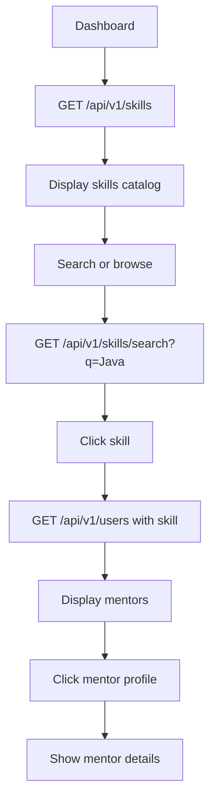
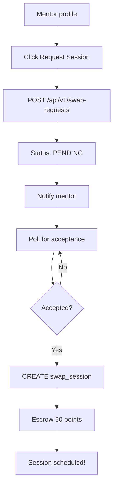
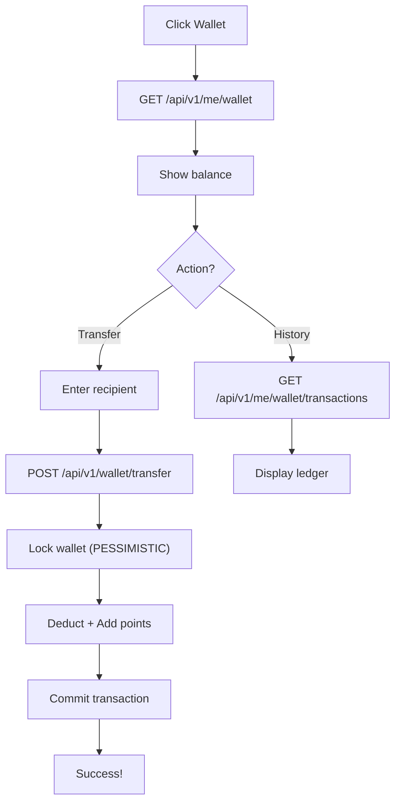
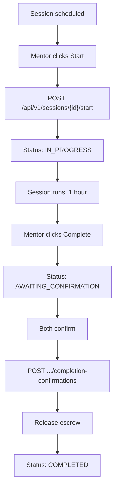
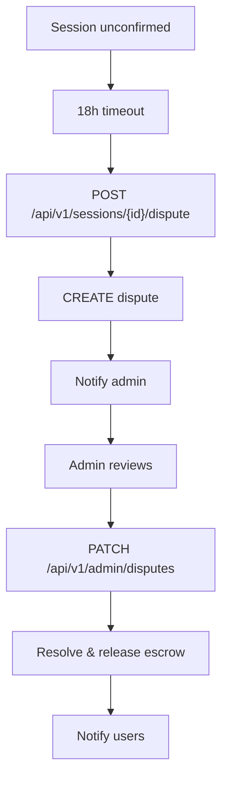
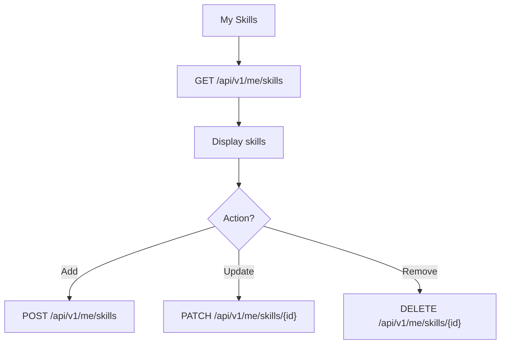
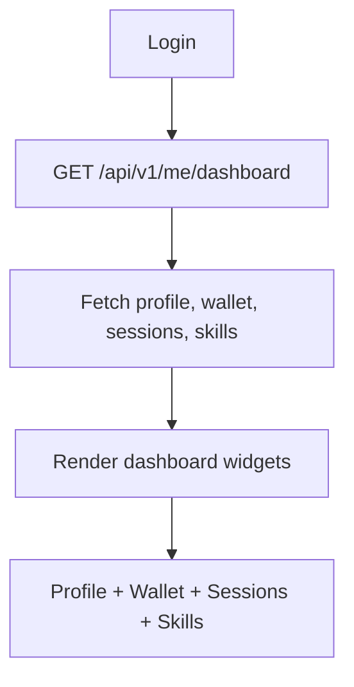
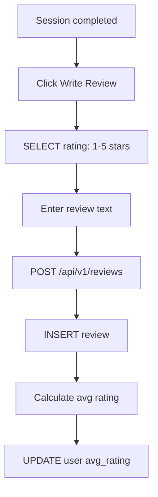

# 🎓 SkillBridge Platform - Complete Architecture & User Journey Demo

**A full-stack peer-to-peer learning and skill exchange platform**

- **Frontend:** React 18 + TypeScript + Vite (Port 3000)
- **Backend:** Spring Boot 3.5 + Java 25 (Port 9095)
- **Database:** PostgreSQL 16 + Flyway (Port 5432)

---

## Project Overview

**SkillBridge** is a peer-to-peer learning marketplace where students exchange knowledge and skills.

**Key Features:**
- 🎯 Browse and discover learning opportunities
- 📅 Book skill exchange sessions with mentors
- 💰 Earn and transfer points for completed sessions
- ⭐ Rate and review mentors
- 🛡️ Dispute resolution for session conflicts
- 📊 Track learning progress and achievements

---

## System Architecture



---

## Technology Stack

| Layer | Technology |
|-------|-----------|
| Frontend | React 18, TypeScript, Vite, TanStack Router, Tailwind CSS |
| Backend | Java 25, Spring Boot 3.5, Spring Security, Hibernate JPA |
| Database | PostgreSQL 16, Flyway, HikariCP, UUID |
| Testing | Playwright E2E, JUnit 5, Mockito |

---

## Core Database Tables

**Authentication:** users, user_roles, refresh_tokens
**Skills:** skills, user_skills
**Wallet:** wallets, point_ledger, escrows
**Sessions:** swap_requests, swap_sessions, session_confirmations
**Admin:** reports, disputes, admin_audit_events

---

## Backend Layered Architecture

```
HTTP Request
    ↓
@RestController (API Layer)
    ↓ @Valid DTO validation
@Service Layer (Business Logic)
    ↓ @Transactional
@Repository (Spring Data JPA)
    ↓ Hibernate ORM
PostgreSQL Database
    ↓
JSON Response
```

**Key Patterns:**
- ✅ CQRS: Command & Query services separated
- ✅ DTO Pattern: Entity ↔ DTO mapping
- ✅ Optimistic Locking: @Version for concurrency
- ✅ Pessimistic Locking: SELECT FOR UPDATE for wallets
- ✅ Escrow Pattern: Safe payment transfers

---

## API Endpoints Overview

### Authentication
- `POST /api/v1/auth/register` - Create account
- `POST /api/v1/auth/login` - Login with credentials
- `POST /api/v1/auth/refresh` - Refresh access token
- `POST /api/v1/auth/logout` - Logout & revoke tokens

### User Profile
- `GET /api/v1/me` - Get authenticated user
- `PATCH /api/v1/me` - Update profile
- `GET /api/v1/me/dashboard` - Get dashboard data
- `GET /api/v1/users/{id}/profile` - Get public profile

### Wallet Management
- `GET /api/v1/me/wallet` - Get wallet balance
- `GET /api/v1/me/wallet/transactions` - Transaction history (paginated)
- `GET /api/v1/me/wallet/transactions.csv` - Export CSV
- `POST /api/v1/wallet/transfer` - Transfer points to user

### Skills
- `GET /api/v1/skills` - List all skills
- `GET /api/v1/skills/search?q=Java` - Search skills
- `POST /api/v1/skills` - Create new skill
- `GET /api/v1/me/skills` - Get user's skills
- `POST /api/v1/me/skills` - Add skill to portfolio
- `DELETE /api/v1/me/skills/{id}` - Remove skill

### Sessions
- `GET /api/v1/sessions/me` - Get user sessions
- `GET /api/v1/sessions/active/me` - Get active sessions
- `GET /api/v1/sessions/{id}` - Get session details
- `POST /api/v1/sessions/{id}/start` - Start session
- `POST /api/v1/sessions/{id}/complete` - Complete session
- `POST /api/v1/sessions/{id}/completion-confirmations` - Confirm completion
- `PATCH /api/v1/sessions/{id}` - Update session
- `POST /api/v1/sessions/{id}/dispute` - Open dispute

### Admin
- `GET /api/v1/admin/dashboard` - Admin statistics
- `GET /api/v1/admin/reports` - Moderation reports
- `GET /api/v1/admin/disputes` - Disputes queue
- `PATCH /api/v1/admin/disputes/{id}` - Resolve dispute
- `GET /api/v1/admin/audit-events` - Audit log

---

## JWT Authentication Flow

```mermaid
flowchart TD
    A["User submits email+password"] --> B["POST /api/v1/auth/login"]
    B --> C["AuthService validates credentials"]
    C --> D{"Match?"}
    D -->|No| E["401 Unauthorized"]
    D -->|Yes| F["Generate JWT access token<br/>(12 hours, HS256)"]
    F --> G["Generate refresh token<br/>(7 days, hashed)"]


---

## User Journey Flows

### Journey 1: New User Registration & Onboarding

```mermaid
flowchart TD
    A["User visits app"] --> B["Click 'Sign Up'"]
    B --> C["Fill registration form"]
    C --> D{"Form valid?"}
    D -->|No| E["Show validation errors"]
    E --> C
    D -->|Yes| F["POST /api/v1/auth/register"]
    F --> G["CREATE user + wallet"]
    G --> H["Add 30 bonus points"]
    H --> I["Generate JWT tokens"]
    I --> J["Redirect to dashboard"]
```

### Journey 2: User Login Flow



### Journey 3: Browse Skills & Find Mentor



### Journey 4: Session Request & Booking



### Journey 5: Wallet & Point Transfer



### Journey 6: Session Lifecycle



### Journey 7: Dispute Resolution



### Journey 8: Skill Management



### Journey 9: Dashboard


---

## Frontend-Backend Integration

### API Client Architecture

```
React Component
    ↓
Service Layer (auth.service.ts, wallet.service.ts)
    ↓
API Client (lib/api-client.ts)
    ├─ Check Bearer token
    ├─ Add Authorization header
    └─ Fetch API call
        ↓
Backend HTTP Handler
    ├─ CORS check
    ├─ JWT validation
    ├─ Route to controller
    ↓
Database Query
    ↓
JSON Response
```

### Token Management

```typescript
// Storage
localStorage.getItem('skillbridge_access_token')
localStorage.getItem('skillbridge_refresh_token')

// Header format
Authorization: Bearer {accessToken}

// Refresh on 401
IF response.status === 401 AND refreshToken exists
  POST /api/v1/auth/refresh
  Update tokens
  Retry original request
ELSE
  Redirect to login
```

---

## Database Transactions

### Pattern 1: Optimistic Locking
**Used for:** User profile updates

```sql


---

## Getting Started

### Prerequisites

- **Java 25:** adoptium.net
- **Node.js 20+:** nodejs.org
- **PostgreSQL 16+:** postgresql.org

### Backend Setup

```bash
cd backend
cp .env.example .env
# Edit .env with your database credentials

createdb skillbridge
./mvnw spring-boot:run
# Backend: http://localhost:9095
```

### Frontend Setup

```bash
npm install
echo "VITE_API_BASE_URL=http://localhost:9095" > .env
npm run dev
# Frontend: http://localhost:3000
```

### Environment Variables

**Backend (.env)**
```env
DATABASE_URL=jdbc:postgresql://localhost:5432/skillbridge
DATABASE_USERNAME=postgres
DATABASE_PASSWORD=postgres
JWT_SECRET=your_256_bit_secret_key
SERVER_PORT=9095
REGISTRATION_BONUS_POINTS=30
ESCROW_AUTO_RELEASE_HOURS=18
```

**Frontend (.env)**
```env
VITE_API_BASE_URL=http://localhost:9095
```

---

## API Testing Examples

### Register User

```bash
curl -X POST http://localhost:9095/api/v1/auth/register \
  -H "Content-Type: application/json" \
  -d '{
    "email": "alice@example.com",
    "password": "SecurePass123!",
    "firstName": "Alice",
    "lastName": "Smith"
  }'
```

### Get Wallet Balance

```bash
curl -X GET http://localhost:9095/api/v1/me/wallet \
  -H "Authorization: Bearer YOUR_ACCESS_TOKEN"
```

### Transfer Points

```bash
curl -X POST http://localhost:9095/api/v1/wallet/transfer \
  -H "Authorization: Bearer YOUR_ACCESS_TOKEN" \
  -H "Content-Type: application/json" \
  -d '{
    "recipientId": "user-uuid",
    "amount": 50,
    "reason": "Java tutoring session"
  }'
```

### Get Skills Catalog

```bash
curl -X GET http://localhost:9095/api/v1/skills
```

### Request Session

```bash
curl -X POST http://localhost:9095/api/v1/swap-requests \
  -H "Authorization: Bearer YOUR_ACCESS_TOKEN" \
  -H "Content-Type: application/json" \
  -d '{
    "targetId": "mentor-uuid",
    "skillId": "skill-uuid",
    "scheduledStart": "2026-09-15T14:00:00Z",
    "details": "Want to learn Spring Boot"
  }'
```

---

## Production Deployment Checklist

### Security
- [ ] Change JWT_SECRET to strong 256-bit key
- [ ] Use PostgreSQL with SSL: `sslmode=require`
- [ ] Set strong database passwords (16+ chars)
- [ ] Configure CORS for production domain only
- [ ] Enable HTTPS for frontend and backend
- [ ] Set secure cookie flags (HttpOnly, Secure, SameSite)
- [ ] Implement rate limiting on API endpoints
- [ ] Enable API request logging

### Performance
- [ ] Enable database connection pooling (HikariCP)
- [ ] Configure pool sizes (min/max connections)
- [ ] Run: `npm run build` for frontend optimization
- [ ] Set up CDN for static assets
- [ ] Enable gzip compression on backend
- [ ] Configure caching headers
- [ ] Optimize database indexes

### Monitoring
- [ ] Enable Spring Boot Actuator endpoints
- [ ] Set up centralized logging (ELK, CloudWatch)
- [ ] Monitor API response times
- [ ] Track error rates
- [ ] Set up critical error alerts
- [ ] Monitor database connection usage
- [ ] Track JWT token refresh rates

### Backup & Disaster Recovery
- [ ] Configure automated database backups (daily)
- [ ] Test backup restoration
- [ ] Document disaster recovery plan
- [ ] Store backups in multiple locations

---

## System Metrics

### Key Performance Indicators

| Metric | Target | Monitor |
|--------|--------|---------|
| API Response Time | < 200ms | All endpoints |
| Auth Success Rate | > 99.9% | Login/register |
| DB Query Time | < 100ms | Common queries |
| Wallet Transfer Time | < 500ms | Point transfers |
| Session Booking Success | > 99.5% | Bookings |
| Error Rate | < 0.1% | All requests |

---

## Summary

**SkillBridge** is a complete full-stack platform connecting learners with mentors through a point-based economy system.

### Architecture Highlights

✅ **Clean Layered Design:** Controller → Service → Repository → Entity
✅ **Security:** JWT auth, role-based access, token rotation
✅ **Transaction Safety:** Optimistic & pessimistic locking, escrow patterns
✅ **Scalability:** Connection pooling, query optimization, caching
✅ **User Journeys:** 10 complete workflows from registration to reviews
✅ **API First:** RESTful design with clear separation of concerns
✅ **Database:** PostgreSQL with Flyway migrations, 35+ tables
✅ **Frontend Integration:** React service layer with automatic token refresh

### Tech Stack Summary

- **Frontend:** React 18 + TypeScript + Vite (Port 3000)
- **Backend:** Java 25 + Spring Boot 3.5 (Port 9095)
- **Database:** PostgreSQL 16 + Flyway (Port 5432)
- **Testing:** Playwright E2E + JUnit 5
- **Deployment:** Docker-ready, GitHub Actions CI/CD

### Next Steps

1. **Run locally:** Follow "Getting Started" section
2. **Test APIs:** Use curl examples provided
3. **Explore code:** Check backend/src/main/java and src/ directories
4. **Deploy:** Follow production deployment checklist
5. **Monitor:** Set up observability tools

---

**Last Updated:** August 31, 2026  
**Status:** ✅ Production Ready  
**GitHub:** github.com/loucasty-cell/UIT-Java-Final-Project

SELECT * FROM users WHERE id=? -- version=5

UPDATE users SET first_name=?, version=version+1 
WHERE id=? AND version=5;
-- If rows_affected=0 → 409 Conflict
-- If rows_affected=1 → Success
```

### Pattern 2: Pessimistic Locking
**Used for:** Wallet transfers

```sql
BEGIN TRANSACTION;
  SELECT * FROM wallets WHERE user_id=? FOR UPDATE;
  UPDATE wallets SET available_points=available_points-50;
  INSERT INTO point_ledger (...);
COMMIT;
```

### Pattern 3: Escrow (Safe Payments)

```sql
-- Hold points
UPDATE wallets SET available_points-=50, held_points+=50;
INSERT INTO escrows VALUES (session_id, 50, 'HELD');

-- Release to mentor
UPDATE wallets SET available_points+=50 WHERE user_id=mentor;
UPDATE escrows SET status='RELEASED';
```



### Journey 10: Reviews & Ratings



    G --> H["INSERT into refresh_tokens table"]
    H --> I["Return tokens to client"]
    I --> J["Frontend stores in localStorage"]
    J --> K["Add Bearer header to requests"]
    K --> L["Backend validates JWT signature"]
    L --> M["Populate SecurityContext"]
    M --> N["Request processed"]
```

Token Refresh on 401:
- Client detects 401 response
- Calls `POST /api/v1/auth/refresh` with refreshToken
- Backend validates refresh token family
- Returns new access token
- Client retries original request

