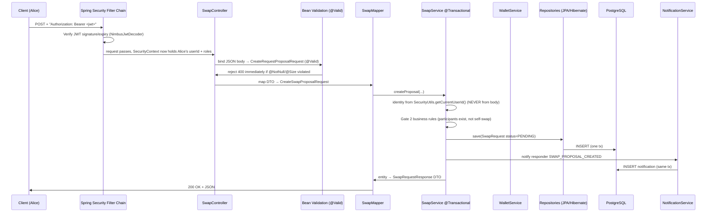
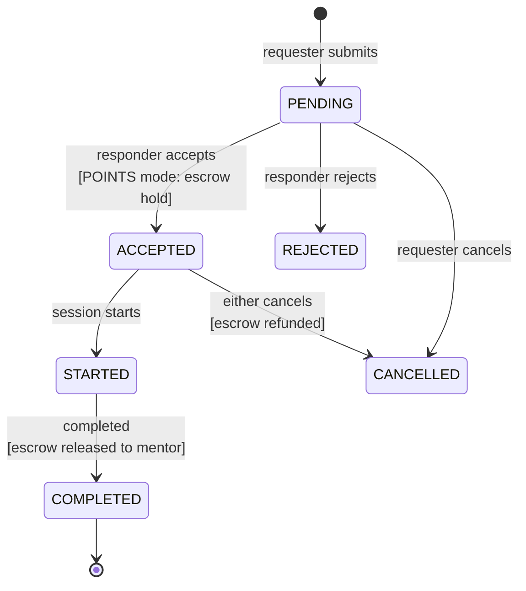

# SkillBridge — Project Overview

> **A guided tour of how data moves, transforms, and is protected inside this backend.**
> Written to be read top-to-bottom by a reviewer who has never seen the codebase — every technical term (DTO, ORM, JWT, escrow…) is explained inline the first time it appears.

---

## Table of Contents

1. [What Is SkillBridge?](#1-what-is-skillbridge)
2. [The Tech Stack — What Each Tool Does and Why It Is Here](#2-the-tech-stack--what-each-tool-does-and-why-it-is-here)
3. [Architecture — Package-by-Feature, Layered](#3-architecture--package-by-feature-layered)
4. **[The Life of a Request — "How It Cooks"](#4-the-life-of-a-request--how-it-cooks)** ← start here if you read only one section
5. [Validation — The Three Gates](#5-validation--the-three-gates)
6. [Database Schema (Flyway V1 → V8)](#6-database-schema-flyway-v1--v8)
7. [Core Business Workflows](#7-core-business-workflows)
8. [REST API Reference](#8-rest-api-reference)
9. [Security Model](#9-security-model)
10. [Error Handling](#10-error-handling)
11. [Testing & CI](#11-testing--ci)
12. [Running It Locally](#12-running-it-locally)

---

## 1. What Is SkillBridge?

SkillBridge is a **peer-to-peer skill-exchange platform for students**. Instead of money, the currency is **points**:

- Every new user receives a starter grant of points (default: 50) in a personal **wallet**.
- A student who wants to learn something posts a **swap proposal**: *"I'll teach you guitar if you teach me Python"* (**SKILL_SWAP** mode), or *"I'll pay you 20 points to teach me Excel"* (**POINTS** mode), or offer free community coaching (**VOLUNTEER** mode).
- When a POINTS proposal is accepted, the platform **locks the buyer's points in escrow** — a neutral holding area, like a deposit at an auction house. The points are released to the teacher when the session completes, or refunded if the deal falls through.
- After a session, both sides leave a **1–5 star review**, which feeds each mentor's public rating.
- A **forum** lets students ask questions; post authors can mark one answer as *Helpful*, instantly paying that answer's author a small point bounty.
- **Admins/moderators** handle abuse reports, warnings, account bans, disputed escrows, and platform-wide settings.

Everything above is served by one Spring Boot backend exposing a JSON REST API.

---

## 2. The Tech Stack — What Each Tool Does and Why It Is Here

| Technology | Version | What it is (plain English) | Why this project uses it |
|---|---|---|---|
| **Java** | 25 LTS | The programming language. Records, pattern matching, and virtual threads are available. | Course requirement + modern language features |
| **Spring Boot** | 3.5.16 | An application framework that wires everything together ("inversion of control") and embeds a web server so no separate Tomcat install is needed. | Industry-standard backend framework |
| **spring-boot-starter-web** | managed | Provides **Spring MVC** — the machinery that turns annotated Java methods into HTTP endpoints and serializes Java objects to JSON (via Jackson). | This is what makes REST possible |
| **spring-boot-starter-data-jpa** | managed | **JPA = Java Persistence API**, with **Hibernate** as its implementation. An **ORM (Object-Relational Mapper)** maps Java classes ↔ database tables so we write `repository.findById(id)` instead of raw SQL. | Type-safe persistence without hand-written SQL for every query |
| **PostgreSQL** | 17 (or Neon serverless) | Relational database. | ACID transactions matter here — points must never vanish mid-transfer |
| **Flyway** | managed | **Database migration tool**: schema changes are versioned `.sql` files (`V1`, `V2`, …) applied in order on startup. Everyone's DB evolves identically. | Reproducible schema across dev machines and CI |
| **Spring Security + OAuth2 Resource Server** | 6.x | Security framework. "Resource server" means: this API holds resources, callers prove identity with a **JWT** token. | Stateless auth — the server keeps no login sessions |
| **spring-security-crypto** | managed | Hashing utilities (`BCryptPasswordEncoder`). | Passwords are stored hashed, never in plain text |
| **spring-boot-starter-validation** | managed | **Bean Validation (Jakarta Validation)** — declarative rules like `@NotNull` on request fields. | First line of input defense |
| **SpringDoc OpenAPI** | 2.6.0 | Auto-generates OpenAPI 3 docs + **Swagger UI** from controller annotations. | Self-documenting API, testable in browser at `/swagger-ui.html` |
| **Lombok** | 1.18.46 | Compile-time code generator: `@Data`, `@RequiredArgsConstructor` remove getter/constructor boilerplate. | Less noise, pinned version because older Lombok breaks on JDK 25 |
| **Actuator** | managed | Operational endpoints (`/actuator/health`). | Health checks for deployment platforms |
| **HikariCP** | bundled w/ Boot | JDBC **connection pool** (reuses DB connections instead of opening one per request). Max pool size configured to 5. | Performance + bounded resource use |
| **JUnit 5 / AssertJ / MockMvc / Testcontainers** | managed | Testing stack: unit tests, fluent assertions, lightweight HTTP-controller tests, and throwaway Dockerized databases for integration tests. | Tests run against real PostgreSQL behavior |
| **Maven Wrapper (`mvnw`)** | 3.9.x | Build tool + wrapper so anyone builds with the exact same Maven version. | Deterministic builds, no local install needed |
| **GitHub Actions** | CI | Runs `mvnw -B test` on every push/PR (`.github/workflows/ci.yml`). | Continuous verification |

**Configuration** lives in `src/main/resources/application.yml`; secrets come from environment variables (see `.env.example`) — `JWT_SECRET`, `DATABASE_URL`, `SERVER_PORT` (default **9095**), `FRONTEND_ORIGINS`, etc. Nothing secret is committed.

---

## 3. Architecture — Package-by-Feature, Layered

*Term check:* most tutorials show a single flat stack (`controller → service → repository`). This project instead groups **by business feature**, and inside each feature keeps clean **layers**. Both ideas combined:

```text
com.skillbridge
├── auth/            # registration, login, JWT issuance, refresh-token rotation, logout
├── user/            # profile, dashboard, account state
├── skill/           # skill catalog & search
├── mentor/          # mentor offerings & availability
├── request/         # friendly facade over swap proposals (thin adapter)
├── swap/            # proposal state machine + session creation + escrow orchestration
├── session/         # session scheduling, start/complete lifecycle
├── review/          # ratings after completed sessions
├── notification/    # event-driven in-app notifications
├── forum/           # posts, comments, likes, helpful-answer bounty
├── moderation/      # user-facing reports
├── admin/           # disputes, warnings, bans, audit log, platform settings
├── wallet/          # THE money module: balances, ledger, escrow
└── shared/          # SecurityConfig, SecurityUtils, GlobalExceptionHandler, enums
```

Each feature folder has the same internal shape — this is the **layered** part:

```text
feature/
├── api/
│   ├── controller/   # HTTP layer: reads request, delegates, returns response
│   ├── dto/request/  # shapes of incoming JSON (with validation rules)
│   ├── dto/response/ # shapes of outgoing JSON (never leaks entities)
│   └── mapper/       # converts DTO ⇄ entity
├── application/
│   ├── command/      # services that CHANGE state (write side)
│   └── query/        # services that only READ state
├── domain/
│   ├── entity/       # JPA-mapped classes = database tables
│   └── model/        # enums & value objects (statuses, types)
└── infrastructure/
    └── persistence/  # Spring Data JPA repository interfaces
```

**Why layers?** Each ring only talks to its neighbors:
- Controllers never touch repositories directly.
- Entities never escape to the network — only DTOs do.
- Cross-feature calls go through services (`SwapService` calls `WalletService`), never through another feature's repository.

This is the **CQS-flavored split** (`command` vs `query` packages): writes are transactional and rule-heavy; reads are optimized and side-effect free (`@Transactional(readOnly = true)`).

---

## 4. The Life of a Request — "How It Cooks"

Let's follow a real request through every stage. Scenario:

> Alice wants Bob to teach her Python. She sends:
> `POST /api/swaps/proposals` with body `{ "responderId": "<bob>", "offeredSkillId": "...", "requestedSkillId": "...", "pointCost": 0, "message": "Trade?" }`

*(Term: **DTO — Data Transfer Object**. A simple Java class whose only job is to mirror the JSON crossing the network. It is NOT the database object — keeping them separate means clients can never accidentally read/write internal fields.)*

### Stage-by-stage trace



1. **Security filter chain** (`shared/security/SecurityConfig.java`) runs *before* any controller.
   - CORS preflight handled first (allowed origins from `FRONTEND_ORIGINS`).
   - CSRF disabled — safe because there are **no cookies/sessions**; every call must carry its own token.
   - Session policy is `STATELESS`: the server creates no `HttpSession`.
   - Public routes (`/api/v1/auth/**`, `/actuator/health`, Swagger) are `permitAll()`; everything else requires a valid **JWT** (*JSON Web Token — a signed string containing the user id and roles; the signature proves it wasn't forged*).
   - `NimbusJwtDecoder` verifies the HMAC-SHA256 signature against `JWT_SECRET`; a converter turns the `roles` claim into Spring authorities used by `@PreAuthorize`.

2. **Controller** (`SwapController`) — thin by design: map inputs, delegate to service, return DTO. No business logic lives here.

3. **Bean Validation** (`@Valid` on the parameter) triggers Jakarta Validation before the method body runs. If `responderId` were null, execution stops with **400 Bad Request** — the controller body never even executes.

4. **Mapper** converts between DTO world and entity world. Mapping is explicit and centralized per feature (`api/mapper/*`), so field-level mistakes are visible in exactly one place.

5. **Service** (`SwapService`, annotated `@Service @Transactional`) is where the cooking really happens:
   - **Identity comes from the token**, not the body: `SecurityUtils.getCurrentUserId()`. A client can never impersonate someone else by posting a fake ID.
   - Business rules checked in order: participants exist and differ, skills exist, point cost ≥ 0 and affordable.
   - State machine enforced: e.g., accepting requires `status == PENDING`, otherwise `IllegalStateException` → 400.

6. **Repository layer** — Spring Data JPA interfaces (`SwapRequestRepository extends JpaRepository<...>`). Method names like `findByResponderIdAndStatusOrderByCreatedAtDesc(...)` are parsed by Spring into SQL automatically. Hibernate generates the INSERT inside the open transaction.

7. **Same-transaction side effects**: `NotificationService.notifySwapProposalUpdate(...)` inserts a notification row **within the same database transaction** — either the proposal AND its notification both persist, or neither does. That atomicity is the whole reason services are `@Transactional`.

8. **Response**: the saved entity is mapped back to `SwapRequestResponse` (no `password_hash`, no `version` internals) and Spring's HttpMessageConverter (Jackson) serializes it to JSON with HTTP 200.

### The write path for points-mode acceptance (the money moment)

When Bob accepts a POINTS proposal, `SwapService.acceptProposal` does all of this in **one transaction**:

1. Verify caller == responder and status == PENDING.
2. Call `WalletService.holdPoints(requesterId, responderId, cost, ...)`:
   - **Replay guard** — ledger lookup on the idempotency key (`"SWAP_HOLD:" + requestId`). Already processed? Silently return.
   - **Pessimistically lock** the requester's wallet row (`SELECT ... FOR UPDATE`) so two concurrent accepts cannot double-spend.
   - Check `available_points >= amount`, then move amount `available_points → held_points`.
   - Insert an `escrows` row with `status = HELD`.
   - Append an immutable `point_ledger` row recording deltas and resulting balances.
3. Set `swapRequest.status = ACCEPTED`, `points_held = true`.
4. Create the 1-to-1 `SwapSession` (status `ACCEPTED`).
5. Notify Alice.

If step 4 fails, the whole transaction rolls back — including the wallet mutation. **No points are ever lost halfway.**

*(Terms: **Escrow** = funds parked in a neutral bucket until conditions are met. **Idempotency key** = unique tag making retries safe — replaying the same operation twice changes nothing. **Optimistic locking** = the `version BIGINT` column on entities; Hibernate refuses to overwrite a row that changed since we read it, throwing `ObjectOptimisticLockingFailureException`.)*

---

## 5. Validation — The Three Gates

Data is defended at three independent layers — *defense in depth*. If one gate misses something, the next catches it.

### Gate 1 — Bean Validation (shape of the input)

Jakarta annotations on request DTOs, activated by `@Valid` in controllers:

```java
// request/api/dto/request/CreateRequestProposalRequest.java
@NotNull private UUID responderId;
@NotNull private UUID offeredSkillId;
@NotNull private UUID requestedSkillId;
@Min(0)  private Integer pointCost = 0;
@Size(max = 1000) private String message;
```

Failure ⇒ automatic **400** with structured details (see §10).

### Gate 2 — Service-level business rules (meaning of the input)

Examples straight from the code:

| Rule | Where | Failure result |
|---|---|---|
| Acting user derived from JWT, never from payload | `SecurityUtils.getCurrentUserId()` everywhere | spoof impossible |
| Requester ≠ responder, both users must exist | `SwapService.validateParticipants` | 400 |
| Skills must exist in catalog | `SwapService.validateSkill` | 400 |
| Sufficient available balance before proposing/holding points | `validatePointCost`, `WalletService.holdPoints` | 400 |
| Only PENDING proposals can be accepted/rejected; only PENDING/ACCEPTED cancelled | `requireStatus` guards (the state machine) | 400 |
| Only the responder may accept/reject; only participants may view/complete sessions | `requireParticipant` → throws `AccessDeniedException` | **403** |
| Reviewer must be a session participant; cannot review themselves; one review per session per reviewer | `ReviewService` + DB constraint below | 400/409 |

### Gate 3 — Database constraints (last line of truth)

Even a bug in Java cannot corrupt these:

```sql
CHECK (rating BETWEEN 1 AND 5)                          -- reviews
CONSTRAINT uq_reviews_session_reviewer UNIQUE (session_id, reviewer_id)  -- one review per session
CHECK (available_points >= 0) CHECK (held_points >= 0)  -- wallets can't go negative
UNIQUE (post_id, user_id)                               -- forum_likes: one like per user
idempotency_key VARCHAR(200) UNIQUE                     -- point_ledger: replay-proof
email VARCHAR(255) UNIQUE, FK ON DELETE CASCADE chains  -- users / roles / tokens
```

Note the belt-and-braces: the one-review-per-session rule exists in **both** the service (friendly error) and the schema (hard guarantee). `ddl-auto: validate` in `application.yml` makes Hibernate verify entity mappings match the Flyway-built schema at boot — entities and DDL can silently drift apart otherwise.

---

## 6. Database Schema (Flyway V1 → V8)

Schema is owned entirely by Flyway scripts in `src/main/resources/db/migration/`. On startup they apply in version order; checksums prevent tampering.

| Migration | Tables created / changed |
|---|---|
| `V1__init_schema.sql` | `users`, `user_roles`, `refresh_tokens` |
| `V2__mentor_and_forum_schema.sql` | `mentor_offerings`, `forum_posts`, `forum_comments` |
| `V3__forum_likes.sql` | `forum_likes` (+ uniqueness) |
| `V4__admin_and_moderation_schema.sql` | `reports`, `account_warnings`, `disputes`, `platform_settings` (seeded defaults), `admin_audit_events` |
| `V4.1__create_skills_table.sql` | `skills` catalog |
| `V5__user_profile_and_wallet_schema.sql` | profile columns on `users`; `wallets`, `point_ledger`, `escrows` |
| `V6__swap_request_session_schema.sql` | `swap_requests`, `swap_sessions` |
| `V7__reviews_schema.sql` | `reviews` |
| `V8__notifications_schema.sql` | `notifications` |

**20 tables total.** Conventions used throughout: UUID primary keys, `TIMESTAMP WITH TIME ZONE` (UTC-safe instants), `version BIGINT` optimistic-lock columns on mutable aggregates, composite indexes tuned to actual access patterns (`(user_id, created_at DESC)` for history queries).

### Entity-relationship overview

```mermaid
erDiagram
    users ||--o{ user_roles : has
    users ||--o{ refresh_tokens : authenticates-with
    users ||--|| wallets : owns
    wallets ||--o{ point_ledger : appends
    users ||--o{ escrows : party-to
    users ||--o{ swap_requests : requests/responds
    skills ||--o{ swap_requests : offered-and-requested
    swap_requests ||--|| swap_sessions : becomes
    swap_sessions ||--o{ reviews : rated-by
    users ||--o{ reviews : writes-and-receives
    users ||--o{ forum_posts : authors
    forum_posts ||--o{ forum_comments : contains
    forum_posts ||--o{ forum_likes : upvoted-by
    users ||--o{ notifications : receives
    users ||--o{ reports : files
    users ||--o{ account_warnings : sanctioned
    swap_sessions ||--o{ disputes : flagged-by
    admin_audit_events }o--|| users : performed-by
    users ||--o{ mentor_offerings : teaches
```

### Key tables, column highlights

**Identity & auth**
- `users` — `email` (unique), `password_hash` (BCrypt), `status` (ACTIVE/SUSPENDED/BANNED), plus V5 profile fields (`display_name`, `major`, `year_of_study`, `bio`, `timezone`, `avatar_object_key`).
- `user_roles` — join table `(user_id, role)` PK; roles like `ROLE_USER`, `ROLE_ADMIN`.
- `refresh_tokens` — stores only a **hash** of each refresh token, plus `family_id` (rotation family), `expires_at`, `revoked` flag.

**Money**
- `wallets` — one per user (`user_id UNIQUE`): `available_points`, `held_points` (both `>= 0` by CHECK), lifetime `total_earned`/`total_spent`. Balances are server-owned numbers; clients can only read them.
- `point_ledger` — **append-only audit trail**; every balance change writes exactly one row with `available_delta`, `held_delta`, `balance_after_*`, polymorphic `reference_type/reference_id`, and a globally `UNIQUE idempotency_key`. Balances can always be re-derived by replaying the ledger.
- `escrows` — one row per held payment: `learner_id`, `mentor_id`, `amount > 0`, `status` (`HELD` → `RELEASED`/`REFUNDED`).

**Exchange**
- `swap_requests` — the negotiation record: both parties, both skills, `point_cost >= 0`, `points_held` flag, `status`, timestamped transitions, `message`.
- `swap_sessions` — created atomically upon acceptance (`swap_request_id UNIQUE` ⇒ exactly 0-or-1 session per accepted deal); carries `scheduled_at`, `duration_minutes`, `meeting_url` (only visible to participants via API), `notes`, `status`.
- `reviews` — `rating 1..5`, optional feedback, `UNIQUE(session_id, reviewer_id)`.

**Community & governance**
- `forum_posts` / `forum_comments` — denormalized counters (`like_count`, `comment_count`) kept consistent transactionally.
- `forum_likes` — `UNIQUE(post_id, user_id)` makes double-like impossible.
- `notifications` — `type`, `title`, `message`, nullable `reference_type/reference_id`, `read_at` (null = unread); indexed `(user_id, created_at DESC)` and `(user_id, read_at)`.
- `reports`, `account_warnings`, `disputes`, `admin_audit_events` — moderation trail; every admin action lands in the immutable audit table with before/after summaries.
- `platform_settings` — single seeded row controlling `registration_bonus` (50), `forum_contribution_reward` (5), `escrow_release_hours` (18). Admin-editable; services read values from here rather than hard-coding them.

---

## 7. Core Business Workflows

### 7.1 Atomic registration

`POST /api/v1/auth/register` performs, in one transaction:

1. Validate email uniqueness; BCrypt-hash the password.
2. Insert `users` row.
3. Assign default role (`user_roles`).
4. `WalletService.createWalletForRegistration` → zeroed wallet.
5. `WalletService.awardOnce("REG:" + userId)` → +registration bonus points, ledger entry, idempotency-key guarded (a retry can never double-grant).
6. Issue access JWT + initial refresh-token family.

### 7.2 Proposal state machine (the heart of the app)



Enforcement pattern (same in every transition method):

```java
requireParticipant(swapRequest, currentUserId, /*responderOnly*/ true,
                   "Only the responder can accept this proposal");
requireStatus(swapRequest, SwapRequestStatus.PENDING,
              "Only pending swap proposals can be accepted");
```

Three modes ride on the same machine: **POINTS** (>0 cost → escrow engaged), **SKILL_SWAP** (mutual teaching, 0 points), **VOLUNTEER** (free coaching, 0 points).

### 7.3 Escrow cycle

| Event | Wallet effect | Ledger | Escrow row |
|---|---|---|---|
| Accept (POINTS) | requester: `available −X`, `held +X` | `SWAP_HOLD:{id}` | created `HELD` |
| Complete session | mentor: `available +X`; requester: `held −X` | `SWAP_RELEASE:{id}` | `RELEASED` |
| Cancel / refund | requester: `held −X`, `available +X` | `SWAP_REFUND:{id}` | `REFUNDED` |

All mutations funnel through `WalletService` — the **single financial mutation boundary** — which guarantees atomicity (one transaction), idempotency (unique keys), and serialized wallet updates (pessimistic lock).

### 7.4 Sessions, reviews, ratings

Acceptance auto-creates the session. Only the two participants may see meeting details, patch schedule/URL, or transition `STARTED → COMPLETED`. Completion releases escrow and fires notifications. Reviews are then allowed; submitting recalculates the reviewee's rolling average rating surfaced on profiles/dashboards.

### 7.5 Notification engine

`NotificationService.notify*` methods are invoked from within the triggering service's transaction — proposal created/accepted/rejected/cancelled, session started/completed, forum activity. Consumers get newest-first lists, unread counting via index, mark-read, and delete endpoints, all ownership-checked against the JWT identity.

### 7.6 Forum helpful-bounty

One `PUT`/`DELETE` toggle per user per post (`forum_likes` uniqueness). Post author marks exactly one comment Helpful → `ForumRewardService` pays `+platform_settings.forum_contribution_reward` points through `awardOnce("FORUM_HELPFUL:" + commentId)` — again replay-proof.

---

## 8. REST API Reference

Conventions: JSON bodies, Bearer-JWT required except where noted, errors as RFC 9457 ProblemDetail. Full interactive docs: `/swagger-ui.html`.

**Auth** (`AuthController`)
| Method | Path | Notes |
|---|---|---|
| POST | `/api/v1/auth/register` | public · creates user+wallet+bonus, returns tokens |
| POST | `/api/v1/auth/login` | public · returns access JWT + refresh token |
| POST | `/api/v1/auth/refresh` | rotates refresh token within family |
| POST | `/api/v1/auth/logout` | revokes entire token family |

**Profile & dashboard** (`ProfileController`, `DashboardController`)
| GET/PATCH | `/api/v1/me` | read/update own profile |
| GET | `/api/v1/me/dashboard` | aggregated personal stats |

**Skills** (`SkillController`) — `GET /api/skills`, `GET /api/skills/{id}`, `GET /api/skills/search?q=`, `POST /api/skills`

**Swaps** (`SwapController`, `RequestController`)
| POST | `/api/swaps/proposals` | create proposal |
| POST | `/api/swaps/proposals/{id}/accept` \| `/reject` | responder actions |
| POST | `/api/swaps/sessions/{sessionId}/complete` | release escrow |
| GET | `/api/swaps/history/me` | own history |
| POST | `/api/requests/swaps/{id}/accept`\|`/reject`\|`/cancel` | facade aliases |
| GET | `/api/requests/swaps/history/me`, `/api/requests/swaps/pending/incoming` | inbox views |

**Sessions** (`SessionController`) — `GET /api/sessions/active/me`, `POST .../{sessionId}/start`, `POST .../{sessionId}/complete`, `PATCH .../{sessionId}` (schedule/URL/notes)

**Reviews** (`ReviewController`) — `POST /api/reviews/sessions/{sessionId}`

**Wallet** (`WalletController`) — `GET /api/v1/me/wallet`, `GET /api/v1/me/wallet/transactions`, `GET /api/v1/me/wallet/transactions.csv`

**Forum** (`ForumPostController`, `ForumCommentController`, `ForumLikeController`, `ForumRewardController`) — CRUD on `/api/v1/forum/posts(/comments)`, `PUT|DELETE /api/v1/forum/posts/{postId}/like`, `POST /api/v1/forum/comments/{commentId}/mark-helpful`, `GET /api/v1/forum/top-volunteers`

**Notifications** (`NotificationController`) — `GET /api/notifications/me`, `POST .../{notificationId}/read`, `DELETE .../{notificationId}`

**Moderation** (`ModerationController`) — `POST|GET /api/moderation/reports`, `POST /api/moderation/reports/{reportId}/resolve`

**Admin** (`AdminUserController`, `AdminReportController`, `AdminDisputeController`, `AdminSettingsController`, `AdminDashboardController`, `AdminAuditController`) under `/api/v1/admin/**` — wallet adjustments (audited), warnings, account status, report triage/dismiss/remove-content, dispute resolution, platform settings PATCH, metrics, audit-log browsing. Role-gated with `@PreAuthorize`.

**Mentor offerings** (`MentorOfferingController`) — CRUD on `/api/v1/me/mentor-offerings`; browse mentors via `GET /api/v1/mentors...`

---

## 9. Security Model

1. **Stateless JWT authentication.** Login/register mint a short-ish access JWT (`ACCESS_TOKEN_MINUTES`, default 12h) signed HMAC-SHA256 with `JWT_SECRET`. No server-side session state for API calls — horizontal scaling is trivial.
2. **Refresh-token rotation with reuse detection.** Refresh tokens live in `refresh_tokens` (hashed!), grouped in `family_id` (one family per device/login). Rotation marks the old token revoked; presenting an already-revoked token is treated as theft — the **entire family is revoked** and access denied. Logout revokes the family too.
3. **Server-derived identity.** Every "me" decision uses `SecurityUtils.getCurrentUserId()` from the authenticated principal. Client-supplied user IDs in bodies are treated as *data* (e.g., "who I'm proposing to"), never as *identity*.
4. **Ownership checks in services.** Beyond URL authorization, services re-verify entity relationships (`session.requesterId == me || session.responderId == me`) before revealing meeting URLs or allowing mutations → 403 via `AccessDeniedException`.
5. **RBAC.** Roles claim in the JWT → `GrantedAuthorities` → `@PreAuthorize("hasRole('ADMIN')")` style guards on admin controllers; `ROLE_USER` vs `ROLE_ADMIN` in `user_roles`.
6. **Password storage.** BCrypt hashes (salted, deliberately slow) — plaintext never persisted or logged.
7. **Transport/CORS.** CORS allow-list from `FRONTEND_ORIGINS`; CSRF off (no cookie auth); Hikari credentials and JWT secret injected via environment variables.

---

## 10. Error Handling

All failures surface as **RFC 9457 Problem Detail** JSON (`application/problem+json`) from `shared/error/GlobalExceptionHandler.java` (`@RestControllerAdvice`):

| Exception | HTTP | Code |
|---|---|---|
| `MethodArgumentNotValidException` (Gate 1) | 400 | `VALIDATION_FAILED` + per-field `fieldErrors` map |
| `IllegalArgumentException` / `IllegalStateException` (Gate 2) | 400 | `INVALID_ARGUMENT` |
| `BadCredentialsException` | 401 | `UNAUTHENTICATED` |
| `AccessDeniedException` | 403 | `FORBIDDEN` |
| anything unexpected | 500 | `INTERNAL_ERROR` — generic message to client, **full stack trace logged server-side with a correlation `requestId`** |

Every problem detail carries `code`, `timestamp`, and `requestId` — so a support conversation ("my request failed") maps cleanly onto logs without leaking internals to attackers.

---

## 11. Testing & CI

**Test pyramid in practice** (`src/test/java/com/skillbridge/...`, 29 test classes ≈ 39 test cases):

| Layer | Style | Example |
|---|---|---|
| Unit | plain JUnit + Mockito-style doubles | `SwapServiceTest` (state-machine rules), `ReviewServiceTest` (self-review ban) |
| Web slice | `MockMvc` standalone/controller tests | `SwapControllerTest`, `SessionControllerTest` (auth + JSON contract) |
| Persistence | repository tests against real mapping behavior | `RequestProposalRepositoryTest`, `SkillRepositoryTest` |
| Entity mapping | entity ⇄ table drift detectors | `SwapEntityMappingTest`, `SkillEntityMappingTest` |

Coverage intentionally targets the risky invariants: escrow math, unauthorized transitions, duplicate reviews, unread-notification isolation, admin privileges.

**CI:** GitHub Actions (`.github/workflows/ci.yml`) sets up Temurin JDK 25, `chmod +x mvnw`, then `./mvnw -B test` on every push and PR. The build badge lives at the top of the README.

---

## 12. Running It Locally

```bash
git clone https://github.com/loucasty-cell/UIT-Java-Final-Project.git
cd UIT-Java-Final-Project

# 1) Start any PostgreSQL 17 instance on localhost:5432 with database "skillbridge"
#    e.g.: docker run -d --name skillbridge-db -p 5432:5432 \
#            -e POSTGRES_DB=skillbridge -e POSTGRES_USER=postgres -e POSTGRES_PASSWORD=postgres postgres:17

# 2) Configure environment
cp .env.example .env                 # adjust DATABASE_URL / JWT_SECRET if needed

# 3) Build & run — Flyway creates the schema automatically on first boot
.\mvnw.cmd spring-boot:run           # Windows   (./mvnw spring-boot:run on Linux/macOS)
```

- Base URL: `http://localhost:9095`
- Health: `/actuator/health`
- Swagger UI: `/swagger-ui.html`
- Run tests: `.\mvnw.cmd test`

---

## Closing Summary — How All the Pieces Connect

```
Client JSON
   │  HTTPS + Bearer JWT
   ▼
Security filter chain ──► identity & roles into SecurityContext
   ▼
Controller (thin) ──► @Valid request DTO (Gate 1: shape)
   ▼
Mapper (DTO ⇄ entity)
   ▼
Service @Transactional (Gate 2: meaning, ownership, state machine)
   ├─► other services (WalletService = money boundary, NotificationService)
   ▼
Repository (Spring Data JPA / Hibernate)
   ▼
PostgreSQL (Gate 3: CHECK/UNIQUE/FK constraints, ACID commit)
   ▼
Response DTO ──► JSON 200   (or ProblemDetail 400/401/403/500)
```

Every design choice serves one theme: **the server is the sole source of truth**. Identity comes from signed tokens, not payloads; balances come from locked wallet rows plus an append-only ledger, not client claims; schema truth lives in versioned migrations, not hand-edited databases. That is what makes the point economy trustworthy — and, conveniently, it is also a textbook demonstration of layered architecture, ORM usage, declarative validation, transactional integrity, and stateless security working together.
