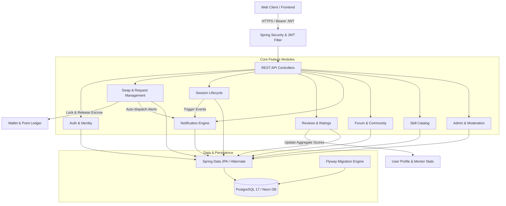
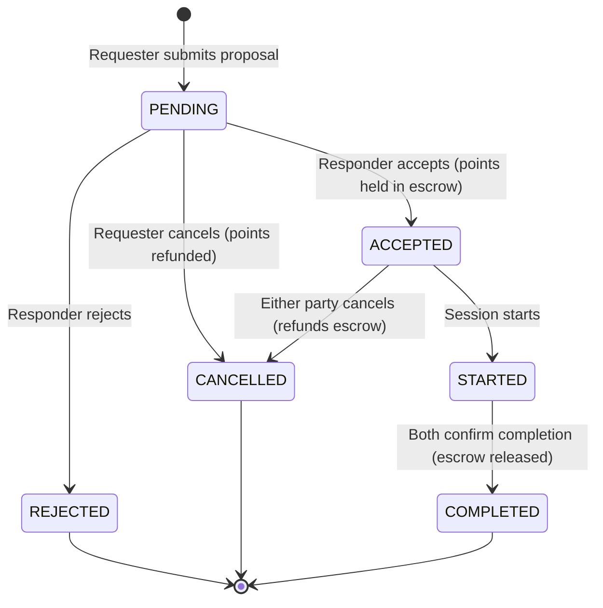

# 🎓 SkillBridge — Backend Service

[](https://github.com/loucasty-cell/UIT-Java-Final-Project/actions/workflows/ci.yml)
[](https://adoptium.net/)
[](https://spring.io/projects/spring-boot)
[](https://www.postgresql.org/)
[](https://flywaydb.org/)
[](LICENSE)

SkillBridge is a modern, peer-to-peer collaborative learning and skill exchange platform built with **Spring Boot** and **Java 25**. The backend handles identity, skill catalogs, peer-to-peer swap proposals, point-based escrow locking, live session coordination, peer reviews, real-time in-app notifications, community forums, and administrative moderation.

---

## 📋 Table of Contents

- [Architectural Overview](#-architectural-overview)
- [Technology Stack](#-technology-stack)
- [Package & Module Architecture](#-package--module-architecture)
- [Core Business Workflows & Invariants](#-core-business-workflows--invariants)
  - [1. Authentication, Identity & Wallet Onboarding](#1-authentication-identity--wallet-onboarding)
  - [2. Skill Catalog & User Skills](#2-skill-catalog--user-skills)
  - [3. Learning Requests & Skill Swap Proposals](#3-learning-requests--skill-swap-proposals)
  - [4. Escrow & Point Transaction Cycle](#4-escrow--point-transaction-cycle)
  - [5. Peer Learning Sessions](#5-peer-learning-sessions)
  - [6. Post-Session Reviews & Rating Calculation](#6-post-session-reviews--rating-calculation)
  - [7. Notification Engine](#7-notification-engine)
  - [8. Community Forum & Helpful Rewards](#8-community-forum--helpful-rewards)
  - [9. Moderation & Admin Control](#9-moderation--admin-control)
- [Security Model](#-security-model)
- [Database Schema & Migrations](#-database-schema--migrations)
- [API Reference](#-api-reference)
- [Local Setup & Quick Start](#-local-setup--quick-start)
- [Configuration & Environment Variables](#-configuration--environment-variables)
- [Testing & Quality Assurance](#-testing--quality-assurance)
- [Continuous Integration (CI)](#-continuous-integration-ci)

---

## 🏛️ Architectural Overview

SkillBridge follows a **Domain-Driven, Package-by-Feature** architecture. Business rules, application logic, and persistence layers are isolated per feature module while maintaining transactional integrity across module boundaries via application services.



---

## 💻 Technology Stack

| Layer / Concern | Technology | Details |
|---|---|---|
| **Language** | Java 25 (Temurin LTS) | Modern language features (virtual threads, records, pattern matching) |
| **Framework** | Spring Boot 3.5.16 | Core web MVC, validation, transaction management |
| **Security** | Spring Security 6 & OAuth2 Resource Server | Stateless JWT authentication, role-based access control, PBKDF2/BCrypt |
| **Persistence** | Spring Data JPA / Hibernate 6 | PostgreSQL dialect, optimistic locking, UUID keys |
| **Database** | PostgreSQL 17 (or Neon Serverless Postgres) | Timestamptz UTC, row constraints, foreign key cascades |
| **Schema Migration** | Flyway | Versioned migrations `V1` through `V8` |
| **API Documentation**| SpringDoc OpenAPI 2.6.0 | Swagger UI and OpenAPI 3.0 specs at `/swagger-ui.html` |
| **Boilerplate** | Lombok 1.18.46 | Clean getters, builders, constructors (JDK 25 compatible) |
| **Build & Wrapper** | Apache Maven 3.9.x / `mvnw` | Deterministic builds with bundled wrapper |
| **Testing** | JUnit 5, AssertJ, MockMvc, Testcontainers | Unit tests, slice tests, integration tests |

---

## 📦 Package & Module Architecture

The codebase is organized by business feature under `src/main/java/com/skillbridge/`:

```text
com.skillbridge
├── auth/            # Registration, login, JWT issuance, token rotation, logout
├── user/            # User profile, account state, public stats
├── skill/           # Skill catalog, categories, search, skill entities
├── mentor/          # Mentor profile, teaching offerings, availability
├── request/         # Request facade for learning/swap proposals
├── swap/            # Peer swap proposal workflow, state machine, point escrow
├── session/         # Session scheduling, status tracking, meeting links
├── review/          # Completed session reviews, 1-5 star ratings, feedback
├── notification/    # Event-driven in-app notifications, read/unread states
├── forum/           # Forum posts, threaded comments, upvotes, helpful rewards
├── moderation/      # Reports, warnings, user account bans, audit logging
├── admin/           # Platform settings, disputed transaction resolutions
├── wallet/          # Points balance, ledger entries, held point escrow
└── shared/          # SecurityUtils, exception handlers, common DTOs, configs
```

---

## 🔄 Core Business Workflows & Invariants

### 1. Authentication, Identity & Wallet Onboarding
* **Atomic Registration**: When a new user registers (`POST /api/auth/register`), the system creates:
  1. A `User` record with hashed credentials.
  2. A default `ROLE_USER` role.
  3. A `Wallet` with an automatic **+50 Starter Points** credit in the immutable `PointLedger`.
* **JWT Lifecycle**:
  - Access Token: Bearer JWT with a configurable lifespan (default: 12 hours).
  - Refresh Token: Stored in the database with family-based rotation. Token reuse triggers immediate family revocation.
* **Server-Derived Identity**: The acting user is **never** extracted from request body IDs; it is derived securely from the authenticated JWT token subject via `SecurityUtils.getCurrentUserId()`.

---

### 2. Skill Catalog & User Skills
* Centralized catalog of normalized skills (`POST /api/skills`, `GET /api/skills`, `GET /api/skills/search?q=`).
* Users associate skills with their profile under two modes:
  - `TEACH`: Skills the user can offer to mentor or swap.
  - `LEARN`: Skills the user is looking to acquire.

---

### 3. Learning Requests & Skill Swap Proposals
The swap proposal lifecycle operates as a strict state machine:



* **Modes Supported**:
  1. **POINTS**: Requester pays a specified point cost; points are deducted and locked in escrow upon acceptance.
  2. **SKILL_SWAP**: Requester offers a `TEACH` skill matching the mentor's `LEARN` skill. 0 points moved.
  3. **VOLUNTEER**: Community service or open peer coaching. 0 points moved.

---

### 4. Escrow & Point Transaction Cycle
* When a points-based proposal is accepted, the server immediately locks `points_held` in the requester's `Wallet`.
* **Completion**: When the session completes, points are atomically transferred from the requester's escrow balance to the mentor's available balance.
* **Cancellation/Rejection**: Held points are immediately unlocked and refunded to the requester.
* **Dispute Protection**: Escrows cannot be released while a session is flagged in dispute.

---

### 5. Peer Learning Sessions
* An accepted proposal automatically instantiates a 1-to-1 `SwapSession`.
* **Participant Authorization**: Only the registered requester or responder can view private meeting URLs, update schedules, or mark progress.
* **Status Progression**: `ACCEPTED` $\rightarrow$ `STARTED` $\rightarrow$ `COMPLETED`.

---

### 6. Post-Session Reviews & Rating Calculation
* Once a session transitions to `COMPLETED`, either participant can submit a review (`POST /api/reviews/sessions/{sessionId}`).
* **Invariants**:
  - Reviewer must be an active participant.
  - Users cannot review themselves (`reviewerId != revieweeId`).
  - Strict **one-review-per-session-per-reviewer** constraint enforced at both service and database levels (`UNIQUE(session_id, reviewer_id)`).
  - Submitting a review recalculates and updates the mentor's rolling average rating.

---

### 7. Notification Engine
* Triggered automatically upon key lifecycle events:
  - Proposals created, accepted, rejected, or cancelled.
  - Sessions scheduled, started, or marked complete.
  - Forum replies and comments marked as helpful.
* Provides user endpoints (`GET /api/notifications/me`, `POST /api/notifications/{id}/read`, `DELETE /api/notifications/{id}`).

---

### 8. Community Forum & Helpful Rewards
* Users can post technical questions and tag relevant catalog skills.
* Threaded community answers and unique upvoting (`forum_likes`).
* **Helpful Answer Bounty**: The post author can mark **one** answer as "Helpful", instantly awarding **+5 Points** to the author from the system reward pool.

---

### 9. Moderation & Admin Control
* Users can report abusive content, spam, or disputes.
* Moderators and Admins (`ROLE_ADMIN`) have access to:
  - Account suspension and formal warnings.
  - Audited manual point adjustments.
  - Global platform setting overrides.

---

## 🔒 Security Model

1. **Stateless JWT Resource Server**:
   - Every protected endpoint requires `Authorization: Bearer <token>`.
   - Security filters populate the `SecurityContext` with the user's UUID and roles.
2. **Access Control & Ownership Enforcement**:
   - Routes check entity ownership (e.g., verifying `session.getRequesterId() == currentUserId || session.getResponderId() == currentUserId`).
   - Client-supplied identity overrides are forbidden (`/me` routes guarantee context isolation).
3. **Global CORS Configuration**:
   - Governed centrally in `SecurityConfig` via `FRONTEND_ORIGINS` environment variable (defaults to `http://localhost:3000`).

---

## 🗄️ Database Schema & Migrations

Database evolution is managed via **Flyway** under `src/main/resources/db/migration/`:

| Version | Migration Script | Description |
|---|---|---|
| **V1** | `V1__init_schema.sql` | Core `users`, `user_roles`, `refresh_tokens`, base schema |
| **V2** | `V2__mentor_and_forum_schema.sql` | `mentor_offerings`, `forum_posts`, `forum_comments` |
| **V3** | `V3__forum_likes.sql` | `forum_likes` table with uniqueness constraint |
| **V4** | `V4__admin_and_moderation_schema.sql` | `reports`, `account_warnings`, `admin_audit_events` |
| **V4.1** | `V4.1__create_skills_table.sql` | Standardized `skills` catalog table |
| **V5** | `V5__user_profile_and_wallet_schema.sql` | `wallets`, `point_ledger`, user bio & certificate fields |
| **V6** | `V6__swap_request_session_schema.sql` | `swap_requests`, `swap_sessions`, escrow hold tracking |
| **V7** | `V7__reviews_schema.sql` | `reviews` table with 1-5 star validation and FKs |
| **V8** | `V8__notifications_schema.sql` | `notifications` table with read flags and descending indexes |

---

## 📡 API Reference

Interactive API documentation and schema explorer are available via **Swagger UI**:
```
http://localhost:9095/swagger-ui.html
```

### Core API Endpoints

#### Authentication (`/api/auth`)
- `POST /api/auth/register` — Register a new account (+50 bonus points)
- `POST /api/auth/login` — Authenticate and receive JWT + Refresh Token
- `POST /api/auth/refresh` — Rotate refresh token family and obtain new JWT
- `POST /api/auth/logout` — Invalidate active refresh token family

#### Skill Catalog (`/api/skills`)
- `GET /api/skills` — List all available skills in catalog
- `GET /api/skills/search?q={query}` — Search skills by name
- `GET /api/skills/{id}` — Get single skill details
- `POST /api/skills` — Create a new skill (Authenticated)
- `DELETE /api/skills/{id}` — Delete a skill (Admin/Owner)

#### Swaps & Learning Proposals (`/api/swaps` & `/api/requests`)
- `POST /api/swaps/proposals` — Submit a new swap/learning proposal
- `GET /api/swaps/proposals/{id}` — View proposal details
- `GET /api/swaps/history/me` — List caller's proposal history
- `POST /api/swaps/proposals/{id}/accept` — Accept proposal (Locks points in escrow)
- `POST /api/swaps/proposals/{id}/reject` — Reject proposal
- `POST /api/swaps/proposals/{id}/cancel` — Cancel proposal (Refunds held points)
- `GET /api/requests/swaps/pending/incoming` — List pending requests awaiting response

#### Sessions (`/api/sessions`)
- `GET /api/sessions/active/me` — List caller's active sessions (`ACCEPTED` / `STARTED`)
- `POST /api/sessions/{sessionId}/start` — Mark session as started
- `POST /api/sessions/{sessionId}/complete` — Complete session and release point escrow
- `PATCH /api/sessions/{sessionId}` — Update session schedule, meeting URL, or notes

#### Reviews (`/api/reviews`)
- `POST /api/reviews/sessions/{sessionId}` — Submit rating (1-5) and feedback for a completed session

#### Notifications (`/api/notifications`)
- `GET /api/notifications/me` — Fetch caller's notifications (newest first)
- `POST /api/notifications/{id}/read` — Mark notification as read
- `DELETE /api/notifications/{id}` — Remove notification

---

## 🚀 Local Setup & Quick Start

### Prerequisites
* **Java 25 JDK** (Adoptium Temurin 25 recommended)
* **Docker & Docker Compose** (Optional, for quick PostgreSQL spin-up)

---

### Step 1: Clone the Repository
```bash
git clone https://github.com/loucasty-cell/UIT-Java-Final-Project.git
cd UIT-Java-Final-Project
```

---

### Step 2: Start PostgreSQL Database
Using Docker Compose:
```bash
docker compose up -d
```

Or ensure a local PostgreSQL instance is running on port `5432` with a database named `skillbridge`.

---

### Step 3: Configure Environment
Copy the example environment file:
```bash
cp .env.example .env
```

Default credentials in [`src/main/resources/application.yml`](src/main/resources/application.yml) connect directly to `localhost:5432/skillbridge` (`postgres`/`postgres`).

---

### Step 4: Build and Run

#### On Windows (PowerShell / CMD)
```powershell
.\mvnw.cmd spring-boot:run
```

#### On Linux / macOS
```bash
chmod +x mvnw
./mvnw spring-boot:run
```

The server starts on port **`9095`** by default.
- Health Check: `http://localhost:9095/actuator/health`
- Swagger UI: `http://localhost:9095/swagger-ui.html`

---

## ⚙️ Configuration & Environment Variables

Key parameters configurable via environment variables or `.env`:

| Variable | Default Value | Description |
|---|---|---|
| `SERVER_PORT` | `9095` | Port the Spring Boot application listens on |
| `DATABASE_URL` | `jdbc:postgresql://localhost:5432/skillbridge?sslmode=disable` | JDBC Database Connection URL |
| `DATABASE_USERNAME` | `postgres` | Database username |
| `DATABASE_PASSWORD` | `postgres` | Database password |
| `FLYWAY_ENABLED` | `true` | Enables automatic schema migrations |
| `JWT_SECRET` | `very_secret_default_key_that_should_be_changed_in_prod` | 256-bit secret key for signing JWTs |
| `ACCESS_TOKEN_MINUTES`| `720` (12 Hours) | JWT access token lifespan |
| `REFRESH_TOKEN_DAYS` | `7` | Refresh token lifespan |
| `FRONTEND_ORIGINS` | `http://localhost:3000` | Allowed CORS origins for web client |

---

## 🧪 Testing & Quality Assurance

The project features a comprehensive automated test suite spanning unit tests, WebMvc slice tests, JPA repository tests, and security tests.

### Run All Tests
```bash
# Windows
.\mvnw.cmd test

# Linux / macOS
./mvnw test
```

### Test Suite Summary
* **Total Tests**: 39 Automated Test Cases
* **Coverage Areas**:
  - `auth`: Registration, password hashing, token validation
  - `swap` & `request`: Proposal lifecycle, point validation, unauthorized transitions
  - `session`: Participant authorization, meeting updates, completion triggers
  - `review`: Unique constraints, self-review prevention, average score updates
  - `notification`: Event listeners, unread counting, user isolation
  - `moderation`: Report handling and admin privileges
  - `skill`: Catalog queries, search filters, entity mappings

---

## 🔄 Continuous Integration (CI)

Every commit and pull request triggers the GitHub Actions workflow in [`.github/workflows/ci.yml`](.github/workflows/ci.yml):
1. Sets up JDK 25 (Temurin).
2. Sets execute permissions on the Maven wrapper (`chmod +x mvnw`).
3. Executes `./mvnw -B test` to compile and verify all 39 tests against Java 25.

---

## 📄 License

This project is licensed under the Apache License 2.0. See the [LICENSE](LICENSE) file for details.
