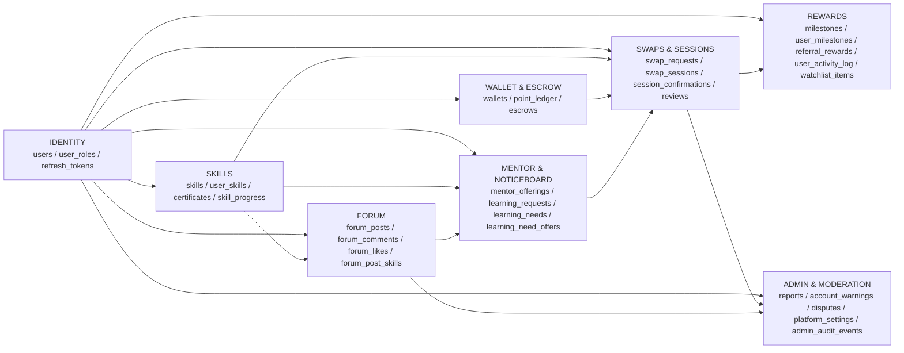
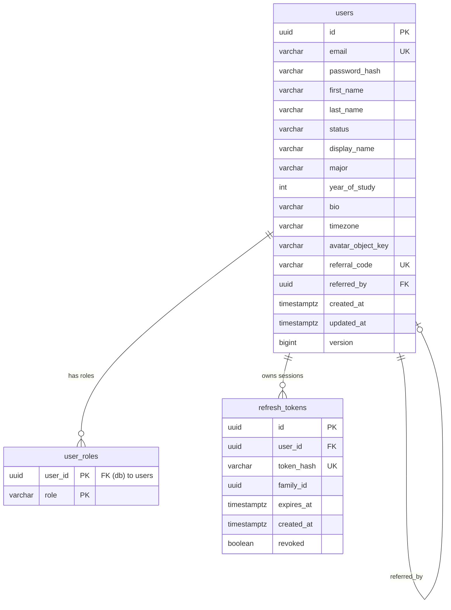
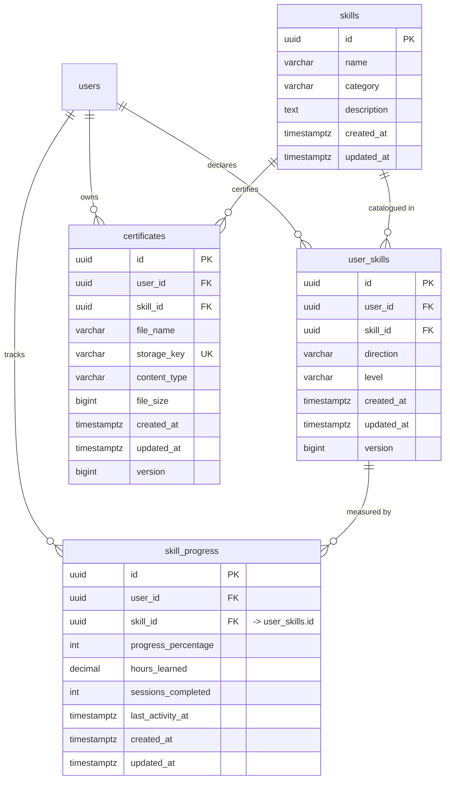
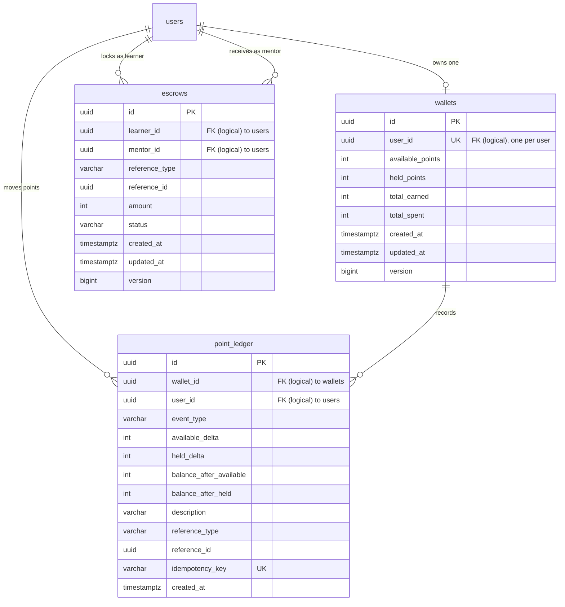
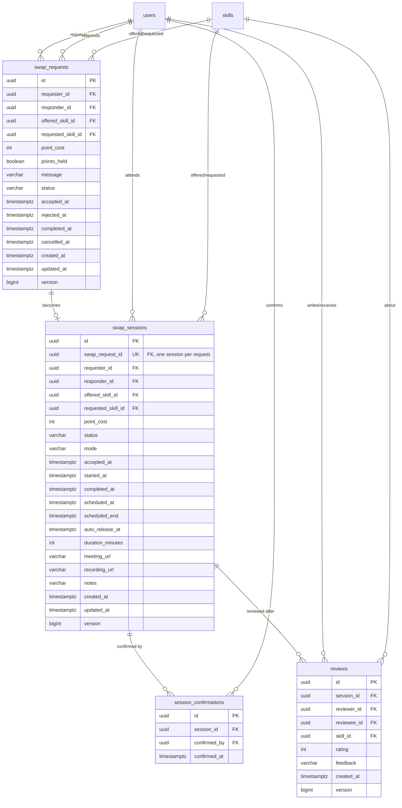
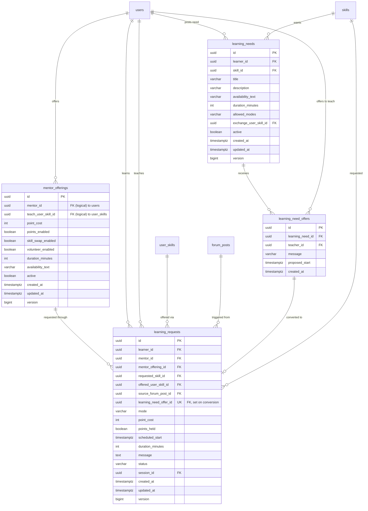
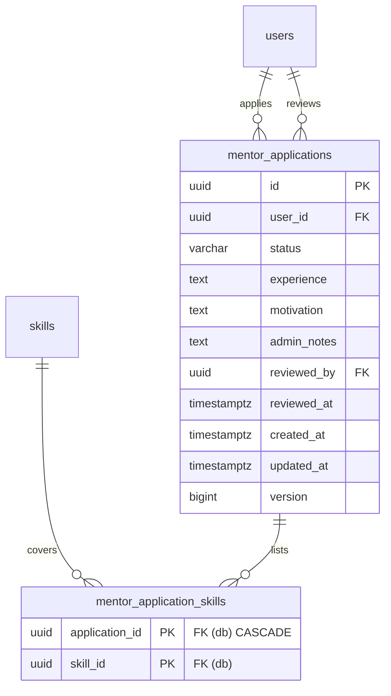
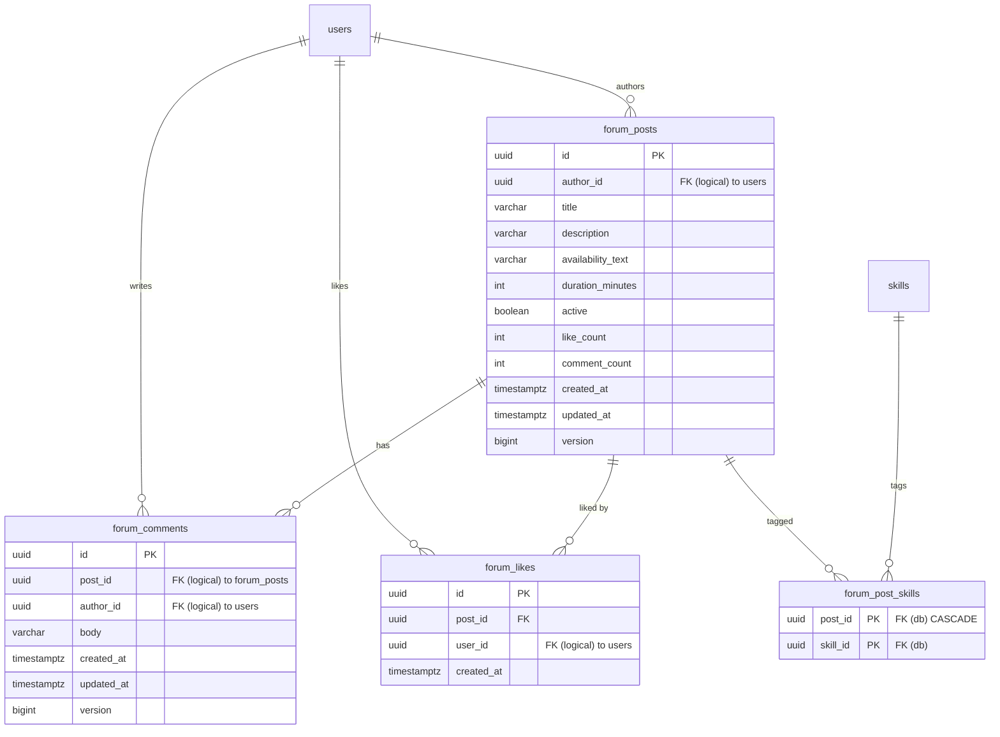
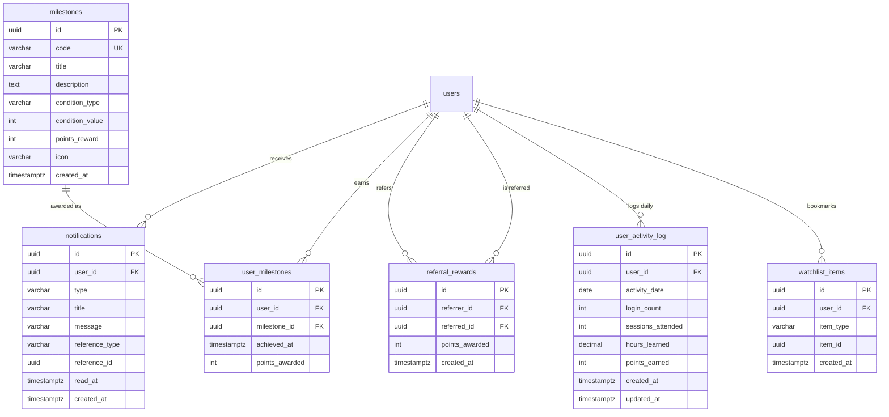
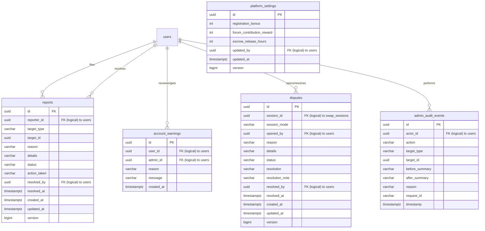

# SkillBridge — Database ER Diagram (ED_Diagram)

Single source of truth for the **actual** PostgreSQL schema. Every table, column,
key, and relationship below is taken from the Flyway migrations
(`backend/src/main/resources/db/migration/V1`–`V33` + valid parts of `V34`).
The stale `backend-context-kit/databaseschema.md` does **not** match the real
schema and is intentionally ignored here.

## Conventions

- `UUID` primary keys on (almost) every table.
- `TIMESTAMPTZ` for all timestamps (UTC).
- `version BIGINT` = optimistic locking, incremented by JPA on update.
- **FK (db)** = enforced in the DB via `REFERENCES`.
- **FK (logical)** = column exists and JPA maps the association, but the DDL has
  no `REFERENCES` clause, so integrity is enforced by application code.

---

## 1. Overview — how the domains connect

---

## 2. Identity & Access

- `users.referred_by` → `users.id` — self FK (db), nullable; set when a new user
  signs up with a referral code.
- `users.referral_code` — UNIQUE, nullable (generated after registration).
- `user_roles(user_id, role)` — composite PK; `user_id` FK (db) `ON DELETE CASCADE`.
- `refresh_tokens` — JWT rotation family: `family_id` groups generations;
  reuse of an old token revokes the whole family. `user_id` FK (db) CASCADE.
- Active trigger state: none (the `trg_auto_assign_roles` trigger from V19 was
  dropped in V24; roles are assigned by authorized service workflows only).

---

## 3. Skills, User Skills, Certificates, Progress

- `user_skills` — FK (db) CASCADE on both sides; UNIQUE
  `(user_id, skill_id, direction)` where `direction` ∈ `TEACH | LEARN`.
- `certificates` — FK (db) CASCADE on both sides; UNIQUE `(user_id, skill_id)`,
  UNIQUE `storage_key`.
- ⚠️ `skill_progress.skill_id` → **`user_skills(id)`**, not `skills(id)`
  (FK (db) CASCADE). UNIQUE `(user_id, skill_id)` on that pair.

---

## 4. Wallet, Ledger, Escrow

- `wallets.user_id` — UNIQUE (one wallet per user); `available_points`,
  `held_points` non-negative CHECKs.
- `point_ledger` — append-only: one row per balance change; UNIQUE
  `idempotency_key`; polymorphic `(reference_type, reference_id)` points at
  e.g. `SWAP_REQUEST` / `LEARNING_REQUEST` / forum rewards.
- `escrows` — point holds between learner and mentor for one session:
  polymorphic `(reference_type, reference_id)` (re-pointed to `SWAP_REQUEST`
  on acceptance, V26). `status` default `HELD`.

---

## 5. Swap Requests, Sessions, Confirmations, Reviews

- `swap_requests` — both participants FK (db) to `users`; both skill columns
  FK (db) to `skills`. Status ∈ `PENDING, ACCEPTED, REJECTED, CANCELLED,
  EXPIRED, COMPLETED` (CHECK).
- `swap_sessions` — `swap_request_id` FK (db) UNIQUE (one session per
  request); both participants FK (db); status ∈ `ACCEPTED, SCHEDULED, STARTED,
  AWAITING_CONFIRMATION, COMPLETED, CANCELLED, DISPUTED` (CHECK, V23);
  `mode` ∈ `SKILL_SWAP | POINTS | VOLUNTEER` (V12).
- `session_confirmations` — FK (db) CASCADE on both; UNIQUE
  `(session_id, confirmed_by)`.
- `reviews` — all FK (db) to `swap_sessions` / `users` / `skills`; rating
  1–5 CHECK; UNIQUE `(session_id, reviewer_id)` = one review per side;
  self-review blocked (`reviewer_id != reviewee_id`).

---

## 6. Mentor Offerings, Learning Requests, Noticeboard

- `learning_requests` — learner/mentor FK (db); `mentor_offering_id`,
  `requested_skill_id`, `offered_user_skill_id` (→ `user_skills`),
  `source_forum_post_id` (→ `forum_posts`), `session_id` (→ `swap_sessions`)
  all FK (db), nullable where optional; `mode` ∈ `POINTS, SKILL_SWAP,
  VOLUNTEER`; status ∈ `PENDING, ACCEPTED, REJECTED, CANCELLED, EXPIRED`.
- `learning_needs` — learner FK (db) CASCADE; `skill_id` FK (db);
  `exchange_user_skill_id` → `user_skills` FK (db); duration 15–480 CHECK.
- `learning_need_offers` — FK (db) CASCADE both sides; UNIQUE
  `(learning_need_id, teacher_id)`; `proposed_start` NOT NULL.
- Accepted offer → auto-created `VOLUNTEER` `learning_request` linked via
  UNIQUE `learning_need_offer_id` (V32: one request per offer).

---

## 7. Mentor Applications

- Status ∈ `PENDING, APPROVED, REJECTED` (CHECK). Composite PK
  `(application_id, skill_id)`.

---

## 8. Forum & Community

- `forum_likes` — `post_id` FK (db) CASCADE; UNIQUE `(post_id, user_id)` =
  one like per user per post.
- `forum_post_skills` — composite PK `(post_id, skill_id)`; `post_id` FK (db)
  CASCADE, `skill_id` FK (db).
- `forum_posts.duration_minutes` — NOT NULL, 15–480 CHECK.
- `like_count` / `comment_count` are denormalized counters maintained by the
  service layer.

---

## 9. Rewards: Notifications, Milestones, Referrals, Activity, Watchlist

- `notifications` — `user_id` FK (db); polymorphic
  `(reference_type, reference_id)`; unread = `read_at IS NULL`.
- `milestones.code` — UNIQUE seeded catalog (e.g. `FIRST_SESSION`,
  `VOLUNTEER_HERO`); `user_milestones` UNIQUE `(user_id, milestone_id)`.
- `referral_rewards` — both sides FK (db); UNIQUE `(referrer_id, referred_id)`
  = one reward per pair.
- `user_activity_log` — FK (db) CASCADE; UNIQUE `(user_id, activity_date)` =
  one row per user per day (streaks/engagement).
- `watchlist_items` — `user_id` FK (db); polymorphic `item_id` where
  `item_type` ∈ `SKILL | MENTOR`; UNIQUE `(user_id, item_type, item_id)`.

---

## 10. Admin & Moderation

- `reports` — polymorphic `(target_type, target_id)`; `status` default `OPEN`.
- `disputes` — opened per session (`session_id` logical FK to
  `swap_sessions`); escrows cannot release while a session is `DISPUTED`.
- `platform_settings` — single seeded singleton row
  (`registration_bonus=30`, `forum_contribution_reward=5`,
  `escrow_release_hours=18`).
- `shedlock(name PK, lock_until, locked_at, locked_by)` — distributed
  scheduler lock, not related to any user. (Infra table, V23.)

---

## 11. Status & enum dictionary

| Where | Values |
|---|---|
| `users.status` | `ACTIVE` (default), `SUSPENDED`, `BANNED` |
| `user_roles.role` | `USER`, `MENTOR`, `ADMIN` (seeded by email pattern in V19 for demo) |
| `user_skills.direction` | `TEACH`, `LEARN` |
| `swap_requests.status` | `PENDING, ACCEPTED, REJECTED, CANCELLED, EXPIRED, COMPLETED` |
| `swap_sessions.status` | `ACCEPTED, SCHEDULED, STARTED, AWAITING_CONFIRMATION, COMPLETED, CANCELLED, DISPUTED` |
| `swap_sessions.mode` / `learning_requests.mode` | `POINTS`, `SKILL_SWAP`, `VOLUNTEER` |
| `learning_requests.status` | `PENDING, ACCEPTED, REJECTED, CANCELLED, EXPIRED` |
| `mentor_applications.status` | `PENDING, APPROVED, REJECTED` |
| `escrows.status` | `HELD` (default), `RELEASED`, `REFUNDED` |
| `reviews.rating` | 1–5 (CHECK) |
| `reports.status` / `disputes.status` | `OPEN` (default), `RESOLVED`, `DISMISSED` |
| `watchlist_items.item_type` | `SKILL`, `MENTOR` |
| `milestones.condition_type` | `SESSIONS_COMPLETED, SESSIONS_TAUGHT, REVIEWS_GIVEN, REVIEWS_RECEIVED, SKILL_SWAPS_COMPLETED, VOLUNTEER_SESSIONS` |
| Canonical values | registration bonus **30** pts · helpful-answer reward **5** pts · escrow auto-release **18** h |

## 12. Workflow → entity map

| # | Workflow | Core path through entities |
|---|---|---|
| 1 | Registration & wallet onboarding | `users` → `user_roles(USER)` → `wallets(+30)` + `point_ledger(REGISTRATION_BONUS)` |
| 2 | Skill catalog & user skills | `skills` → `user_skills(TEACH/LEARN)` → optional `certificates`, `skill_progress` |
| 3 | Swap proposals | `swap_requests(PENDING → ACCEPTED/REJECTED/CANCELLED)` between `users`, over `skills` |
| 4 | Learning requests | `learning_requests` via `mentor_offerings` / `user_skills` / `forum_posts` / `learning_need_offers` → `swap_sessions` on accept |
| 5 | Escrow & points | `swap_requests.points_held` → `escrows(HELD)` → `RELEASED`/`REFUNDED` on completion/cancel, every move logged in `point_ledger` |
| 6 | Sessions | `swap_sessions(ACCEPTED → SCHEDULED → STARTED → AWAITING_CONFIRMATION → COMPLETED)` + `session_confirmations` (both parties) |
| 7 | Reviews & ratings | `reviews` per `swap_sessions` (one per side) → mentor aggregate rating |
| 8 | Notifications | `notifications` on proposal events, session events, forum replies, helpful marks |
| 9 | Forum & bounty | `forum_posts` (+`forum_post_skills`, `forum_comments`, `forum_likes`) → author marks one helpful → `+5` via `point_ledger` |
| 10 | Noticeboard | `learning_needs` ← `learning_need_offers` → auto `learning_requests(VOLUNTEER)` → sessions |
| 11 | Mentor onboarding | `mentor_applications` + `mentor_application_skills` → approval grants `MENTOR` role → `mentor_offerings` |
| 12 | Rewards & engagement | `milestones` → `user_milestones` (+points), `referral_rewards` via `users.referral_code/referred_by`, `user_activity_log` streaks, `watchlist_items` |
| 13 | Moderation & admin | `reports` → `account_warnings` / bans (`users.status`) / `disputes` (blocks escrow) → `admin_audit_events`; rules in `platform_settings` |

---

## Appendix A — unique constraints

`users(email)`, `users(referral_code)`, `wallets(user_id)`,
`point_ledger(idempotency_key)`, `user_skills(user_id, skill_id, direction)`,
`certificates(user_id, skill_id)`, `certificates(storage_key)`,
`reviews(session_id, reviewer_id)`, `session_confirmations(session_id, confirmed_by)`,
`swap_sessions(swap_request_id)`, `learning_requests(learning_need_offer_id)`,
`forum_likes(post_id, user_id)`, `milestones(code)`,
`user_milestones(user_id, milestone_id)`, `referral_rewards(referrer_id, referred_id)`,
`user_activity_log(user_id, activity_date)`,
`watchlist_items(user_id, item_type, item_id)`,
`learning_need_offers(learning_need_id, teacher_id)`.

## Appendix B — known schema issue (not part of the ER)

`V34__add_performance_indexes.sql` references objects that do not exist in the
migrations: tables `sessions` and `point_transactions`, column
`notifications(read)`, column `admin_audit_events(created_at)`. Those index
statements cannot apply to a fresh database and are excluded from this diagram.
