# SkillBridge — Database ER Diagram & Workflow Specification (ER_Diagram)

Single source of truth for the **actual** PostgreSQL schema, Mermaid entity-relationship diagrams, and domain workflow lifecycles in SkillBridge. Every table, column, key, constraint, and relationship below is verified against the Flyway migrations (`backend/src/main/resources/db/migration/V1`–`V33`), JPA entity mappings, and backend domain services.

## Conventions

- `UUID` primary keys on (almost) every table (`gen_random_uuid()` / `uuid-ossp`).
- `TIMESTAMPTZ` for all timestamps in UTC.
- `version BIGINT` = optimistic locking, managed by JPA on updates.
- **FK (db)** = enforced in PostgreSQL via `REFERENCES` with foreign key constraints.
- **FK (logical)** = column stores target entity ID; consistency enforced by service layer or polymorphic association.

---

## 1. Domain Architecture Overview

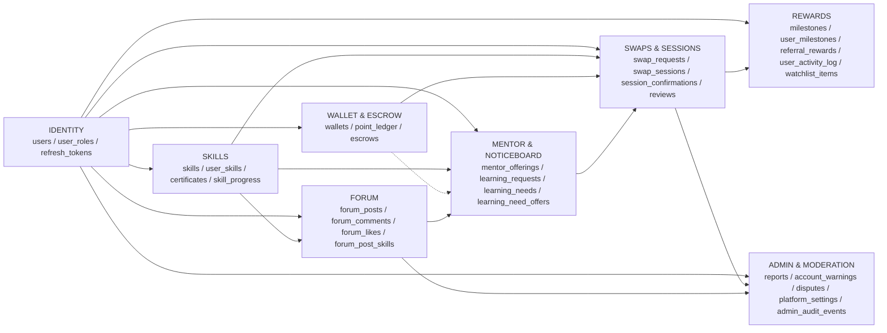

---

## 1.5. Master Unified ER Diagram (All 36 Tables & All Fields)

> **Single Full Schema View:** This unified Mermaid ER diagram encapsulates all 36 tables, all attributes, primary keys, unique constraints, foreign keys, and cardinalities across the entire SkillBridge backend database.

```mermaid
erDiagram
    %% --- RELATIONSHIPS ---
    users ||--o{ user_roles : "has"
    users ||--o{ refresh_tokens : "owns"
    users ||--o| users : "referred_by"
    users ||--o{ user_skills : "declares"
    users ||--o{ certificates : "owns"
    users ||--o{ skill_progress : "tracks"
    skills ||--o{ user_skills : "categorizes"
    skills ||--o{ certificates : "certifies"
    user_skills ||--o{ skill_progress : "measures"
    users ||--o| wallets : "owns"
    wallets ||--o{ point_ledger : "logs"
    users ||--o{ point_ledger : "earns_spends"
    users ||--o{ escrows : "locks_points"
    users ||--o{ escrows : "receives_points"
    swap_requests ||--o{ escrows : "holds_escrow"
    users ||--o{ swap_requests : "requests"
    users ||--o{ swap_requests : "responds"
    skills ||--o{ swap_requests : "offers_skill"
    skills ||--o{ swap_requests : "requests_skill"
    swap_requests ||--o| swap_sessions : "spawns"
    users ||--o{ swap_sessions : "attends_requester"
    users ||--o{ swap_sessions : "attends_responder"
    skills ||--o{ swap_sessions : "session_offered_skill"
    skills ||--o{ swap_sessions : "session_requested_skill"
    swap_sessions ||--o{ session_confirmations : "confirmed_by"
    users ||--o{ session_confirmations : "confirms"
    swap_sessions ||--o{ reviews : "reviewed_in"
    users ||--o{ reviews : "writes_review"
    users ||--o{ reviews : "receives_review"
    skills ||--o{ reviews : "rates_skill"
    swap_sessions ||--o{ disputes : "subject_of_dispute"
    users ||--o{ mentor_offerings : "offers_mentorship"
    user_skills ||--o{ mentor_offerings : "teaches_skill"
    mentor_offerings ||--o{ learning_requests : "requested_through"
    users ||--o{ learning_requests : "learns"
    users ||--o{ learning_requests : "teaches"
    skills ||--o{ learning_requests : "targets_skill"
    user_skills ||--o{ learning_requests : "proposes_skill"
    forum_posts ||--o{ learning_requests : "from_post"
    learning_requests ||--o| swap_sessions : "creates_session"
    users ||--o{ learning_needs : "posts_need"
    skills ||--o{ learning_needs : "wants_skill"
    user_skills ||--o{ learning_needs : "exchange_skill"
    learning_needs ||--o{ learning_need_offers : "receives_offers"
    users ||--o{ learning_need_offers : "offers_to_teach"
    learning_need_offers ||--o| learning_requests : "converts_to"
    users ||--o{ mentor_applications : "applies"
    users ||--o{ mentor_applications : "reviewed_by"
    mentor_applications ||--o{ mentor_application_skills : "includes"
    skills ||--o{ mentor_application_skills : "qualifies"
    users ||--o{ forum_posts : "authors"
    forum_posts ||--o{ forum_comments : "contains"
    users ||--o{ forum_comments : "writes_comment"
    forum_posts ||--o{ forum_likes : "receives_like"
    users ||--o{ forum_likes : "likes"
    forum_posts ||--o{ forum_post_skills : "tagged_with"
    skills ||--o{ forum_post_skills : "tags_post"
    users ||--o{ notifications : "notified"
    milestones ||--o{ user_milestones : "awarded_as"
    users ||--o{ user_milestones : "earns_milestone"
    users ||--o{ referral_rewards : "referrer"
    users ||--o{ referral_rewards : "referred"
    users ||--o{ user_activity_log : "logs_daily"
    users ||--o{ watchlist_items : "bookmarks"
    users ||--o{ reports : "files_report"
    users ||--o{ reports : "report_resolved_by"
    users ||--o{ account_warnings : "warned_user"
    users ||--o{ account_warnings : "warning_admin"
    users ||--o{ disputes : "opens_dispute"
    users ||--o{ disputes : "dispute_resolved_by"
    users ||--o{ admin_audit_events : "actor"
    users ||--o{ platform_settings : "updated_by"

    %% --- ENTITY DEFINITIONS ---
    users {
        uuid id PK
        varchar email UK
        varchar password_hash
        varchar first_name
        varchar last_name
        varchar status "ACTIVE | WARNED | SUSPENDED | DISABLED"
        varchar display_name
        varchar major
        int year_of_study
        varchar bio
        varchar timezone
        varchar avatar_object_key
        varchar referral_code UK
        uuid referred_by FK "references users(id)"
        timestamptz created_at
        timestamptz updated_at
        bigint version
    }
    user_roles {
        uuid user_id PK "FK references users(id)"
        varchar role PK "USER | MENTOR | ADMIN"
    }
    refresh_tokens {
        uuid id PK
        uuid user_id FK "references users(id)"
        varchar token_hash UK
        uuid family_id
        timestamptz expires_at
        timestamptz created_at
        boolean revoked
    }
    skills {
        uuid id PK
        varchar name
        varchar category
        text description
        timestamptz created_at
        timestamptz updated_at
    }
    user_skills {
        uuid id PK
        uuid user_id FK "references users(id)"
        uuid skill_id FK "references skills(id)"
        varchar direction "TEACH | LEARN"
        varchar level "BEGINNER | INTERMEDIATE | ADVANCED"
        timestamptz created_at
        timestamptz updated_at
        bigint version
    }
    certificates {
        uuid id PK
        uuid user_id FK "references users(id)"
        uuid skill_id FK "references skills(id)"
        varchar file_name
        varchar storage_key UK
        varchar content_type
        bigint file_size
        timestamptz created_at
        timestamptz updated_at
        bigint version
    }
    skill_progress {
        uuid id PK
        uuid user_id FK "references users(id)"
        uuid skill_id FK "references user_skills(id)"
        int progress_percentage
        decimal hours_learned
        int sessions_completed
        timestamptz last_activity_at
        timestamptz created_at
        timestamptz updated_at
    }
    wallets {
        uuid id PK
        uuid user_id UK "references users(id)"
        int available_points "CHECK >= 0"
        int held_points "CHECK >= 0"
        int total_earned
        int total_spent
        timestamptz created_at
        timestamptz updated_at
        bigint version
    }
    point_ledger {
        uuid id PK
        uuid wallet_id FK "references wallets(id)"
        uuid user_id FK "references users(id)"
        varchar event_type "PointEventType enum"
        int available_delta
        int held_delta
        int balance_after_available
        int balance_after_held
        varchar description
        varchar reference_type
        uuid reference_id
        varchar idempotency_key UK
        timestamptz created_at
    }
    escrows {
        uuid id PK
        uuid learner_id FK "references users(id)"
        uuid mentor_id FK "references users(id)"
        varchar reference_type "SWAP_REQUEST | LEARNING_REQUEST"
        uuid reference_id
        int amount "CHECK > 0"
        varchar status "HELD | RELEASED | REFUNDED"
        timestamptz created_at
        timestamptz updated_at
        bigint version
    }
    swap_requests {
        uuid id PK
        uuid requester_id FK "references users(id)"
        uuid responder_id FK "references users(id)"
        uuid offered_skill_id FK "references skills(id)"
        uuid requested_skill_id FK "references skills(id)"
        int point_cost "CHECK >= 0"
        boolean points_held
        varchar message
        varchar status "PENDING | ACCEPTED | REJECTED | CANCELLED | EXPIRED | COMPLETED"
        timestamptz accepted_at
        timestamptz rejected_at
        timestamptz completed_at
        timestamptz cancelled_at
        timestamptz created_at
        timestamptz updated_at
        bigint version
    }
    swap_sessions {
        uuid id PK
        uuid swap_request_id UK "FK references swap_requests(id)"
        uuid requester_id FK "references users(id)"
        uuid responder_id FK "references users(id)"
        uuid offered_skill_id FK "references skills(id)"
        uuid requested_skill_id FK "references skills(id)"
        int point_cost "CHECK >= 0"
        varchar status "ACCEPTED | SCHEDULED | STARTED | AWAITING_CONFIRMATION | COMPLETED | CANCELLED | DISPUTED"
        varchar mode "POINTS | SKILL_SWAP | VOLUNTEER"
        timestamptz accepted_at
        timestamptz started_at
        timestamptz completed_at
        timestamptz scheduled_at
        timestamptz scheduled_end
        timestamptz auto_release_at
        int duration_minutes
        varchar meeting_url
        varchar recording_url
        varchar notes
        timestamptz created_at
        timestamptz updated_at
        bigint version
    }
    session_confirmations {
        uuid id PK
        uuid session_id FK "references swap_sessions(id)"
        uuid confirmed_by FK "references users(id)"
        timestamptz confirmed_at
    }
    reviews {
        uuid id PK
        uuid session_id FK "references swap_sessions(id)"
        uuid reviewer_id FK "references users(id)"
        uuid reviewee_id FK "references users(id)"
        uuid skill_id FK "references skills(id)"
        int rating "CHECK 1..5"
        varchar feedback
        timestamptz created_at
        bigint version
    }
    mentor_offerings {
        uuid id PK
        uuid mentor_id FK "references users(id)"
        uuid teach_user_skill_id FK "references user_skills(id)"
        int point_cost
        boolean points_enabled
        boolean skill_swap_enabled
        boolean volunteer_enabled
        int duration_minutes
        varchar availability_text
        boolean active
        timestamptz created_at
        timestamptz updated_at
        bigint version
    }
    learning_requests {
        uuid id PK
        uuid learner_id FK "references users(id)"
        uuid mentor_id FK "references users(id)"
        uuid mentor_offering_id FK "references mentor_offerings(id)"
        uuid requested_skill_id FK "references skills(id)"
        uuid offered_user_skill_id FK "references user_skills(id)"
        uuid source_forum_post_id FK "references forum_posts(id)"
        uuid learning_need_offer_id UK "FK references learning_need_offers(id)"
        varchar mode "POINTS | SKILL_SWAP | VOLUNTEER"
        int point_cost "CHECK >= 0"
        boolean points_held
        timestamptz scheduled_start
        int duration_minutes
        text message
        varchar status "PENDING | ACCEPTED | REJECTED | CANCELLED | EXPIRED"
        uuid session_id FK "references swap_sessions(id)"
        timestamptz created_at
        timestamptz updated_at
        bigint version
    }
    learning_needs {
        uuid id PK
        uuid learner_id FK "references users(id)"
        uuid skill_id FK "references skills(id)"
        varchar title
        varchar description
        varchar availability_text
        int duration_minutes "CHECK 15..480"
        varchar allowed_modes "VOLUNTEER | POINTS | SKILL_SWAP"
        uuid exchange_user_skill_id FK "references user_skills(id)"
        boolean active
        timestamptz created_at
        timestamptz updated_at
        bigint version
    }
    learning_need_offers {
        uuid id PK
        uuid learning_need_id FK "references learning_needs(id)"
        uuid teacher_id FK "references users(id)"
        varchar message
        timestamptz proposed_start
        timestamptz created_at
    }
    mentor_applications {
        uuid id PK
        uuid user_id FK "references users(id)"
        varchar status "PENDING | APPROVED | REJECTED"
        text experience
        text motivation
        text admin_notes
        uuid reviewed_by FK "references users(id)"
        timestamptz reviewed_at
        timestamptz created_at
        timestamptz updated_at
        bigint version
    }
    mentor_application_skills {
        uuid application_id PK "references mentor_applications(id)"
        uuid skill_id PK "references skills(id)"
    }
    forum_posts {
        uuid id PK
        uuid author_id FK "references users(id)"
        varchar title
        varchar description
        varchar availability_text
        int duration_minutes "CHECK 15..480"
        boolean active
        int like_count
        int comment_count
        timestamptz created_at
        timestamptz updated_at
        bigint version
    }
    forum_comments {
        uuid id PK
        uuid post_id FK "references forum_posts(id)"
        uuid author_id FK "references users(id)"
        varchar body
        timestamptz created_at
        timestamptz updated_at
        bigint version
    }
    forum_likes {
        uuid id PK
        uuid post_id FK "references forum_posts(id)"
        uuid user_id FK "references users(id)"
        timestamptz created_at
    }
    forum_post_skills {
        uuid post_id PK "references forum_posts(id)"
        uuid skill_id PK "references skills(id)"
    }
    notifications {
        uuid id PK
        uuid user_id FK "references users(id)"
        varchar type "NotificationType enum"
        varchar title
        varchar message
        varchar reference_type
        uuid reference_id
        timestamptz read_at
        timestamptz created_at
    }
    milestones {
        uuid id PK
        varchar code UK
        varchar title
        text description
        varchar condition_type
        int condition_value
        int points_reward
        varchar icon
        timestamptz created_at
    }
    user_milestones {
        uuid id PK
        uuid user_id FK "references users(id)"
        uuid milestone_id FK "references milestones(id)"
        timestamptz achieved_at
        int points_awarded
    }
    referral_rewards {
        uuid id PK
        uuid referrer_id FK "references users(id)"
        uuid referred_id FK "references users(id)"
        int points_awarded
        timestamptz created_at
    }
    user_activity_log {
        uuid id PK
        uuid user_id FK "references users(id)"
        date activity_date
        int login_count
        int sessions_attended
        decimal hours_learned
        int points_earned
        timestamptz created_at
        timestamptz updated_at
    }
    watchlist_items {
        uuid id PK
        uuid user_id FK "references users(id)"
        varchar item_type "SKILL | MENTOR"
        uuid item_id
        timestamptz created_at
    }
    reports {
        uuid id PK
        uuid reporter_id FK "references users(id)"
        varchar target_type "USER | FORUM_POST | FORUM_COMMENT | SESSION"
        uuid target_id
        varchar reason
        varchar details
        varchar status "OPEN | RESOLVED | DISMISSED"
        varchar action_taken
        uuid resolved_by FK "references users(id)"
        timestamptz resolved_at
        timestamptz created_at
        timestamptz updated_at
        bigint version
    }
    account_warnings {
        uuid id PK
        uuid user_id FK "references users(id)"
        uuid admin_id FK "references users(id)"
        varchar reason
        varchar message
        timestamptz created_at
    }
    disputes {
        uuid id PK
        uuid session_id FK "references swap_sessions(id)"
        varchar session_mode "POINTS | SKILL_SWAP | VOLUNTEER"
        uuid opened_by FK "references users(id)"
        varchar reason
        varchar details
        varchar status "OPEN | RESOLVED | DISMISSED"
        varchar resolution "REFUND_LEARNER | RELEASE_MENTOR | SPLIT | DISMISSED"
        varchar resolution_note
        uuid resolved_by FK "references users(id)"
        timestamptz resolved_at
        timestamptz created_at
        timestamptz updated_at
        bigint version
    }
    platform_settings {
        uuid id PK
        int registration_bonus
        int forum_contribution_reward
        int escrow_release_hours
        uuid updated_by FK "references users(id)"
        timestamptz updated_at
        bigint version
    }
    admin_audit_events {
        uuid id PK
        uuid actor_id FK "references users(id)"
        varchar action
        varchar target_type
        uuid target_id
        varchar before_summary
        varchar after_summary
        varchar reason
        varchar request_id
        timestamptz timestamp
    }
    shedlock {
        varchar name PK
        timestamptz lock_until
        timestamptz locked_at
        varchar locked_by
    }
```

---

## 2. Identity & Access Control

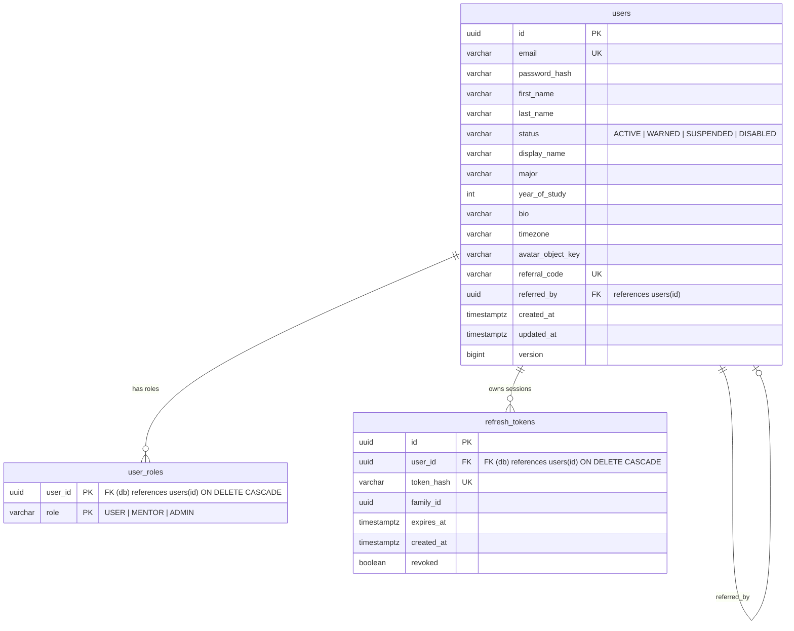

### Domain Rules:

- `users.status`: Managed by `AccountStatus.java` (`ACTIVE`, `WARNED`, `SUSPENDED`, `DISABLED`).
- `users.referral_code`: 12-char unique code generated after registration; `users.referred_by` points to inviter's `users.id`.
- `user_roles(user_id, role)`: Composite PK. Roles assigned by domain commands; automated email-pattern triggers were intentionally dropped in V24.
- `refresh_tokens`: Family-based rotation with immediate invalidation of entire family if reused.

---

## 3. Skills Catalog, User Profiles, Certificates & Progress

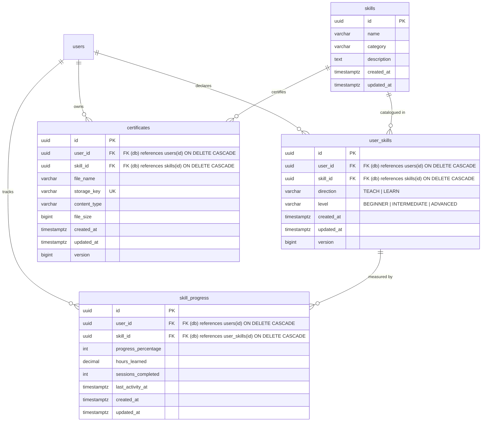

### Domain Rules:

- `user_skills`: Unique on `(user_id, skill_id, direction)`. Direction is `TEACH` or `LEARN`.
- `certificates`: Unique on `(user_id, skill_id)` and `storage_key`.
- `skill_progress.skill_id`: References **`user_skills(id)`** (not `skills(id)`), tracking progress on a user's declared skill.

---

## 4. Wallet, Double-Entry Ledger & Escrow

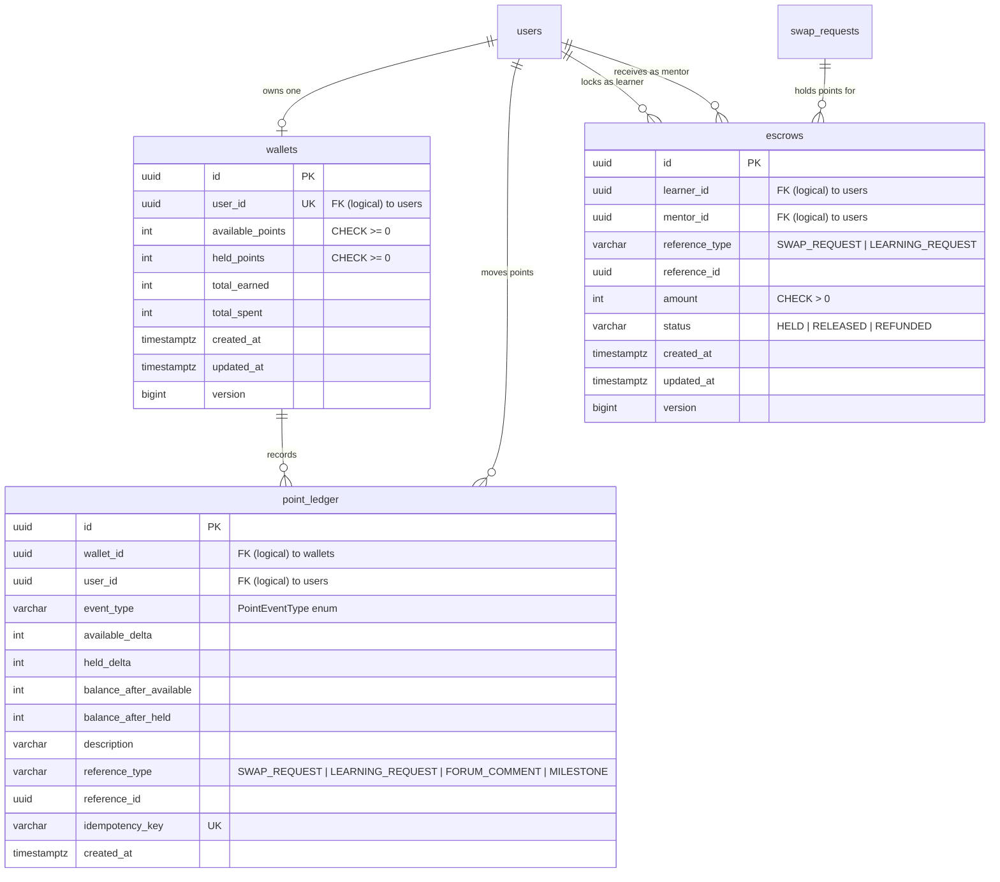

### Domain Rules:

- `wallets`: Initialized upon registration with **+30** registration bonus points. Both balances have `CHECK >= 0`.
- `point_ledger`: Append-only double-entry ledger. Every balance mutation is logged with before/after audit balances and an `idempotency_key`.
- `PointEventType`: `REGISTRATION_BONUS`, `FORUM_REWARD`, `ADMIN_ADJUSTMENT`, `POINTS_HOLD`, `POINTS_RELEASE`, `POINTS_REFUND`, `VOLUNTEER_REWARD`, `REVIEW_REWARD`, `REFERRAL_BONUS`, `MILESTONE_BONUS`, `POINT_TRANSFER`.
- `escrows`: Points are held from learner upon request acceptance; released to mentor upon double session confirmation or auto-release timer (18 hours), or refunded upon cancellation/dispute.

---

## 5. Peer-to-Peer Swaps, Sessions, Double-Confirmation & Reviews

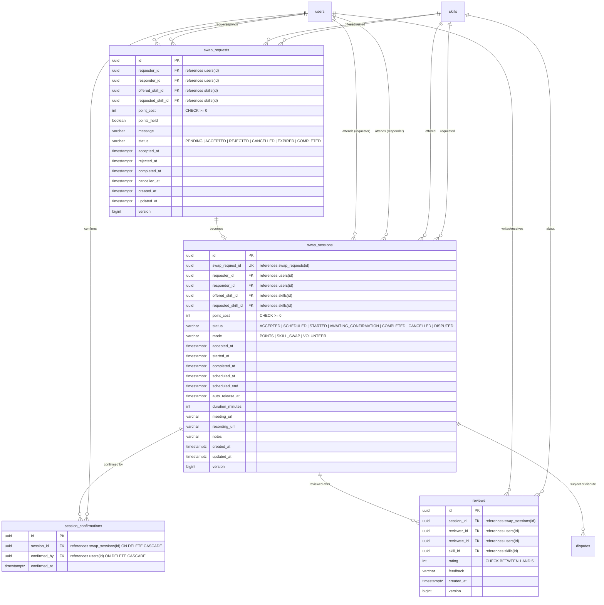

### Domain Rules:

- `swap_requests`: Status check constraint ensures valid transitions (`PENDING -> ACCEPTED / REJECTED / CANCELLED / EXPIRED -> COMPLETED`).
- `swap_sessions`: Exactly 1 session per accepted request. When scheduled, `scheduled_end` is calculated automatically.
- **Double Confirmation Protocol:** A session moves to `COMPLETED` when **both** participants submit a `session_confirmations` record, OR when the background `auto_release_at` timer expires without disputes.
- `reviews`: Rating 1–5; unique on `(session_id, reviewer_id)`; self-reviews blocked (`reviewer_id != reviewee_id`).

---

## 6. Mentor Offerings, Learning Requests & Noticeboard

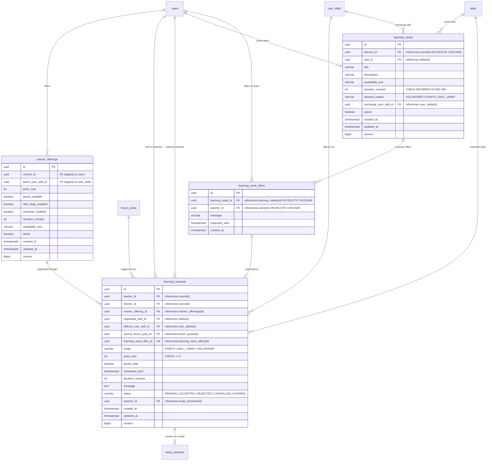

### Domain Rules:

- `mentor_offerings`: A mentor lists skills they are willing to teach with enabled modes (`points_enabled`, `skill_swap_enabled`, `volunteer_enabled`).
- `learning_requests`: Learner books a mentor offering, sends a request from a forum post (`source_forum_post_id`), or converts a noticeboard teaching offer (`learning_need_offer_id`).
- When a `learning_request` is accepted, the system creates a underlying `swap_session` (and associated `swap_request`) and populates `learning_requests.session_id`.
- `learning_needs`: Learner posts a wanted skill on the Noticeboard. Mentors submit `learning_need_offers` with a proposed start time. When learner accepts an offer, it converts into a confirmed session.

---

## 7. Mentor Applications & Vetting

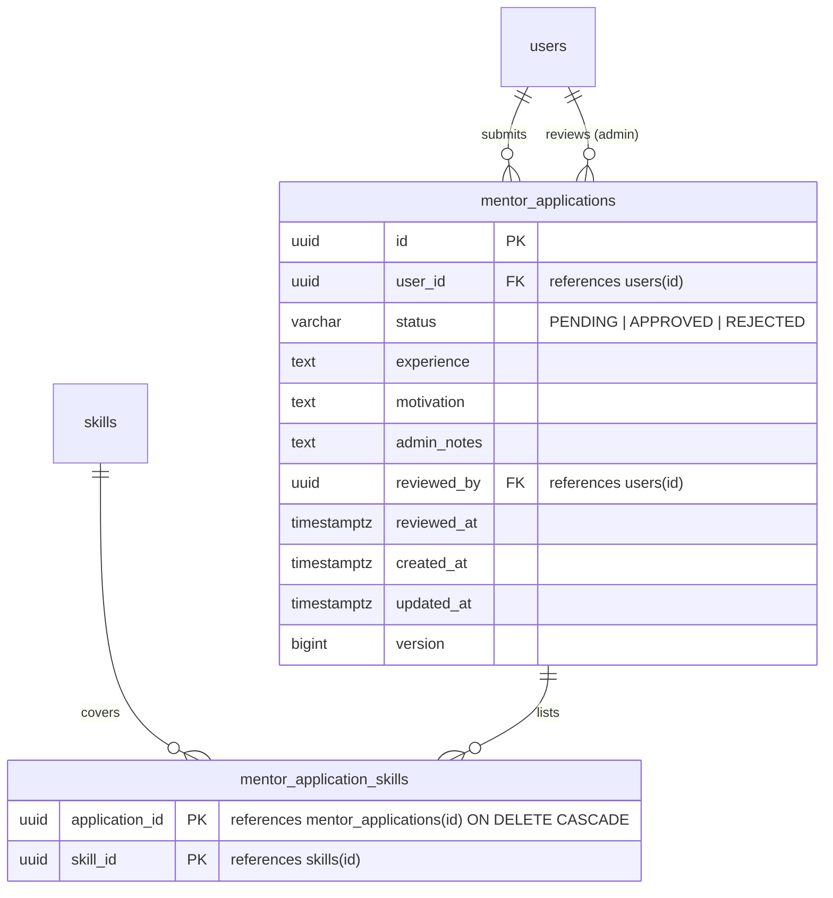

### Domain Rules:

- User submits application to become a mentor with motivation and skills.
- Admin reviews application; on approval, the system assigns the `MENTOR` role in `user_roles`.

---

## 8. Community Forum & Bounty

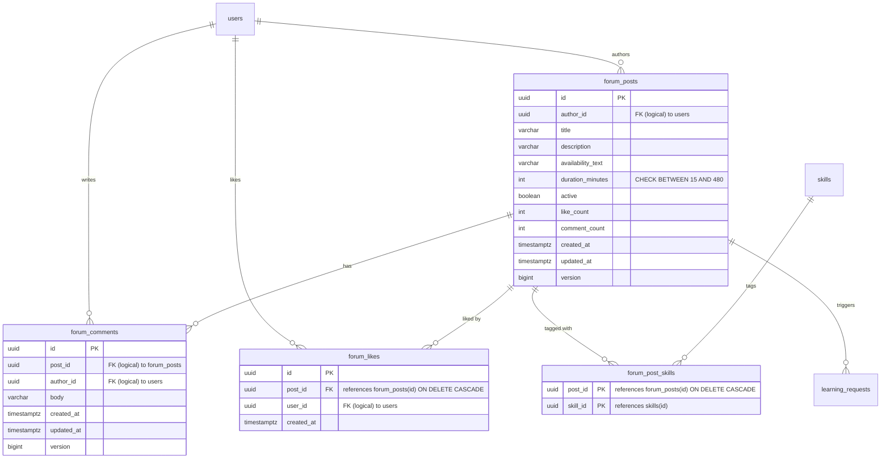

### Domain Rules:

- `forum_posts.duration_minutes`: 15–480 minutes constraint.
- `forum_likes`: Unique on `(post_id, user_id)`.
- **Helpful Comment Bounty:** When post author marks a comment as helpful, the system awards **+5** points to the comment author via `point_ledger` with `event_type = 'FORUM_REWARD'`.

---

## 9. Rewards, Milestones, Referrals, Activity & Watchlist

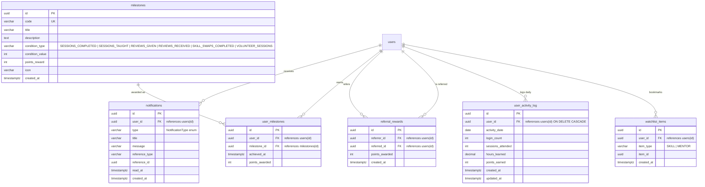

### Domain Rules:

- `notifications`: Unread when `read_at IS NULL`. Closed vocabulary in `NotificationType`.
- `milestones`: Seeded catalog (`FIRST_SESSION`, `FIVE_SESSIONS`, `TEN_SESSIONS`, `FIRST_TEACH`, `FIVE_REVIEWS`, `FIRST_SWAP`, `VOLUNTEER_HERO`, `PERFECT_RATING`). Unique on `(user_id, milestone_id)`.
- `referral_rewards`: Awards **+5** points to referrer when invited user completes registration. Unique on `(referrer_id, referred_id)`.
- `user_activity_log`: Unique on `(user_id, activity_date)` for tracking streaks and learning analytics.
- `watchlist_items`: Unique on `(user_id, item_type, item_id)` for bookmarking mentors or skills.

---

## 10. Admin, Moderation, Disputes & Platform Settings

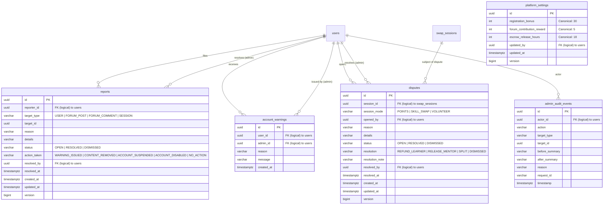

### Domain Rules:

- `disputes`: Opened by either participant of a session. When a dispute is `OPEN`, escrow auto-release is suspended.
- `platform_settings`: Singleton row with canonical settings:
  - `registration_bonus` = **30**
  - `forum_contribution_reward` = **5**
  - `escrow_release_hours` = **18**
- `admin_audit_events`: Full immutable audit log of administrative actions.

---

## 11. Canonical Status & Enum Dictionary

| Field                                           | Enum / Check Constraints                                                                                                                                                                                 | Notes                                       |
| ----------------------------------------------- | -------------------------------------------------------------------------------------------------------------------------------------------------------------------------------------------------------- | ------------------------------------------- |
| `users.status`                                  | `ACTIVE` (default), `WARNED`, `SUSPENDED`, `DISABLED`                                                                                                                                                    | Mapped via `AccountStatus.java`             |
| `user_roles.role`                               | `USER`, `MENTOR`, `ADMIN`                                                                                                                                                                                | Composite PK with `user_id`                 |
| `user_skills.direction`                         | `TEACH`, `LEARN`                                                                                                                                                                                         | Enforced in `user_skills` UNIQUE constraint |
| `user_skills.level`                             | `BEGINNER`, `INTERMEDIATE`, `ADVANCED`                                                                                                                                                                   | Mapped via `Level.java`                     |
| `point_ledger.event_type`                       | `REGISTRATION_BONUS`, `FORUM_REWARD`, `ADMIN_ADJUSTMENT`, `POINTS_HOLD`, `POINTS_RELEASE`, `POINTS_REFUND`, `VOLUNTEER_REWARD`, `REVIEW_REWARD`, `REFERRAL_BONUS`, `MILESTONE_BONUS`, `POINT_TRANSFER`   | Mapped via `PointEventType.java`            |
| `notifications.type`                            | `SWAP_PROPOSAL_CREATED`, `SWAP_PROPOSAL_ACCEPTED`, `SWAP_PROPOSAL_REJECTED`, `SWAP_PROPOSAL_CANCELLED`, `SESSION_STARTED`, `SESSION_UPDATED`, `SESSION_COMPLETED`, `FORUM_COMMENT_REPLY`, `SYSTEM_ALERT` | Mapped via `NotificationType.java`          |
| `swap_requests.status`                          | `PENDING`, `ACCEPTED`, `REJECTED`, `CANCELLED`, `EXPIRED`, `COMPLETED`                                                                                                                                   | PostgreSQL CHECK constraint                 |
| `swap_sessions.status`                          | `ACCEPTED`, `SCHEDULED`, `STARTED`, `AWAITING_CONFIRMATION`, `COMPLETED`, `CANCELLED`, `DISPUTED`                                                                                                        | PostgreSQL CHECK constraint                 |
| `swap_sessions.mode` / `learning_requests.mode` | `POINTS`, `SKILL_SWAP`, `VOLUNTEER`                                                                                                                                                                      | Session exchange modality                   |
| `learning_requests.status`                      | `PENDING`, `ACCEPTED`, `REJECTED`, `CANCELLED`, `EXPIRED`                                                                                                                                                | PostgreSQL CHECK constraint                 |
| `mentor_applications.status`                    | `PENDING`, `APPROVED`, `REJECTED`                                                                                                                                                                        | PostgreSQL CHECK constraint                 |
| `escrows.status`                                | `HELD` (default), `RELEASED`, `REFUNDED`                                                                                                                                                                 | Point hold state                            |
| `reviews.rating`                                | `1`, `2`, `3`, `4`, `5`                                                                                                                                                                                  | PostgreSQL CHECK constraint                 |
| `reports.status` / `disputes.status`            | `OPEN` (default), `RESOLVED`, `DISMISSED`                                                                                                                                                                | Default `OPEN`                              |
| `disputes.resolution`                           | `REFUND_LEARNER`, `RELEASE_MENTOR`, `SPLIT`, `DISMISSED`                                                                                                                                                 | Managed upon dispute closure                |
| `reports.action_taken`                          | `WARNING_ISSUED`, `CONTENT_REMOVED`, `ACCOUNT_SUSPENDED`, `ACCOUNT_DISABLED`, `NO_ACTION`                                                                                                                | Set by reviewing admin                      |
| `watchlist_items.item_type`                     | `SKILL`, `MENTOR`                                                                                                                                                                                        | PostgreSQL CHECK constraint                 |
| `milestones.condition_type`                     | `SESSIONS_COMPLETED`, `SESSIONS_TAUGHT`, `REVIEWS_GIVEN`, `REVIEWS_RECEIVED`, `SKILL_SWAPS_COMPLETED`, `VOLUNTEER_SESSIONS`                                                                              | Condition evaluation criteria               |
| Canonical platform values                       | Registration: **30** pts · Forum Answer: **5** pts · Escrow Auto-Release: **18** hours                                                                                                                   | Seeded in `platform_settings`               |

---

## 12. Workflow Lifecycle Maps

| #   | Workflow                             | Primary Domain Entities                                                      | Workflow Invariants & State Transitions                                                                                                                       |
| --- | ------------------------------------ | ---------------------------------------------------------------------------- | ------------------------------------------------------------------------------------------------------------------------------------------------------------- |
| 1   | **Registration & Onboarding**        | `users` -> `user_roles(USER)` -> `wallets` (+30) -> `point_ledger`           | New user receives role `USER`, wallet initialized with 30 pts recorded under `REGISTRATION_BONUS`.                                                            |
| 2   | **Skills & Certifications**          | `skills` -> `user_skills` -> `certificates` / `skill_progress`               | User declares `TEACH` or `LEARN` skills. Uploads optional proof certificates. Learning sessions update `skill_progress`.                                      |
| 3   | **P2P Skill Swap**                   | `swap_requests` -> `swap_sessions`                                           | Proposer sends swap request (`PENDING`). Receiver accepts -> moves to `ACCEPTED` and automatically spawns a `swap_session`.                                   |
| 4   | **Mentor Booking**                   | `mentor_offerings` -> `learning_requests` -> `escrows` -> `swap_sessions`    | In `POINTS` mode: learner's points are placed on hold (`escrows(HELD)`). Mentor accepts -> session scheduled.                                                 |
| 5   | **Noticeboard / Learning Needs**     | `learning_needs` -> `learning_need_offers` -> `learning_requests`            | Learner posts need (`VOLUNTEER`, `POINTS`, or `SKILL_SWAP`). Teacher offers schedule -> learner accepts -> auto-creates confirmed session.                    |
| 6   | **Double-Confirmation & Completion** | `swap_sessions` -> `session_confirmations` -> `escrows` -> `point_ledger`    | Both parties must confirm via `session_confirmations`. Upon double confirmation (or 18h auto-release), points release to mentor, session becomes `COMPLETED`. |
| 7   | **Reviews & Ratings**                | `swap_sessions` -> `reviews`                                                 | Each party leaves a 1–5 review for the counterpart. Mentor overall rating and session counters recalculate.                                                   |
| 8   | **Forum & Bounty Q&A**               | `forum_posts` -> `forum_comments` -> `point_ledger` (+5)                     | Authors post questions. Marking a comment helpful triggers `+5` points to helper under `FORUM_REWARD`.                                                        |
| 9   | **Mentor Onboarding**                | `mentor_applications` -> `mentor_application_skills` -> `user_roles(MENTOR)` | Candidate applies. Admin approves -> grants `MENTOR` role, unlocking `mentor_offerings`.                                                                      |
| 10  | **Milestones & Streaks**             | `milestones` -> `user_milestones` -> `user_activity_log`                     | Reaching session or review thresholds awards achievement badge and bonus points. Daily logins track streaks.                                                  |
| 11  | **Moderation & Disputes**            | `reports` -> `account_warnings` / `disputes` -> `admin_audit_events`         | User reports content or disputes an unsatisfactory session. Disputes halt escrow release until admin resolution.                                              |

---

## Appendix A — Complete Unique Constraints Inventory

- `users(email)`
- `users(referral_code)`
- `wallets(user_id)`
- `point_ledger(idempotency_key)`
- `user_skills(user_id, skill_id, direction)`
- `certificates(user_id, skill_id)`
- `certificates(storage_key)`
- `reviews(session_id, reviewer_id)`
- `session_confirmations(session_id, confirmed_by)`
- `swap_sessions(swap_request_id)`
- `learning_requests(learning_need_offer_id)`
- `learning_needs(exchange_user_skill_id)`
- `learning_need_offers(learning_need_id, teacher_id)`
- `forum_likes(post_id, user_id)`
- `milestones(code)`
- `user_milestones(user_id, milestone_id)`
- `referral_rewards(referrer_id, referred_id)`
- `user_activity_log(user_id, activity_date)`
- `watchlist_items(user_id, item_type, item_id)`

---

## Appendix B — Known Migration Edge Cases

- `V34__add_performance_indexes.sql`: References non-existent tables `sessions` (actual table is `swap_sessions` with `requester_id`/`responder_id`) and `point_transactions` (actual table is `point_ledger`), non-existent column `notifications(read)` (actual column is `read_at`), and `admin_audit_events(created_at)` (actual column is `timestamp`). When configuring fresh environments, ensure performance indices target the canonical table and column names documented above.
